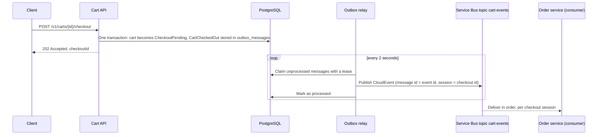

# Abysalto Web Shop – Architecture Proposal and Cart API

This repository contains the solution to the Abysalto Senior Backend Developer technical task.

| Part | Location | Status |
| --- | --- | --- |
| High-level architecture and implementation strategy for a multi-channel retail platform (EU market, Croatia first) | [docs/architecture.md](docs/architecture.md) | Complete |
| Cart Web API (reference implementation of one service from the architecture) | `src/` | In progress |

## Architecture document

The document describes the target system for a retail platform that serves millions of users a day
through a web shop, mobile apps, marketplace integrations, and B2B integrations. It covers the
architecture view, key components, scaling, security, external integrations (including Croatian
fiscalization), monitoring, and the code delivery plan. A decision log records each load-bearing
decision with its reason, the rejected alternative, and the condition to revisit it.

GitHub renders the diagrams in the Markdown file. To read the document with its diagrams outside GitHub,
open [docs/architecture.html](docs/architecture.html) in a browser (it needs an internet connection to load
the Markdown and Mermaid renderers). The Markdown file is the source; the HTML file is a rendered copy.

## Cart API

The Cart API is one service of the platform described in the architecture document, built with .NET 10.
It is under construction; this section grows with each pull request.

### Prerequisites

- .NET 10 SDK (see `global.json`)
- Docker (the integration tests start PostgreSQL and the Azure Service Bus emulator with Testcontainers)
- About 3 GB of free memory for Docker: the Service Bus emulator needs a SQL Server

### Run with Docker Compose

```bash
docker compose up --build
```

This starts PostgreSQL 17, the Azure Service Bus emulator (with its SQL Server), and the API in the
Development environment. The API applies the database migrations when it starts and answers on
http://localhost:8080. The first start downloads about 2 GB of images, and the emulator needs up to a minute
to become ready; the relay keeps retrying until it is. Stop and remove everything, including the database
volume, with `docker compose down -v`.

On the very first start the log shows one `fail:` entry for `SELECT ... FROM "__EFMigrationsHistory"`. That is
Entity Framework Core checking its history table in a new database, just before it creates the table. It is
expected and not an error of the service.

### Try the API

Open the interactive documentation at **http://localhost:8080/scalar** (the OpenAPI document is at
http://localhost:8080/openapi/v1.json). Both exist only in the Development environment.

**As a signed-in customer.** In Development, `POST /dev/token` stands in for the identity provider and issues a
token for any customer id. Paste the token into the Bearer field of Scalar, or use curl:

```bash
TOKEN=$(curl -s -X POST http://localhost:8080/dev/token -H "Content-Type: application/json" \
  -d '{"customerId":"3f2b8d9e-5c1a-4e7b-9a62-0d4f1c7e8a11"}' | sed -E 's/.*"accessToken":"([^"]+)".*/\1/')

curl -s -X POST http://localhost:8080/v1/carts -H "Authorization: Bearer $TOKEN"
curl -s -X POST http://localhost:8080/v1/carts/<cart id>/items -H "Authorization: Bearer $TOKEN" \
  -H "Content-Type: application/json" -d '{"productId":"tee-blue-m","quantity":2}'
curl -s -X POST http://localhost:8080/v1/carts/<cart id>/checkout -H "Authorization: Bearer $TOKEN"
```

After the checkout, see that the event was published and the outbox row is processed:

```bash
docker compose logs api | grep Published
docker compose exec postgres psql -U cart -d cartservice -c "SELECT type, attempts, processed_at FROM outbox_messages"
```

**As a guest.** `POST /v1/carts` without a token creates a guest cart and returns a `guestToken` once. Send it
in the `X-Cart-Token` header on every later request for that cart.

The sample products are `tee-blue-m`, `tee-blue-l`, `hoodie-grey-m`, `cap-red`, `socks-wool`, `belt-leather`,
`mug-white`, and `notebook-a5` (see `ProductCatalog` in `src/CartService.Api/appsettings.json`).

### Endpoints

| Endpoint | Who | Result |
| --- | --- | --- |
| `POST /v1/carts` | Customer or anonymous | Customer: 201 with the cart, or 200 when they already have an active cart. Anonymous: 201 with a guest cart and its `guestToken` |
| `GET /v1/carts/me` | Customer | The active cart, or 404 |
| `GET /v1/carts/{cartId}` | Owner | The cart. A missing cart and somebody else's cart both give 404 |
| `POST /v1/carts/{cartId}/items` | Owner | Adds a product; the name and price come from the catalog. Send an `Idempotency-Key` header to make the request safe to repeat |
| `PUT /v1/carts/{cartId}/items/{productId}` | Owner | Sets the quantity |
| `DELETE /v1/carts/{cartId}/items/{productId}` | Owner | 204, also when the product is not in the cart |
| `POST /v1/carts/{cartId}/checkout` | Customer who owns the cart | 202 with the `checkoutId`; the cart becomes read-only and the `CartCheckedOut` event is published. Repeating it returns the same id |
| `POST /v1/carts/me/merge` | Customer, plus the guest's `X-Cart-Token` | The customer's cart after the guest cart was merged into it |
| `POST /dev/token` | Anyone, Development only | A token for a customer id |
| `GET /health/live` | Anyone | Liveness |

### Guest carts and merging

A visitor can shop without an account. When they sign in, the items of the guest cart move into their customer cart:

```bash
GUEST=$(curl -s -X POST http://localhost:8080/v1/carts)          # contains "guestToken" and the cart
# ... add products to the guest cart with the X-Cart-Token header, then sign in and merge:
curl -s -X POST http://localhost:8080/v1/carts/me/merge \
  -H "Authorization: Bearer $TOKEN" -H "X-Cart-Token: <guestToken>"
```

| Rule | Behavior |
| --- | --- |
| Two proofs | The customer's bearer token says who receives the items; the guest token says which cart gives them away. Without the guest header the answer is 400, without a customer 401, with an unknown token 404 |
| Same product in both carts | Quantities add up, at most 20; the customer's name and price win |
| No active customer cart | A new one is created for the merge |
| Too many products | More than 50 different products: 422, and neither cart changes |
| After the merge | The guest cart is read-only (status `Merged`) |
| Repeating the request | Changes nothing and returns the customer's cart, so a client that lost the answer can retry without doubling the quantities |
| Merged already, then somebody else sends the token | The second customer's cart is returned unchanged: nothing is taken from a merged guest cart |
| Parallel requests | One wins; the others get 409 or the same answer as a repeat. The items are never doubled |

### Checkout and the outbox

Checkout must tell the Order service, and it must do so exactly when the checkout really happened. Writing to
the database and publishing to a message broker cannot share one transaction, so the service uses the
**transactional outbox** pattern:



| Question | Answer |
| --- | --- |
| Can an event exist for a checkout that did not happen? | No. The event is written in the same transaction as the cart change; if the save fails, neither exists |
| Can a checkout lose its event? | No. If the broker is down, the message stays in the table and is retried with a growing delay, up to 10 attempts, then it stays with its error and an error log |
| Can an event be published twice? | Yes, rarely: if the relay stops after publishing but before it marks the message. The message id is the event id, so the broker drops duplicates within its window, and consumers skip event ids they have seen (at-least-once delivery) |
| Can two relays publish the same message? | No. A relay claims a message with a lease (`FOR UPDATE SKIP LOCKED`); a relay that dies loses its messages when the lease expires |
| In which order are events handled? | All events of one checkout share a Service Bus session (the checkout id), so one consumer handles them in order |

The event is a CloudEvents 1.0 document in structured JSON mode; see `CartCheckedOut` in
`src/CartService.Application/Events` and the end-to-end test `CheckoutEventEndToEndTests`.

### Safe retries with idempotency keys

Adding a product twice is not the same as adding it once, so a client that does not get an answer, for example
because the connection broke, cannot just send the request again. It sends the same request with an
`Idempotency-Key` header (1 to 128 characters: letters, digits, `-`, `_`, `.`, `:`; a UUID is fine). The header is
optional; without it every request is carried out.

```bash
curl -s -X POST http://localhost:8080/v1/carts/<cart id>/items -H "Authorization: Bearer $TOKEN"   -H "Idempotency-Key: 6f1d2c9e-0b8a-4c55-9a43-1e7f5b2d8c10"   -H "Content-Type: application/json" -d '{"productId":"cap-red","quantity":1}'
```

Send it again and the cap is not added a second time: the answer of the first request comes back, with the header
`Idempotent-Replayed: true`.

| Situation | Answer |
| --- | --- |
| First request with a key | Carried out; a successful answer is stored for 24 hours |
| Same key and same request again | The stored answer, `Idempotent-Replayed: true`. Nothing changes |
| Same key, different body or cart | 422 `idempotency.key_reused` |
| Same key while the first request still runs | 409 `idempotency.request_in_progress` with `Retry-After` |
| The first request failed (validation, unknown product, conflict, error) | The key is given back; the client can fix the request and use the same key |

Keys belong to the requester: two customers (or a customer and a guest) can use the same key without seeing
each other's answers. The records live in the `idempotency_records` table. The claim is one
`INSERT ... ON CONFLICT DO NOTHING`, so the database decides which of several parallel requests wins, with any
number of service instances. A request that dies while it runs holds its key for at most 30 seconds
(`Idempotency:InProgressLease`); a stored answer is kept for `Idempotency:Retention` (24 hours).

One limit is accepted on purpose: the cart change and the stored answer are two separate database writes. If
the service dies exactly between them, the key frees itself after the lease and a repeat would add the product
again. Writing both in one transaction would close that gap; for a shopping cart, where the customer sees the
result and can correct it, that was not worth the coupling. Checkout and merging need no key because they are
idempotent by their state (see the sections above).

### Rate limiting

Every requester has a token bucket, so one client that loops or abuses the API cannot use up the service for
others. A signed-in customer is limited by customer id; everybody else is limited by IP address, because a guest
cart token cannot be trusted as a key before it is checked (a client could invent a new one for every request).

| Bucket | Used for | Burst | Sustained |
| --- | --- | --- | --- |
| Normal | All cart endpoints | 60 | 10 per second |
| Strict | Checkout and creating a cart, which an anonymous visitor can do without any proof | 10 | 10 per minute |

A request over the limit answers 429 with problem details (`code` `rate_limit.exceeded`) and a `Retry-After`
header in seconds. Health checks are not limited. The numbers are in the `RateLimiting` section of
`appsettings.json`; `RateLimiting:Enabled` switches the limits off, which the integration tests do. Behind a
reverse proxy or ingress, set `ASPNETCORE_FORWARDEDHEADERS_ENABLED=true` so the limit sees the address of the
client and not the address of the proxy. The edge of the platform (Front Door and API Management) is still the
place that stops floods; this limit protects the service itself.

### Authentication

| Who | How |
| --- | --- |
| Customer | A bearer token. The customer id is the `oid` claim, not `sub`, because Entra External ID gives one customer a different `sub` in every app. Production trusts the identity provider in `Authentication:Authority`; Development and tests use a local signing key |
| Guest | The `X-Cart-Token` header. The token is 256 random bits, shown once; only its SHA-256 hash is stored |

The service refuses to start in production without an authority, and refuses a development signing key there.
In production the service also reaches Service Bus with its workload identity (`ServiceBus:FullyQualifiedNamespace`),
so no connection string or secret is needed.

### Business rules and error codes

A cart holds at most 20 units of one product and at most 50 different products. A customer has one active
cart. Errors are RFC 7807 problem details with a stable `code`:

| Status | When | `code` |
| --- | --- | --- |
| 400 | Invalid input, for example a quantity outside 1 to 20 | Validation errors per field |
| 401 | No valid bearer token or cart token | |
| 404 | The cart does not exist or belongs to somebody else | `cart.not_found` |
| 409 | Two requests changed the same cart at once; read it again and retry | `cart.concurrency_conflict` |
| 409 | A request with the same `Idempotency-Key` is still running; wait for `Retry-After` | `idempotency.request_in_progress` |
| 422 | A business rule is broken | `cart.product_not_found`, `cart.quantity_out_of_range`, `cart.item_limit_exceeded`, `cart.item_not_found`, `cart.not_active`, `cart.empty`, `cart.checkout_requires_customer` |
| 422 | An `Idempotency-Key` was already used for a different request | `idempotency.key_reused` |
| 429 | Too many requests; wait for `Retry-After` | `rate_limit.exceeded` |

### Run the API from the command line

```bash
docker compose up -d postgres servicebus-emulator
dotnet run --project src/CartService.Api
```

The API listens on http://localhost:5080 and uses the connection strings in
`src/CartService.Api/appsettings.Development.json`, which point to the containers above.

### Build and test

```bash
dotnet build CartService.slnx
dotnet test --solution CartService.slnx
```

The integration tests need Docker. They start PostgreSQL and the Service Bus emulator, apply the real migrations,
run the API in memory against them, and remove the containers when the tests finish.

### Database and migrations

| Topic | Decision |
| --- | --- |
| Schema | `carts`, `cart_items`, `outbox_messages`, and `idempotency_records`, created by Entity Framework Core migrations in `src/CartService.Infrastructure/Persistence/Migrations` |
| Integrity in the database | One owner per cart, quantity between 1 and 20, and one active cart per customer (partial unique index) |
| Concurrent changes | Every change increments the cart version; a write based on an old version is rejected and becomes HTTP 409 |
| Applying migrations | `Database:ApplyMigrationsOnStartup` is on for Docker Compose and local runs, and off by default so that production applies migrations in the delivery pipeline |

Create a new migration after a model change:

```bash
dotnet tool restore
dotnet dotnet-ef migrations add <Name> --project src/CartService.Infrastructure --output-dir Persistence/Migrations
```

### Solution structure

| Project | Responsibility |
| --- | --- |
| `src/CartService.Domain` | Cart aggregate and business rules, no dependencies |
| `src/CartService.Application` | Use cases (one handler per use case), integration events, and ports |
| `src/CartService.Infrastructure` | PostgreSQL, outbox and relay, Service Bus publisher, product catalog stand-in, guest tokens; later Redis |
| `src/CartService.Api` | Host, Minimal API endpoints, authentication, OpenAPI, health checks |
| `tests/CartService.Domain.Tests` | Unit tests of the business rules |
| `tests/CartService.Application.Tests` | Unit tests of the handlers, with in-memory fakes |
| `tests/CartService.Architecture.Tests` | Enforces the allowed dependencies between layers |
| `tests/CartService.Api.IntegrationTests` | The API over HTTP against real containers: PostgreSQL and the Service Bus emulator |
