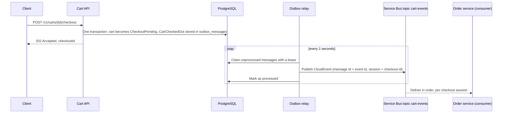

# Abysalto Web Shop – Architecture Proposal and Cart API

This repository contains the solution to the Abysalto Senior Backend Developer technical task.

| Part | Location | Status |
| --- | --- | --- |
| High-level architecture and implementation strategy for a multi-channel retail platform (EU market, Croatia first) | [docs/architecture.md](docs/architecture.md) | Complete |
| Cart Web API (reference implementation of one service from the architecture) | `src/` | Complete |

## Architecture document

The document describes the target system for a retail platform that serves millions of users a day
through a web shop, mobile apps, marketplace integrations, and B2B integrations. It covers the
architecture view, key components, scaling, security, external integrations (including Croatian
fiscalization), monitoring, and the code delivery plan. A decision log records each load-bearing
decision with its reason, the rejected alternative, and the condition to revisit it.

GitHub renders the diagrams in the Markdown file. To read the document with its diagrams outside GitHub,
open [docs/architecture.html](docs/architecture.html) in a browser (it needs an internet connection to load
the Markdown and Mermaid renderers). The Markdown file is the source; the HTML file is a rendered copy.

## Cart API

The Cart API is one service of the platform described in the architecture document, built with .NET 10.
It is deliberately small in scope and deliberately complete in operation: one aggregate and a handful of use
cases, but with the parts that decide whether a service survives production (see the table below).

| The architecture document decides | Where the Cart API does it |
| --- | --- |
| PostgreSQL owned by the service | [Database and migrations](#database-and-migrations): PostgreSQL 17 with Entity Framework Core, optimistic concurrency, constraints in the database |
| Redis cache-aside that the service survives without | [Caching with Redis](#caching-with-redis) |
| Events through a transactional outbox to Service Bus, CloudEvents | [Checkout and the outbox](#checkout-and-the-outbox) |
| Customers and guests, identity from Entra External ID | [Authentication](#authentication) and [Guest carts and merging](#guest-carts-and-merging) |
| Safe retries and protection from noisy clients | [Safe retries with idempotency keys](#safe-retries-with-idempotency-keys) and [Rate limiting](#rate-limiting) |
| Health checks for the orchestrator | [Health checks](#health-checks) |
| OpenTelemetry to Azure Monitor | [Observability](#observability) |
| Trunk-based development, CI on every pull request | [Build, test and CI](#build-test-and-ci) |

### Prerequisites

- .NET 10 SDK (see `global.json`)
- Docker (the integration tests start PostgreSQL, Redis and the Azure Service Bus emulator with Testcontainers)
- About 3 GB of free memory for Docker: the Service Bus emulator needs a SQL Server

### Run with Docker Compose

```bash
docker compose up --build
```

This starts PostgreSQL 17, Redis, the Azure Service Bus emulator (with its SQL Server), the Aspire Dashboard, and
the API in the Development environment. The API applies the database migrations when it starts and answers on
http://localhost:8080. The first start downloads about 2 GB of images, and the emulator needs up to a minute
to become ready; the relay keeps retrying until it is. Stop and remove everything, including the database
volume, with `docker compose down -v`.

On the very first start the log shows one `fail:` entry for `SELECT ... FROM "__EFMigrationsHistory"`. That is
Entity Framework Core checking its history table in a new database, just before it creates the table. It is
expected and not an error of the service.

### Try the API

Open the interactive documentation at **http://localhost:8080/scalar** (the OpenAPI document is at
http://localhost:8080/openapi/v1.json). Both exist only in the Development environment.

**As a signed-in customer.** In Development, `POST /dev/token` stands in for the identity provider and issues a
token for any customer id. Paste the token into the Bearer field of Scalar, or use curl:

```bash
TOKEN=$(curl -s -X POST http://localhost:8080/dev/token -H "Content-Type: application/json" \
  -d '{"customerId":"3f2b8d9e-5c1a-4e7b-9a62-0d4f1c7e8a11"}' | sed -E 's/.*"accessToken":"([^"]+)".*/\1/')

curl -s -X POST http://localhost:8080/v1/carts -H "Authorization: Bearer $TOKEN"
curl -s -X POST http://localhost:8080/v1/carts/<cart id>/items -H "Authorization: Bearer $TOKEN" \
  -H "Content-Type: application/json" -d '{"productId":"tee-blue-m","quantity":2}'
curl -s -X POST http://localhost:8080/v1/carts/<cart id>/checkout -H "Authorization: Bearer $TOKEN"
```

After the checkout, see that the event was published and the outbox row is processed:

```bash
docker compose logs api | grep Published
docker compose exec postgres psql -U cart -d cartservice -c "SELECT type, attempts, processed_at FROM outbox_messages"
```

Look at the cache and at readiness:

```bash
docker compose exec redis redis-cli --scan --pattern 'cart:*'
curl -s http://localhost:8080/health/ready
```

Stop Redis with `docker compose stop redis` and everything above keeps working, only the readiness report says
`Degraded`. Start it again with `docker compose start redis`.

See what the service did at **http://localhost:18888** (the Aspire Dashboard): every request is a trace, and the
trace of the checkout continues in the span that publishes the event. See [Observability](#observability).

**As a guest.** `POST /v1/carts` without a token creates a guest cart and returns a `guestToken` once. Send it
in the `X-Cart-Token` header on every later request for that cart.

The sample products are `tee-blue-m`, `tee-blue-l`, `hoodie-grey-m`, `cap-red`, `socks-wool`, `belt-leather`,
`mug-white`, and `notebook-a5` (see `ProductCatalog` in `src/CartService.Api/appsettings.json`).

### Endpoints

| Endpoint | Who | Result |
| --- | --- | --- |
| `POST /v1/carts` | Customer or anonymous | Customer: 201 with the cart, or 200 when they already have an active cart. Anonymous: 201 with a guest cart and its `guestToken` |
| `GET /v1/carts/me` | Customer | The active cart, or 404 |
| `GET /v1/carts/{cartId}` | Owner | The cart. A missing cart and somebody else's cart both give 404 |
| `POST /v1/carts/{cartId}/items` | Owner | Adds a product; the name and price come from the catalog. Send an `Idempotency-Key` header to make the request safe to repeat |
| `PUT /v1/carts/{cartId}/items/{productId}` | Owner | Sets the quantity |
| `DELETE /v1/carts/{cartId}/items/{productId}` | Owner | 204, also when the product is not in the cart |
| `POST /v1/carts/{cartId}/checkout` | Customer who owns the cart | 202 with the `checkoutId`; the cart becomes read-only and the `CartCheckedOut` event is published. Repeating it returns the same id |
| `POST /v1/carts/me/merge` | Customer, plus the guest's `X-Cart-Token` | The customer's cart after the guest cart was merged into it |
| `POST /dev/token` | Anyone, Development only | A token for a customer id |
| `GET /health/live` | Anyone | Liveness: the process answers. It runs no checks |
| `GET /health/ready` | Anyone | Readiness: 200 when healthy or degraded, 503 when the database is down. See below |

### Guest carts and merging

A visitor can shop without an account. When they sign in, the items of the guest cart move into their customer cart:

```bash
GUEST=$(curl -s -X POST http://localhost:8080/v1/carts)          # contains "guestToken" and the cart
# ... add products to the guest cart with the X-Cart-Token header, then sign in and merge:
curl -s -X POST http://localhost:8080/v1/carts/me/merge \
  -H "Authorization: Bearer $TOKEN" -H "X-Cart-Token: <guestToken>"
```

| Rule | Behavior |
| --- | --- |
| Two proofs | The customer's bearer token says who receives the items; the guest token says which cart gives them away. Without the guest header the answer is 400, without a customer 401, with an unknown token 404 |
| Same product in both carts | Quantities add up, at most 20; the customer's name and price win |
| No active customer cart | A new one is created for the merge |
| Too many products | More than 50 different products: 422, and neither cart changes |
| After the merge | The guest cart is read-only (status `Merged`) |
| Repeating the request | Changes nothing and returns the customer's cart, so a client that lost the answer can retry without doubling the quantities |
| Merged already, then somebody else sends the token | The second customer's cart is returned unchanged: nothing is taken from a merged guest cart |
| Parallel requests | One wins; the others get 409 or the same answer as a repeat. The items are never doubled |

### Checkout and the outbox

Checkout must tell the Order service, and it must do so exactly when the checkout really happened. Writing to
the database and publishing to a message broker cannot share one transaction, so the service uses the
**transactional outbox** pattern:



| Question | Answer |
| --- | --- |
| Can an event exist for a checkout that did not happen? | No. The event is written in the same transaction as the cart change; if the save fails, neither exists |
| Can a checkout lose its event? | No. If the broker is down, the message stays in the table and is retried with a growing delay, up to 10 attempts, then it stays with its error and an error log |
| Can an event be published twice? | Yes, rarely: if the relay stops after publishing but before it marks the message. The message id is the event id, so the broker drops duplicates within its window, and consumers skip event ids they have seen (at-least-once delivery) |
| Can two relays publish the same message? | No. A relay claims a message with a lease (`FOR UPDATE SKIP LOCKED`); a relay that dies loses its messages when the lease expires |
| In which order are events handled? | All events of one checkout share a Service Bus session (the checkout id), so one consumer handles them in order |

The event is a CloudEvents 1.0 document in structured JSON mode; see `CartCheckedOut` in
`src/CartService.Application/Events` and the end-to-end test `CheckoutEventEndToEndTests`.

### Safe retries with idempotency keys

Adding a product twice is not the same as adding it once, so a client that does not get an answer, for example
because the connection broke, cannot just send the request again. It sends the same request with an
`Idempotency-Key` header (1 to 128 characters: letters, digits, `-`, `_`, `.`, `:`; a UUID is fine). The header is
optional; without it every request is carried out.

```bash
curl -s -X POST http://localhost:8080/v1/carts/<cart id>/items -H "Authorization: Bearer $TOKEN"   -H "Idempotency-Key: 6f1d2c9e-0b8a-4c55-9a43-1e7f5b2d8c10"   -H "Content-Type: application/json" -d '{"productId":"cap-red","quantity":1}'
```

Send it again and the cap is not added a second time: the answer of the first request comes back, with the header
`Idempotent-Replayed: true`.

| Situation | Answer |
| --- | --- |
| First request with a key | Carried out; a successful answer is stored for 24 hours |
| Same key and same request again | The stored answer, `Idempotent-Replayed: true`. Nothing changes |
| Same key, different body or cart | 422 `idempotency.key_reused` |
| Same key while the first request still runs | 409 `idempotency.request_in_progress` with `Retry-After` |
| The first request failed (validation, unknown product, conflict, error) | The key is given back; the client can fix the request and use the same key |

Keys belong to the requester: two customers (or a customer and a guest) can use the same key without seeing
each other's answers. The records live in the `idempotency_records` table. The claim is one
`INSERT ... ON CONFLICT DO NOTHING`, so the database decides which of several parallel requests wins, with any
number of service instances. A request that dies while it runs holds its key for at most 30 seconds
(`Idempotency:InProgressLease`); a stored answer is kept for `Idempotency:Retention` (24 hours).

One limit is accepted on purpose: the cart change and the stored answer are two separate database writes. If
the service dies exactly between them, the key frees itself after the lease and a repeat would add the product
again. Writing both in one transaction would close that gap; for a shopping cart, where the customer sees the
result and can correct it, that was not worth the coupling. Checkout and merging need no key because they are
idempotent by their state (see the sections above).

### Rate limiting

Every requester has a token bucket, so one client that loops or abuses the API cannot use up the service for
others. A signed-in customer is limited by customer id; everybody else is limited by IP address, because a guest
cart token cannot be trusted as a key before it is checked (a client could invent a new one for every request).

| Bucket | Used for | Burst | Sustained |
| --- | --- | --- | --- |
| Normal | All cart endpoints | 60 | 10 per second |
| Strict | Checkout and creating a cart, which an anonymous visitor can do without any proof | 10 | 10 per minute |

A request over the limit answers 429 with problem details (`code` `rate_limit.exceeded`) and a `Retry-After`
header in seconds. Health checks are not limited. The numbers are in the `RateLimiting` section of
`appsettings.json`; `RateLimiting:Enabled` switches the limits off, which the integration tests do. Behind a
reverse proxy or ingress, set `ASPNETCORE_FORWARDEDHEADERS_ENABLED=true` so the limit sees the address of the
client and not the address of the proxy. The edge of the platform (Front Door and API Management) is still the
place that stops floods; this limit protects the service itself.

### Caching with Redis

Reading a cart is by far the most common request, so `GET /v1/carts/{id}` and `GET /v1/carts/me` are served
from Redis when they can be. PostgreSQL stays the only source of truth: a cart is never changed in the cache,
only read into it.

| Topic | Decision |
| --- | --- |
| Pattern | Cache-aside. A miss reads PostgreSQL and stores the cart for 60 seconds (`Cache:EntryLifetime`) |
| Writes | Every change reads the cart from PostgreSQL, saves it, and then removes the cached cart (the merge removes both carts, checkout also the customer's active cart). The next read loads the new state. A change that fails to save leaves the cache alone |
| Privacy | The owner is stored with the cart and checked on every cache hit, so a hit gives the same 404 as the database does. Only the hash of a guest token is stored |
| Keys | `cart:v1:id:<id>` and `cart:v1:customer:<customer id>` (the active cart only). The version in the key means a release that changes the entry never reads entries of the old release |
| Redis is slow or down | Every call has a timeout of 300 ms (`Cache:Timeout`) and a circuit breaker: after repeated failures the cache is skipped for 15 seconds (`Cache:BreakDuration`). A failure is the same as a miss, so no request fails or waits because of Redis. The service starts without Redis |
| No cache configured | Leave `Cache:ConnectionString` empty and every read goes to PostgreSQL |

One window is accepted on purpose: if Redis is unreachable when a cart changes, the cached copy cannot be
removed. If the same Redis comes back with its old data, a client can read the old cart for at most
`Cache:EntryLifetime` (60 seconds). Writes are never affected, because they always start from PostgreSQL and the
cart version rejects a stale write. A shorter lifetime narrows the window; a cart is small, so the price of a
shorter one is only more reads from PostgreSQL.

In production Redis is Azure Cache for Redis. Its connection string comes from Key Vault like the other secrets.

### Health checks

`/health/live` only says that the process answers. A dependency that is down must never restart the service,
because a restart does not bring the dependency back.

`/health/ready` decides whether the service gets traffic and lists every check by name and status, never an
exception or an address:

| Check | If it fails | Why |
| --- | --- | --- |
| `postgres` | Unhealthy, HTTP 503 | The service cannot do anything without its database |
| `redis` | Degraded, HTTP 200 | The service works without the cache, only slower. Taking it out of rotation would turn a slowdown into an outage |
| `outbox` | Degraded, HTTP 200 | Events wait longer than `Outbox:DegradedAfter` (1 minute) or ran out of attempts, so Service Bus or the relay has a problem. Carts keep working and no event is lost |

The service may only send to Service Bus and the emulator has no management API, so it cannot ask Service Bus
whether it is reachable. The age of the oldest waiting event in the outbox answers the question that matters:
do events reach the Order service.

### Observability

The service produces traces, metrics and logs with OpenTelemetry. Docker Compose starts the Aspire Dashboard and
sends everything to it; open http://localhost:18888.

| Signal | What is collected |
| --- | --- |
| Traces | Every request (named after its route, never after the path with ids), its PostgreSQL calls, the Service Bus send, the HTTP client, and the cart's own spans: publishing an outbox message and a cleanup run. Health probes are not traced |
| Metrics | ASP.NET Core, runtime, Npgsql and rate limiting, plus `cartservice.carts.created`, `items.added`, `checkouts`, `merges`, `cache.lookups` (hit or miss), `idempotency.requests` (by outcome), `outbox.published` (by result), `outbox.publish.duration` and `cleanup.deleted` |
| Logs | Console logs in Development; one JSON document per line elsewhere, which the platform collects from standard output. With an OTLP endpoint the logs are exported too |

How it is switched on: the service always produces the data, and it leaves the process only when
`OTEL_EXPORTER_OTLP_ENDPOINT` is set, so a run without a collector has no export errors. In Azure the endpoint is a
collector that feeds Azure Monitor, as the architecture document describes.

- **One trace for a checkout.** The event stores the `traceparent` of the request that wrote it (the CloudEvents
  distributed tracing extension). The relay publishes in a span that joins that trace, so one trace shows the
  request, the failed and successful publish attempts, and, once the Order service reads the same attribute, the
  order that follows.
- **No secrets in telemetry.** The instrumentation does not record headers, and a test checks that no span holds
  a bearer token or a guest token.
- **No noise.** A database call that belongs to no trace (the relay polling every two seconds, startup) is
  dropped by a sampler, so the dashboard shows the traces of requests and jobs and not thousands of one-query
  traces. A query inside a request, a published message or a cleanup run has a parent and is kept.

### Housekeeping

Without cleanup the tables only grow. A background job runs one minute after startup and then every hour
(`Cleanup` section of `appsettings.json`):

| Deleted | When |
| --- | --- |
| Active guest carts | Nobody changed them for 30 days (`GuestCartIdleAfter`) |
| Guest carts that were merged | 7 days after the merge (`MergedCartRetention`), long enough for a client to repeat the merge request |
| Outbox messages | Published more than 7 days ago (`ProcessedOutboxRetention`); unpublished messages are never deleted |
| Idempotency records | Expired |

Customer carts are never deleted, whatever their age or status. Rows go in batches of 1000, so a large backlog never
holds a long lock. Deleting is idempotent, so several instances that clean at the same time only repeat work; a
failed run is logged and the next interval tries again. `Cleanup:Enabled` turns the job off, and the job counts
what it deleted in `cartservice.cleanup.deleted`.

### Authentication

| Who | How |
| --- | --- |
| Customer | A bearer token. The customer id is the `oid` claim, not `sub`, because Entra External ID gives one customer a different `sub` in every app. Production trusts the identity provider in `Authentication:Authority`; Development and tests use a local signing key |
| Guest | The `X-Cart-Token` header. The token is 256 random bits, shown once; only its SHA-256 hash is stored |

The service refuses to start in production without an authority, and refuses a development signing key there.
In production the service also reaches Service Bus with its workload identity (`ServiceBus:FullyQualifiedNamespace`),
so no connection string or secret is needed.

### Business rules and error codes

A cart holds at most 20 units of one product and at most 50 different products. A customer has one active
cart. Errors are RFC 7807 problem details with a stable `code`:

| Status | When | `code` |
| --- | --- | --- |
| 400 | Invalid input, for example a quantity outside 1 to 20 | Validation errors per field |
| 401 | No valid bearer token or cart token | |
| 404 | The cart does not exist or belongs to somebody else | `cart.not_found` |
| 409 | Two requests changed the same cart at once; read it again and retry | `cart.concurrency_conflict` |
| 409 | A request with the same `Idempotency-Key` is still running; wait for `Retry-After` | `idempotency.request_in_progress` |
| 422 | A business rule is broken | `cart.product_not_found`, `cart.quantity_out_of_range`, `cart.item_limit_exceeded`, `cart.item_not_found`, `cart.not_active`, `cart.empty`, `cart.checkout_requires_customer` |
| 422 | An `Idempotency-Key` was already used for a different request | `idempotency.key_reused` |
| 429 | Too many requests; wait for `Retry-After` | `rate_limit.exceeded` |

### Run the API from the command line

```bash
docker compose up -d postgres redis servicebus-emulator
dotnet run --project src/CartService.Api
```

The API listens on http://localhost:5080 and uses the connection strings in
`src/CartService.Api/appsettings.Development.json`, which point to the containers above. It exports no telemetry
unless `OTEL_EXPORTER_OTLP_ENDPOINT` is set (to send it to the dashboard, publish its port 18889 in
`docker-compose.yml` and set the variable to `http://localhost:18889`).

### Build, test and CI

```bash
dotnet build CartService.slnx
dotnet test --solution CartService.slnx
```

The integration tests need Docker. They start PostgreSQL, Redis and the Service Bus emulator, apply the real
migrations, run the API in memory against them, and remove the containers when the tests finish. They include a
Redis that is stopped and started again, a cleanup of every kind of row, and the traces of a checkout.

GitHub Actions (`.github/workflows/ci.yml`) runs on every pull request: restore (NuGet Audit reports vulnerable
packages), build with warnings as errors, `dotnet format --verify-no-changes`, the whole test suite, and a build of
the Docker image. Development is trunk-based: a short branch, small commits that each build and pass the format
check, a pull request, green CI, squash merge.

### Database and migrations

| Topic | Decision |
| --- | --- |
| Schema | `carts`, `cart_items`, `outbox_messages`, and `idempotency_records`, created by Entity Framework Core migrations in `src/CartService.Infrastructure/Persistence/Migrations` |
| Integrity in the database | One owner per cart, quantity between 1 and 20, and one active cart per customer (partial unique index) |
| Concurrent changes | Every change increments the cart version; a write based on an old version is rejected and becomes HTTP 409 |
| Applying migrations | `Database:ApplyMigrationsOnStartup` is on for Docker Compose and local runs, and off by default so that production applies migrations in the delivery pipeline |

Create a new migration after a model change:

```bash
dotnet tool restore
dotnet dotnet-ef migrations add <Name> --project src/CartService.Infrastructure --output-dir Persistence/Migrations
```

### Solution structure

| Project | Responsibility |
| --- | --- |
| `src/CartService.Domain` | Cart aggregate and business rules, no dependencies |
| `src/CartService.Application` | Use cases (one handler per use case), integration events, ports, and the telemetry instruments |
| `src/CartService.Infrastructure` | PostgreSQL, idempotency store, outbox and relay, Service Bus publisher, Redis cache, cleanup job, health checks, product catalog stand-in, guest tokens |
| `src/CartService.Api` | Host, Minimal API endpoints, authentication, idempotency filter, rate limiting, OpenTelemetry, OpenAPI, health endpoints |
| `tests/CartService.Domain.Tests` | Unit tests of the business rules |
| `tests/CartService.Application.Tests` | Unit tests of the handlers, with in-memory fakes |
| `tests/CartService.Architecture.Tests` | Enforces the allowed dependencies between layers |
| `tests/CartService.Api.IntegrationTests` | The API over HTTP against real containers: PostgreSQL, Redis and the Service Bus emulator |

### What was left out, and why

This is a reference implementation of one service, not the platform. These are known gaps, each on purpose:

| Left out | Why |
| --- | --- |
| Consuming `OrderConfirmed` and `CheckoutFailed` (the second half of the checkout saga) | The Order service does not exist here. The cart stays `CheckoutPending`; the architecture document describes the saga |
| A real Catalog and Pricing service | `IProductCatalog` is the port; a configured list of eight products stands in. Prices are copied into the cart at the moment of adding |
| A real Entra External ID tenant | The service validates tokens against `Authentication:Authority` in production. Development uses `POST /dev/token` and a local signing key, which production refuses |
| Kubernetes manifests, Argo CD, Azure resources | They belong to the platform repositories of the delivery plan, not to one service |
| Redis authentication and TLS | Local Redis is open on purpose. Azure Cache for Redis is configured through the connection string from Key Vault |
| Other currencies | The launch market is the euro area, and `Money` is EUR only |
| Stock reservation and availability | The Inventory service owns it. The cart does not promise stock |
| Load testing at scale | The tests prove the behavior (parallel requests, a Redis outage, a broker outage); capacity needs a real environment |
