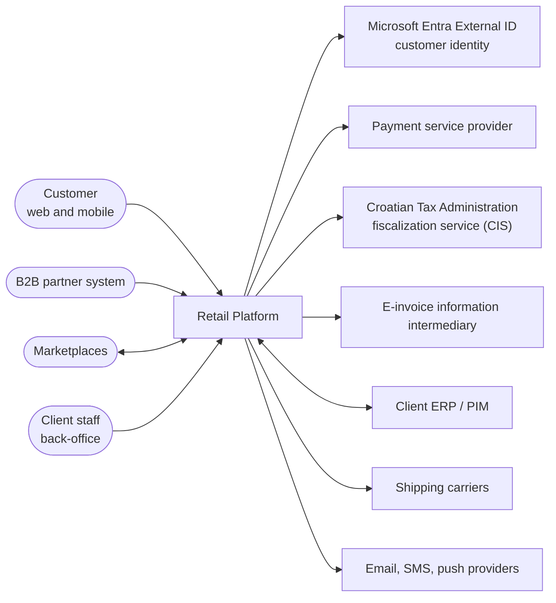
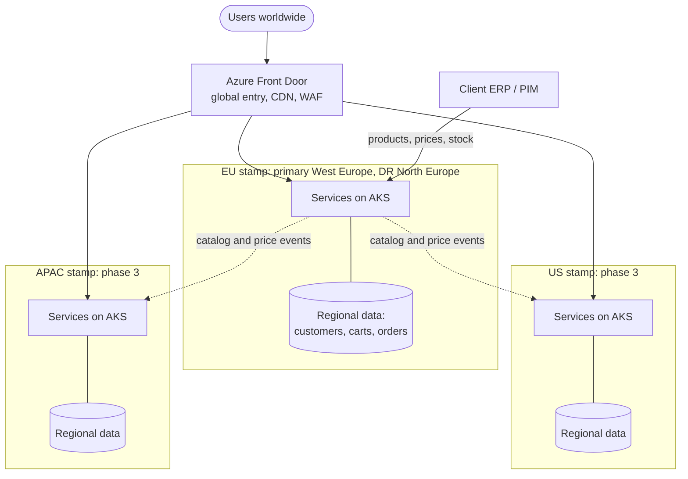
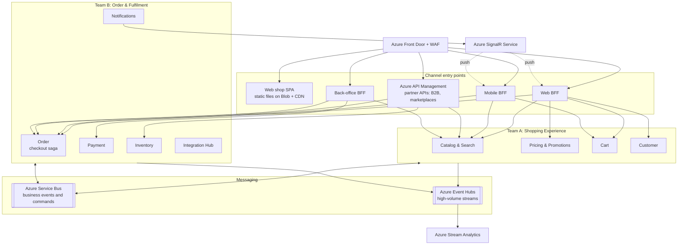

# Global Retail Platform: High-Level Architecture and Implementation Strategy

| | |
| --- | --- |
| Author | Robert Miani |
| Status | Proposal for review |
| Audience | Client technical stakeholders, delivery teams |
| Reference implementation | Cart API in this repository (`src/`) |

## Contents

1. [Purpose, scope, and assumptions](#1-purpose-scope-and-assumptions)
2. [Architecture drivers and principles](#2-architecture-drivers-and-principles)
3. [Architecture view](#3-architecture-view)
4. [Key components and responsibilities](#4-key-components-and-responsibilities)
5. [Component communication](#5-component-communication)
6. [Main technology choices](#6-main-technology-choices)
7. [Scaling strategy](#7-scaling-strategy)
8. [Real-time data processing](#8-real-time-data-processing)
9. [Security and authentication](#9-security-and-authentication)
10. [Integration with external services](#10-integration-with-external-services)
11. [Monitoring and alerting](#11-monitoring-and-alerting)
12. [Code delivery plan](#12-code-delivery-plan)
13. [Implementation roadmap](#13-implementation-roadmap)
14. [Architecture decision log](#14-architecture-decision-log)
15. [Risks and open questions](#15-risks-and-open-questions)
16. [Reference implementation: Cart API](#16-reference-implementation-cart-api)

---

## 1. Purpose, scope, and assumptions

### 1.1 Purpose

This document proposes the high-level design and the implementation strategy for an online retail
platform. The client sells on a global market and serves millions of users a day. The platform sells
products through four channels:

- Web shop
- Mobile apps (iOS, Android)
- Marketplace integrations (for example Amazon, eBay, regional marketplaces)
- B2B integrations (partner systems that order through an API)

The client's key requirements are:

1. Scalability and support for high traffic (millions of users a day).
2. Secure transactions and protection of personal data.
3. Real-time data processing.

Two cross-functional teams will build and run the platform.

### 1.2 Scope

In scope: the platform backend, the channel-facing APIs, integrations with external systems, the
runtime platform, security, observability, and the delivery process.

Out of scope: visual design of the web and mobile clients, the internal design of the client's ERP/PIM,
and data warehouse and BI design beyond the real-time event feed.

### 1.3 Assumptions

The load figures below are estimates. They set the order of magnitude that the design must handle.
They must be replaced with the client's real numbers in the first weeks of the project.

| Metric | Assumption | Derived value |
| --- | --- | --- |
| Daily active users | 5 million, across all regions | |
| API calls per active user per day | about 40 (browse, search, cart, account) | about 200 million calls/day, about 2,300 requests/s average |
| Daily peak factor | 3x average (evening peak per region) | about 7,000 requests/s |
| Campaign peak factor (Black Friday, launches) | a further 3x | about 20,000 requests/s at the edge |
| Share served by CDN cache | 60% to 70% (static assets, images, cached catalog pages) | 6,000 to 8,000 requests/s reach the origin at campaign peak |
| Orders per day | 2% to 3% conversion, about 120,000 orders/day | about 1.5 orders/s average, 200 to 300 orders/s at campaign peak |
| Cart writes per day | about 5 million | about 60/s average, about 1,000/s at campaign peak |
| Catalog size | 0.5 to 2 million SKUs | |

Other assumptions:

- The client's ERP/PIM is the master system for products, base prices, and physical stock (see [section 4](#4-key-components-and-responsibilities)).
- The platform owns promotions, available-to-sell stock, carts, orders, and customer profiles.
- The first market is the EU, with Croatia as a launch country. The US and APAC follow.
- Card payments go through an external payment service provider (PSP). The platform never stores card data.
- The client uses Microsoft Entra ID for its own staff.

## 2. Architecture drivers and principles

### 2.1 Quality attributes

The quality attributes are ranked. When two attributes conflict, the higher one wins.

| Rank | Quality attribute | Target |
| --- | --- | --- |
| 1 | Availability of the purchase path (browse, cart, checkout) | 99.95% per month per region |
| 2 | Security and compliance (PCI DSS, GDPR, fiscal law) | No card data in platform scope; personal data stays in the customer's home region |
| 3 | Elasticity | Absorb a 10x traffic increase within minutes without manual action |
| 4 | Data freshness | Stock and price changes visible in all channels within 5 s (p95) |
| 5 | Latency | Channel API p95 below 300 ms for reads and below 800 ms for checkout steps |
| 6 | Team autonomy | Each team deploys its services independently, several times a day |
| 7 | Cost efficiency | Infrastructure cost scales with traffic, not with peak capacity |

### 2.2 Principles

Every decision in this document can be checked against these principles:

1. **Services own their data.** Each service has its own database. No service reads another service's
   database. Data is shared through APIs and events.
2. **Asynchronous by default between services.** A service calls another service synchronously only when
   the user waits for the answer and the data cannot be held locally.
3. **Stateless compute.** State lives in managed data stores. Any instance can serve any request, so the
   platform scales by adding instances.
4. **Design for failure.** Every external call has a timeout, a retry policy, and a fallback. A failure in
   one service or partner does not stop checkout.
5. **Secure by default.** Every request is authenticated. Services use private networking and managed
   identities. Secrets never appear in code or configuration files.
6. **Managed services first.** Two teams cannot operate brokers, databases, and identity servers. The
   platform uses managed Azure services, and the teams spend their time on business features.
7. **Everything as code.** Infrastructure, pipelines, dashboards, and alerts live in the repository and
   change through reviewed pull requests.

## 3. Architecture view

### 3.1 System context

The diagram shows the platform, the people and systems that use it, and the external systems it depends on.

### 3.2 Global topology

The platform runs as independent **regional deployment stamps**. A stamp is a complete copy of the
platform in one Azure region, with its own compute, databases, and messaging. Stamps share no runtime
state, so a failure in one stamp does not affect the others.

- **Azure Front Door** is the single global entry point. It routes anonymous traffic to the nearest stamp.
- Each customer gets a **home stamp** at registration, based on the customer's country. The home stamp
  holds all personal data for that customer. The home stamp ID is a claim in the customer's token, and
  Front Door routes authenticated traffic to that stamp.
- **Catalog and price data** are replicated to all stamps as events, because every region sells the same products.
- Each stamp has a **paired disaster-recovery region** with database geo-replicas.

The region names are examples. The final choice depends on latency tests and on the availability of
all required Azure services in the region.

### 3.3 Container view of one stamp

The diagram shows the main runtime components inside one stamp and how they connect.

Each service has its own data store. The data stores are listed in [section 4](#4-key-components-and-responsibilities)
and left out of this diagram for readability.

## 4. Key components and responsibilities

### 4.1 Channel entry points

| Component | Responsibility | Owner |
| --- | --- | --- |
| Azure Front Door + WAF | Global entry point. TLS termination, CDN caching, web application firewall, DDoS protection, routing to the home or nearest stamp. | Platform (shared) |
| Web BFF | API for the web shop. Aggregates data from several services into one response per page. Runs the login flow and keeps tokens server-side; the browser only gets an HTTP-only session cookie. | Team A |
| Mobile BFF | API for the mobile apps. Payloads shaped for mobile screens, API versioning that supports old app versions in the stores. | Team A |
| Azure API Management | Public partner API for B2B partners and marketplaces. Partner onboarding, subscription keys, OAuth2 client credentials, quotas, rate limits, developer portal. | Team B |
| Back-office BFF | API for the back-office portal used by client staff: merchandising, order management, refunds, customer service. Staff log in with the client's Entra ID workforce tenant. Each team owns its own portal modules. | Team B hosts; both teams contribute |

### 4.2 Domain services

| Service | Responsibility | Owner | Data store | Load profile |
| --- | --- | --- | --- | --- |
| Catalog & Search | Product data for the channels: descriptions, attributes, categories, media, search, filters. Imports master data from ERP/PIM through the Integration Hub. Publishes product changes. | Team A | PostgreSQL (product read model), Azure AI Search (search index), Blob (media) | Very read-heavy; most traffic is served from CDN and cache |
| Pricing & Promotions | Calculates the final price for a customer and channel: base price from ERP, price lists for B2B accounts, promotions, coupons. | Team A | PostgreSQL, Redis (price cache) | Read-heavy; called for every product list and cart |
| Cart | Holds the customer's cart across devices. Adds, updates, and removes items; merges an anonymous cart into the customer cart at login; hands the cart over to checkout. | Team A | PostgreSQL (source of truth), Redis (cache) | Write-heavy per user; large peaks in campaigns |
| Customer | Customer profile, addresses, consents (GDPR and marketing), preferences, wishlist, B2B company accounts (company, buyers, price list, credit terms). Stores the identity provider's user ID as a reference. Runs GDPR data export and erasure across the platform. | Team A | PostgreSQL | Moderate; read on login and checkout |
| Order | Runs checkout as an orchestrated saga: reserve stock, authorize payment, confirm order. Owns the order lifecycle after that (fulfilment status, cancellations, returns). | Team B | PostgreSQL | Write-heavy at peaks; must stay consistent |
| Payment | Integrates with the PSP. Creates payment sessions, handles authorization, capture, refund, and PSP webhooks. Stores PSP tokens and references, never card data. | Team B | PostgreSQL | Low volume, high criticality |
| Inventory | Available-to-sell stock per SKU and warehouse. Reserves stock for checkout with a time limit, releases or commits it. Receives physical stock from ERP. Publishes stock changes to all channels. | Team B | PostgreSQL, Redis (stock counters for hot SKUs) | Write-heavy on popular SKUs during campaigns |
| Integration Hub | All integrations with external systems behind an anti-corruption layer: fiscalization, e-invoicing, ERP/PIM, marketplaces, shipping carriers. One bounded context, deployed as several independent workers so a slow partner cannot block the others. | Team B | PostgreSQL (integration state, outbox, idempotency records) | Event-driven; spikes follow orders |
| Notifications | Sends email, SMS, and push messages. Pushes real-time updates (order status, stock) to open web and mobile sessions through Azure SignalR Service. | Team B | PostgreSQL (templates, delivery log) | Event-driven |

### 4.3 Team ownership

The teams are split by **value stream**. Each team owns a complete part of the customer journey,
so most features need only one team.

| Team | Value stream | Components |
| --- | --- | --- |
| Team A: Shopping Experience | Find a product, decide, put it in the cart, manage the account | Web BFF, Mobile BFF, Catalog & Search, Pricing & Promotions, Cart, Customer |
| Team B: Order & Fulfilment | Pay, receive the goods, get a valid receipt or invoice, return | API Management partner APIs, Back-office BFF, Order, Payment, Inventory, Integration Hub, Notifications |

Shared responsibilities, owned jointly with a named rotating owner per quarter:

- Platform infrastructure (AKS, networking, Terraform modules)
- Observability standards (OpenTelemetry setup, dashboards, alert rules)
- API and event contracts (review of breaking changes)

Customer identity is not a service we build. Microsoft Entra External ID provides sign-up, sign-in,
MFA, social login, and password reset (see [section 9](#9-security-and-authentication)).

---

## 5. Component communication

_To be written._

## 6. Main technology choices

_To be written._

## 7. Scaling strategy

_To be written._

## 8. Real-time data processing

_To be written._

## 9. Security and authentication

_To be written._

## 10. Integration with external services

_To be written._

## 11. Monitoring and alerting

_To be written._

## 12. Code delivery plan

_To be written._

## 13. Implementation roadmap

_To be written._

## 14. Architecture decision log

_To be written._

## 15. Risks and open questions

_To be written._

## 16. Reference implementation: Cart API

_To be written._
