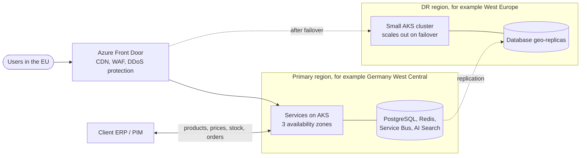
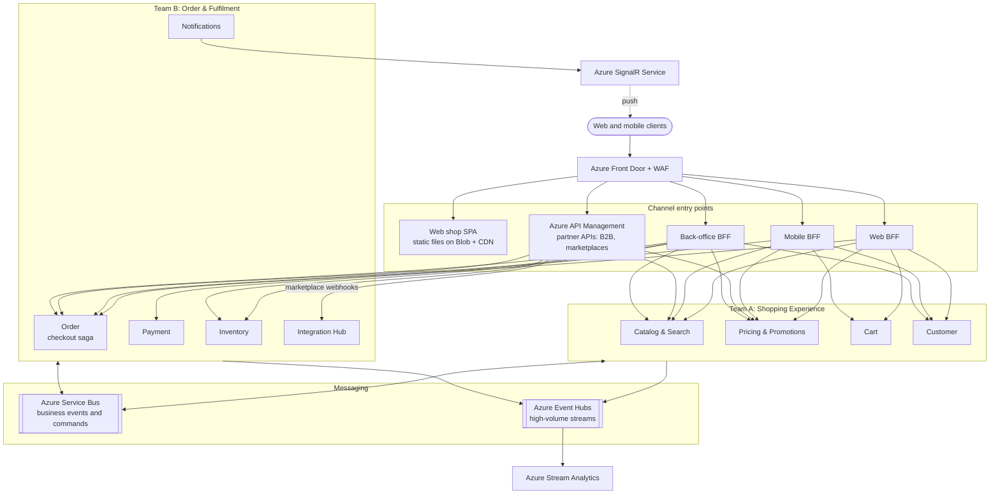
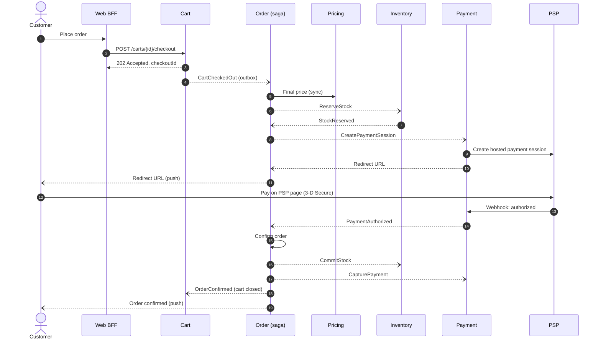
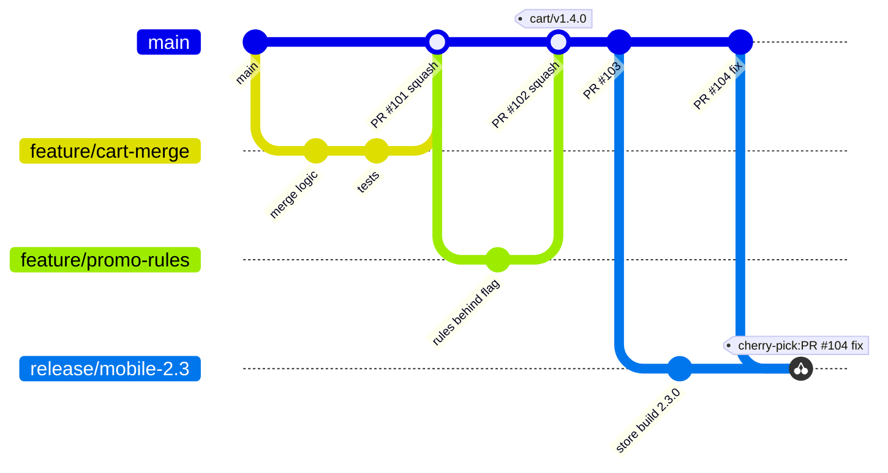
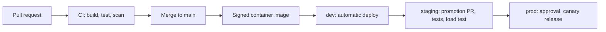

# Retail Platform: High-Level Architecture and Implementation Strategy

| | |
| --- | --- |
| Author | Robert Miani |
| Status | Proposal for review |

## Contents

1. [Purpose, scope, and assumptions](#1-purpose-scope-and-assumptions)
2. [Architecture drivers](#2-architecture-drivers)
3. [Architecture view](#3-architecture-view)
4. [Key components and responsibilities](#4-key-components-and-responsibilities)
5. [Component communication](#5-component-communication)
6. [Main technology choices](#6-main-technology-choices)
7. [Scaling strategy](#7-scaling-strategy)
8. [Real-time data processing](#8-real-time-data-processing)
9. [Security and authentication](#9-security-and-authentication)
10. [Integration with external services](#10-integration-with-external-services)
11. [Monitoring and alerting](#11-monitoring-and-alerting)
12. [Code delivery plan](#12-code-delivery-plan)
13. [Key decisions](#13-key-decisions)

---

## 1. Purpose, scope, and assumptions

This document proposes the high-level design and the implementation strategy for an online retail platform
that serves millions of users a day through four channels: a web shop, mobile apps, marketplace integrations,
and B2B integrations. The client's key requirements are scalability under high traffic, secure transactions
and data protection, and real-time data processing. Two cross-functional teams will build and run the platform.

**Scope.** The platform backend, channel APIs, external integrations, runtime platform, security,
observability, and delivery process. The design of the web and mobile clients and of the client's ERP/PIM
(enterprise resource planning and product information management) system is out of scope.

**Assumptions.** The numbers are estimates that set the order of magnitude, to be replaced with real data
at the start of the project.

| Metric | Estimate |
| --- | --- |
| Daily active users | 5 million across the EU |
| Requests | about 2,300/s on average, about 20,000/s at the edge during campaigns, of which 60% to 70% is served from the content delivery network (CDN) |
| Orders | about 120,000/day; about 40/s sustained at campaign peak, short bursts up to 300/s |
| Catalog | 0.5 to 2 million SKUs (stock keeping units) |

- The platform sells in the EU. Croatia is the launch country; other EU countries follow.
- The ERP/PIM is the master for products, base prices, and physical stock. The platform owns promotions,
  available-to-sell stock, carts, orders, and customer profiles.
- Card payments go through an external payment service provider (PSP). The platform never stores card data.

## 2. Architecture drivers

The drivers are ranked. When two of them conflict, the higher one wins.

1. **Availability of the purchase path** (browse, cart, checkout): 99.95% per month. A failing service or
   partner must not stop checkout, so every external call has a timeout, a retry policy, and a fallback.
2. **Security and compliance** (PCI DSS, GDPR, fiscal law): no card data in the platform, all data in the EU,
   every request authenticated, private networking, and no secrets in code.
3. **Elasticity**: absorb a 10x traffic increase within minutes. Services are stateless, so the platform
   scales by adding instances.
4. **Data freshness**: 99% of stock and price changes visible in all channels within 5 seconds. Services own
   their data and share it through events.
5. **Team autonomy and focus**: each team deploys its services independently, several times a day. The teams
   spend their time on business features, not on running brokers, databases, and identity servers, so the
   platform uses managed Azure services, and everything (infrastructure, pipelines, alerts) is code.

## 3. Architecture view

### 3.1 Deployment topology

The platform runs on Azure Kubernetes Service (AKS) in **one primary Azure region in the EU**, spread over three availability zones, with a
**warm disaster recovery (DR) region** in another EU country. From one central region, every EU user is within
about 50 ms. **Azure Front Door** is the entry point: it serves cached content from edge locations across
Europe, filters traffic with its web application firewall (WAF), and routes requests to the active region.

The region names are examples, to be confirmed by latency tests and service availability.

### 3.2 Container view

All components in the diagram, with their data stores, are described in [section 4](#4-key-components-and-responsibilities).

## 4. Key components and responsibilities

**Channel entry points**

| Component | Responsibility |
| --- | --- |
| Azure Front Door | Single entry point for all channels: TLS, CDN caching, WAF, DDoS protection, routing to the active region. |
| Web shop SPA | The web shop as a single-page application (SPA). Its static files (HTML, JavaScript, CSS, images) are stored in Blob Storage and served from the Front Door CDN, so loading the shop puts no load on the services. |
| Web BFF and Mobile BFF (Backend for Frontend) | One API per first-party channel. Aggregate data from several services per screen. The Web BFF runs the login flow and keeps tokens server-side. |
| Azure API Management | Partner API for B2B partners and marketplaces: onboarding, OAuth2, keys, quotas, developer portal. |
| Back-office BFF | API for the client's staff: merchandising, order management, refunds, customer service. |

**Domain services**

| Service | Responsibility | Data store | Team |
| --- | --- | --- | --- |
| Catalog & Search | Product data, categories, media, search; imports master data from the ERP/PIM | PostgreSQL, Azure AI Search, Blob Storage | A |
| Pricing & Promotions | Final price per customer and channel: price lists, promotions, coupons, VAT | PostgreSQL, Redis | A |
| Cart | Cart across devices; merges an anonymous cart at login; starts checkout | PostgreSQL, Redis cache | A |
| Customer | Profile, addresses, consents, B2B company accounts; GDPR export and erasure | PostgreSQL | A |
| Order | Checkout saga and order lifecycle for all channels | PostgreSQL | B |
| Payment | PSP integration: sessions, capture, refunds, webhooks; no card data | PostgreSQL | B |
| Inventory | Available-to-sell stock and reservations; publishes stock changes | PostgreSQL, Redis | B |
| Integration Hub | All external integrations behind an anti-corruption layer, one worker per connector | PostgreSQL | B |
| Notifications | Email, SMS, push messages, and real-time updates to open sessions | PostgreSQL | B |

**Messaging and real-time infrastructure**

| Component | Responsibility |
| --- | --- |
| Azure Service Bus | Business events and commands between services (for example `CartCheckedOut`, `StockChanged`, `OrderPaid`), with retries, dead-letter queues, and ordered processing per checkout. |
| Azure Event Hubs | High-volume event streams for analytics: clickstream, order, and payment events. |
| Azure Stream Analytics | Live metrics and fraud signals computed from the Event Hubs streams. |
| Azure SignalR Service | Pushes order status and stock updates to open web and mobile sessions, so services never hold client connections. |

These are shared components, owned jointly by both teams.

The teams are split by **value stream**, so most features need only one team. **Team A (Shopping
Experience)** owns finding a product, the cart, and the customer account, plus the web and mobile BFFs.
**Team B (Order & Fulfilment)** owns payment, delivery, receipts, and returns, plus API Management and the
back-office BFF. Customer identity is not built: Microsoft Entra External ID provides sign-up, sign-in, and MFA.

## 5. Component communication

- **Clients and partners** call the BFFs and API Management over HTTPS with JSON. Order status and stock
  updates are pushed to clients over WebSocket through Azure SignalR Service.
- **Synchronous calls between services** are used only when a user waits for an answer that must be exact at
  that moment, for example the final price at checkout. A service makes at most one such call per request.
- **Everything else is asynchronous.** Services publish events about their own data (`ProductChanged`,
  `StockChanged`, `OrderConfirmed`) to **Azure Service Bus**, and other services keep the local copy they need.
  High-volume streams for analytics (clickstream, order events) go to **Azure Event Hubs**.

**Reliability rules** in every service:

- **Transactional outbox**: a service saves its change and the outgoing event in one database transaction,
  so an event is never lost.
- **Idempotency**: consumers skip messages they have already processed, and write requests carry an
  `Idempotency-Key`, so a retry never creates a second order.
- **Dead-letter queue**: a message that still fails after retries is parked and raises an alert.
- **Contracts**: APIs are versioned (`/v1/...`) and events change only in backward-compatible ways.

**Checkout** crosses five services, so it runs as an **orchestrated saga** in the Order service, which stores
the saga state and runs compensations when a step fails (release the stock, void the payment, reopen the cart).
Checkout starts asynchronously with `CartCheckedOut`: the client gets `202 Accepted` and follows the progress
through push updates, and the queue absorbs checkout peaks.

## 6. Main technology choices

| Concern | Choice | Reason |
| --- | --- | --- |
| Runtime | C#, .NET 10 (LTS), ASP.NET Core | Long-term support, high throughput, the team's core skill |
| Compute | Azure Kubernetes Service (AKS) Automatic | Managed nodes, upgrades, and autoscaling |
| Edge | Azure Front Door Premium | CDN, WAF, bot and DDoS protection in one service |
| Partner APIs | Azure API Management | Partner onboarding, keys, and quotas without custom code |
| Messaging | Azure Service Bus Premium, Azure Event Hubs | Reliable business messaging; high-volume streams |
| Data | Azure Database for PostgreSQL Flexible Server, one database per service; Azure Managed Redis; Azure AI Search | Zone-redundant transactions, fast cache, product search |
| Real-time | Azure SignalR Service, Azure Stream Analytics | Push to clients; windowed stream queries |
| Identity and secrets | Microsoft Entra External ID, Entra ID, Azure Key Vault | Managed customer and staff identity; central secrets |
| Observability | OpenTelemetry, Azure Monitor, Managed Grafana | Vendor-neutral instrumentation, managed back ends |
| Delivery | GitHub Actions, Argo CD, Terraform | Pipelines, deployments, and infrastructure as code |

## 7. Scaling strategy

- **Edge first.** Front Door serves static files, images, and cacheable catalog pages, which is most of the traffic.
- **Stateless services scale out.** The Kubernetes Horizontal Pod Autoscaler adds pods on CPU and request rate,
  KEDA (Kubernetes Event-Driven Autoscaling) adds message workers when queues grow, and AKS adds nodes. Every
  service runs at least three replicas, one per availability zone.
- **Caching.** Product pages are cached at the CDN for 60 seconds, prices and carts in Redis. Events invalidate
  the caches (`ProductChanged`, `PriceChanged`). The cache is never the source of truth; if Redis fails, services
  read from the database.
- **Data.** Each service has its own database, so load is spread from the start. Read-heavy services add read
  replicas, and large tables are partitioned by month.
- **Checkout peaks.** Checkout is queue-based: the Order service consumes `CartCheckedOut` at the rate it can
  handle, and KEDA adds workers as the backlog grows. Customers see a short "processing" state instead of errors.
- **Popular products.** For products in a campaign, a Redis counter acts as a gate in front of the stock
  reservation, so "sold out" is answered without touching the database. PostgreSQL stays the source of truth.
- **Protection.** Rate limits at Front Door, API Management, and service level; circuit breakers per external
  dependency; graceful degradation (drop non-essential page parts, show cached prices).
- **Disaster recovery.** Zone failures have no user impact. If the whole region fails, the team fails over to
  the DR region following a runbook, with a target of at most 5 minutes of data loss and 1 hour of downtime.

Load tests in staging confirm the campaign numbers from [section 1](#1-purpose-scope-and-assumptions) before every major campaign.

## 8. Real-time data processing

Real-time processing has two tiers:

- **Operational tier.** Business events go through Service Bus to .NET consumers within seconds. When stock
  changes, Inventory publishes `StockChanged`; Catalog updates the search index, the caches update the shown
  stock, and the marketplace connectors push the new stock to each marketplace, which prevents overselling.
  Order status changes are pushed to the customer's open web or mobile session through SignalR Service.
- **Analytical tier.** Clickstream, order, and payment events go to Event Hubs. Azure Stream Analytics computes
  live metrics (conversion, payment success rate) and fraud signals, for example many orders from one card in a
  few minutes. Fraud signals go back to the Order service, which holds suspicious orders for manual review.
  All raw events are archived for BI.

## 9. Security and authentication

| Actor | Authentication |
| --- | --- |
| Web shop customer | Entra External ID with OpenID Connect and PKCE. The Web BFF keeps the tokens on the server; the browser only gets an `HttpOnly`, `Secure` session cookie. |
| Mobile app customer | Entra External ID with PKCE; short-lived access tokens; refresh tokens in the device's secure storage. |
| B2B partner system | OAuth2 client credentials with a certificate-signed assertion, validated by API Management with per-partner quotas. |
| Client staff | The client's Entra ID with MFA and conditional access. |
| Services | Managed (workload) identities for databases, Service Bus, and Key Vault; no passwords in configuration. |

- **Authorization.** Every service checks that the caller owns the resource, so a customer can only access
  their own cart, orders, and profile. Partners get scopes and staff get roles.
- **Payments.** Customers enter card data only on the PSP's hosted payment page. The platform stores only PSP
  references, which keeps it in the smallest PCI DSS scope (SAQ A). The PSP runs 3-D Secure.
- **Data protection.** TLS everywhere, encryption at rest, private endpoints for all data stores, outbound
  traffic through Azure Firewall, and secrets only in Azure Key Vault. All data stays in EU regions. The
  Customer service records consents and runs GDPR erasure across all services.
- **Application protection.** Front Door WAF and bot protection, input validation, rate limits, scanned and
  signed container images, and a penetration test before go-live.

## 10. Integration with external services

All external integrations go through the **Integration Hub**, an anti-corruption layer. Domain services publish
events in the platform's own language (`OrderPaid`, `StockChanged`), and a connector translates them to the
partner's protocol and back, so no domain service depends on a partner's API. Each connector runs as its own
worker with its own queue, retries, and circuit breaker, so a slow partner cannot delay the others. The
connectors cover the ERP/PIM, the marketplaces, shipping carriers, and the Tax Administration. The PSP is called
directly by the Payment service, because payment is part of checkout.

**Tax Administration (Porezna uprava).** Every B2C receipt must be fiscalized with the Tax Administration's
fiscalization service. The fiscalization connector reacts to `OrderPaid` asynchronously, so a slow or unavailable
Tax Administration never blocks checkout. If the service is down, the receipt is issued and delivered to the Tax
Administration later, within the legal deadline, and an alert fires before that deadline. The fiscal certificate
is stored in Azure Key Vault. B2B e-invoices are sent through a certified e-invoice intermediary.

## 11. Monitoring and alerting

Every service sends traces, metrics, and logs through **OpenTelemetry** to Azure Monitor. One trace follows a
checkout across all services and messages. Dashboards and alert rules are code in the repository.

| Health check | What it checks | Used by |
| --- | --- | --- |
| Liveness `/health/live` | The process responds (no dependency checks, so a database outage does not restart every pod) | Kubernetes |
| Readiness `/health/ready` | The service's own database is reachable; Redis and Service Bus are reported as degraded but do not take the pod out | Kubernetes, load balancer |
| Region health | The region can serve the purchase path | Front Door probes, DR alert |
| Synthetic journeys | Home page, search, add to cart, and login every 5 minutes | Azure Monitor availability tests |

**Service level objectives (SLOs)**: 99.95% of browse, cart, and checkout requests succeed; 99% of reads are
faster than 300 ms; 99% of stock changes are visible within 5 seconds. **Alerts** page the owning team when an
SLO burns too fast, and also fire on failed messages in a dead-letter queue, growing queues, fiscal receipts
close to their deadline, and expiring certificates. Every alert links to a runbook.

## 12. Code delivery plan

**Repositories.** One application monorepo for all services, where `CODEOWNERS` gives each team its folders and
CI builds only what changed; one GitOps repository with the desired deployment state; one Terraform repository.

**Branching: trunk-based development.**

- `main` is always releasable. Work happens on short-lived branches (1 to 2 days) merged by pull request with
  green CI and one approval from the owning team.
- Unfinished features are merged behind feature flags instead of living on long branches.
- A release promotes a built version to production and tags it (`<service>/vX.Y.Z`). A hotfix is a normal pull
  request through the same pipeline.
- Mobile apps cut a short release branch for app store review; fixes go to `main` first and are cherry-picked.

**CI/CD.**

- **CI (GitHub Actions)**: build, unit and integration tests, static analysis, dependency and secret scanning,
  and container image scanning. Any failure blocks the merge.
- **CD (GitOps with Argo CD)**: each cluster pulls its desired state from the GitOps repository, so promotion to
  staging and production is a reviewed pull request and CI needs no cluster credentials.
- **Canary releases**: new versions get 5%, then 25%, 50%, and 100% of traffic, with automatic rollback if errors
  or latency increase.
- **Database migrations** use expand and contract, so the running version always works with the schema.
- **Environments**: `dev`, `staging`, and `prod`, with separate subscriptions and credentials.

## 13. Key decisions

| Decision | Why | Rejected alternative | Revisit when |
| --- | --- | --- | --- |
| Coarse-grained microservices, teams split by value stream | Very different load per domain; two teams with one flow each | Modular monolith (cannot scale catalog and checkout separately); fine-grained services (too many for two teams) | A service needs both teams in most sprints |
| AKS Automatic for compute | Many services and workers, event-driven scaling, canary releases | Azure Container Apps (less control) | Cluster operations take more than 20% of one engineer |
| Service Bus with outbox for business events; Event Hubs for streams | Dead-letter queues and sessions for workflows; throughput for analytics | Self-run RabbitMQ and Kafka (no first-party managed option on Azure, operational load for two teams); one broker for both jobs | One broker covers both needs in practice |
| Orchestrated checkout saga, started asynchronously | Five services with compensations; peaks need a buffer | Choreography (implicit flow); synchronous chain (fails under peaks) | Checkout confirmation stays above 10 s |
| PostgreSQL per service, Redis as cache | ACID for orders and payments; team skills | Cosmos DB (weak multi-document transactions) | A database outgrows the largest tier |
| One EU region with a warm DR region | EU-only market; one region is close enough to all EU users | Several active regions (double cost and complexity) | Expansion outside the EU |
| Managed identity (Entra External ID) and PSP-hosted payment page | Identity and card data are the highest-risk areas; managed services and SAQ A reduce the risk | Self-hosted identity server; own card processing | A required feature is missing |
| Asynchronous fiscalization through the Integration Hub | A Tax Administration outage must not stop sales | Synchronous fiscalization in checkout | The fiscal rules change |
