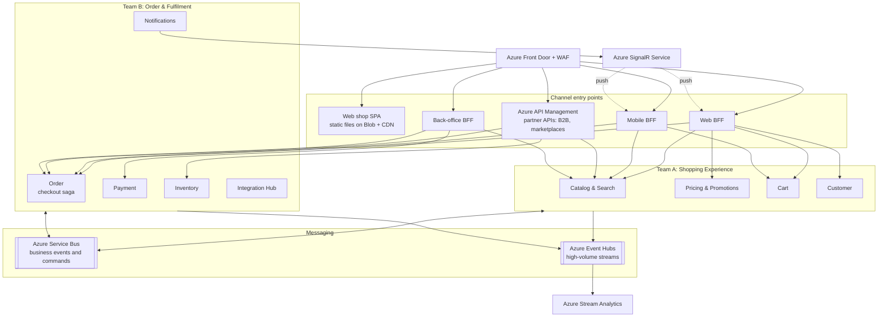
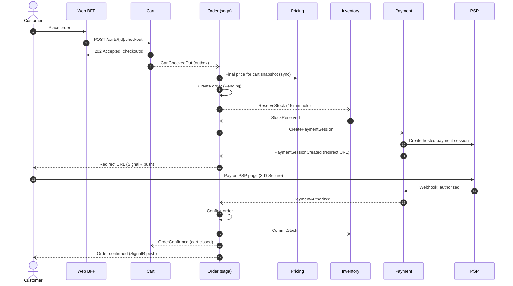
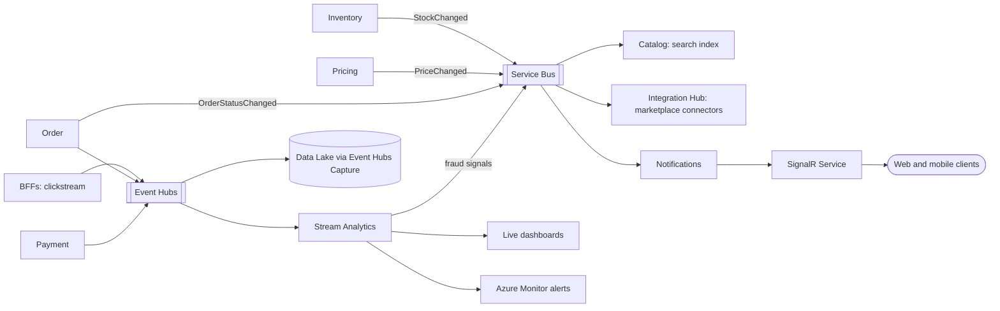
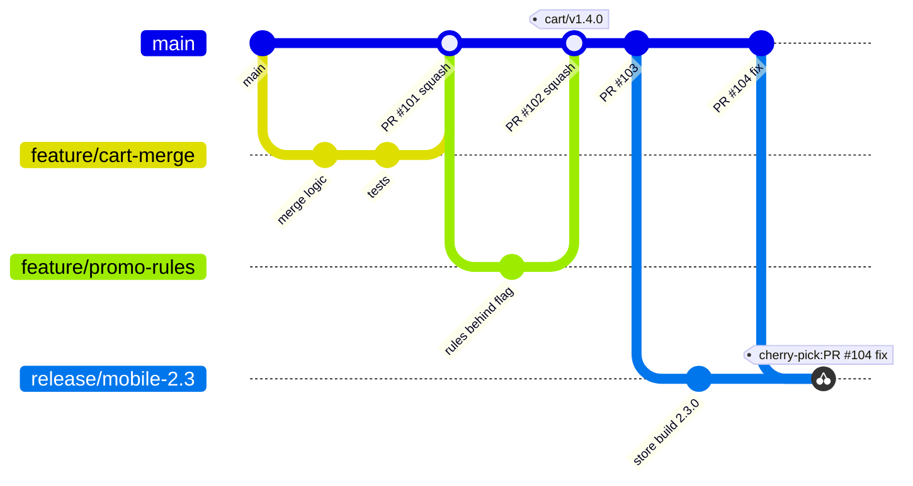
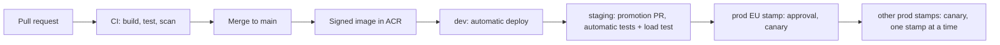

# Global Retail Platform: High-Level Architecture and Implementation Strategy

| | |
| --- | --- |
| Author | Robert Miani |
| Status | Proposal for review |
| Audience | Client technical stakeholders, delivery teams |
| Reference implementation | Cart API in this repository (`src/`) |

## Contents

1. [Purpose, scope, and assumptions](#1-purpose-scope-and-assumptions)
2. [Architecture drivers and principles](#2-architecture-drivers-and-principles)
3. [Architecture view](#3-architecture-view)
4. [Key components and responsibilities](#4-key-components-and-responsibilities)
5. [Component communication](#5-component-communication)
6. [Main technology choices](#6-main-technology-choices)
7. [Scaling strategy](#7-scaling-strategy)
8. [Real-time data processing](#8-real-time-data-processing)
9. [Security and authentication](#9-security-and-authentication)
10. [Integration with external services](#10-integration-with-external-services)
11. [Monitoring and alerting](#11-monitoring-and-alerting)
12. [Code delivery plan](#12-code-delivery-plan)
13. [Implementation roadmap](#13-implementation-roadmap)
14. [Architecture decision log](#14-architecture-decision-log)
15. [Risks and open questions](#15-risks-and-open-questions)
16. [Reference implementation: Cart API](#16-reference-implementation-cart-api)

---

## 1. Purpose, scope, and assumptions

### 1.1 Purpose

This document proposes the high-level design and the implementation strategy for an online retail
platform. The client sells on a global market and serves millions of users a day. The platform sells
products through four channels:

- Web shop
- Mobile apps (iOS, Android)
- Marketplace integrations (for example Amazon, eBay, regional marketplaces)
- B2B integrations (partner systems that order through an API)

The client's key requirements are:

1. Scalability and support for high traffic (millions of users a day).
2. Secure transactions and protection of personal data.
3. Real-time data processing.

Two cross-functional teams will build and run the platform.

### 1.2 Scope

In scope: the platform backend, the channel-facing APIs, integrations with external systems, the
runtime platform, security, observability, and the delivery process.

Out of scope: visual design of the web and mobile clients, the internal design of the client's ERP/PIM,
and data warehouse and BI design beyond the real-time event feed.

### 1.3 Assumptions

The load figures below are estimates. They set the order of magnitude that the design must handle.
They must be replaced with the client's real numbers in the first weeks of the project.

| Metric | Assumption | Derived value |
| --- | --- | --- |
| Daily active users | 5 million, across all regions | |
| API calls per active user per day | about 40 (browse, search, cart, account) | about 200 million calls/day, about 2,300 requests/s average |
| Daily peak factor | 3x average (evening peak per region) | about 7,000 requests/s |
| Campaign peak factor (Black Friday, launches) | a further 3x | about 20,000 requests/s at the edge |
| Share served by CDN cache | 60% to 70% (static assets, images, cached catalog pages) | 6,000 to 8,000 requests/s reach the origin at campaign peak |
| Orders per day | 2% to 3% conversion, about 120,000 orders/day | about 1.5 orders/s average, 200 to 300 orders/s at campaign peak |
| Cart writes per day | about 5 million | about 60/s average, about 1,000/s at campaign peak |
| Catalog size | 0.5 to 2 million SKUs | |

Other assumptions:

- The client's ERP/PIM is the master system for products, base prices, and physical stock (see [section 4](#4-key-components-and-responsibilities)).
- The platform owns promotions, available-to-sell stock, carts, orders, and customer profiles.
- The first market is the EU, with Croatia as a launch country. The US and APAC follow.
- Card payments go through an external payment service provider (PSP). The platform never stores card data.
- The client uses Microsoft Entra ID for its own staff.

## 2. Architecture drivers and principles

### 2.1 Quality attributes

The quality attributes are ranked. When two attributes conflict, the higher one wins.

| Rank | Quality attribute | Target |
| --- | --- | --- |
| 1 | Availability of the purchase path (browse, cart, checkout) | 99.95% per month per region |
| 2 | Security and compliance (PCI DSS, GDPR, fiscal law) | No card data in platform scope; personal data stays in the customer's home region |
| 3 | Elasticity | Absorb a 10x traffic increase within minutes without manual action |
| 4 | Data freshness | Stock and price changes visible in all channels within 5 s (p95) |
| 5 | Latency | Channel API p95 below 300 ms for reads and below 800 ms for checkout steps |
| 6 | Team autonomy | Each team deploys its services independently, several times a day |
| 7 | Cost efficiency | Infrastructure cost scales with traffic, not with peak capacity |

### 2.2 Principles

Every decision in this document can be checked against these principles:

1. **Services own their data.** Each service has its own database. No service reads another service's
   database. Data is shared through APIs and events.
2. **Asynchronous by default between services.** A service calls another service synchronously only when
   the user waits for the answer and the data cannot be held locally.
3. **Stateless compute.** State lives in managed data stores. Any instance can serve any request, so the
   platform scales by adding instances.
4. **Design for failure.** Every external call has a timeout, a retry policy, and a fallback. A failure in
   one service or partner does not stop checkout.
5. **Secure by default.** Every request is authenticated. Services use private networking and managed
   identities. Secrets never appear in code or configuration files.
6. **Managed services first.** Two teams cannot operate brokers, databases, and identity servers. The
   platform uses managed Azure services, and the teams spend their time on business features.
7. **Everything as code.** Infrastructure, pipelines, dashboards, and alerts live in the repository and
   change through reviewed pull requests.

## 3. Architecture view

### 3.1 System context

The diagram shows the platform, the people and systems that use it, and the external systems it depends on.

### 3.2 Global topology

The platform runs as independent **regional deployment stamps**. A stamp is a complete copy of the
platform in one Azure region, with its own compute, databases, and messaging. Stamps share no runtime
state, so a failure in one stamp does not affect the others.

- **Azure Front Door** is the single global entry point. It routes anonymous traffic to the nearest stamp.
- Each customer gets a **home stamp** at registration, based on the customer's country. The home stamp
  holds all personal data for that customer. The home stamp ID is a claim in the customer's token, and
  Front Door routes authenticated traffic to that stamp.
- **Catalog and price data** are replicated to all stamps as events, because every region sells the same products.
- Each stamp has a **paired disaster-recovery region** with database geo-replicas.

The region names are examples. The final choice depends on latency tests and on the availability of
all required Azure services in the region.

### 3.3 Container view of one stamp

The diagram shows the main runtime components inside one stamp and how they connect.

Each service has its own data store. The data stores are listed in [section 4](#4-key-components-and-responsibilities)
and left out of this diagram for readability.

## 4. Key components and responsibilities

### 4.1 Channel entry points

| Component | Responsibility | Owner |
| --- | --- | --- |
| Azure Front Door + WAF | Global entry point. TLS termination, CDN caching, web application firewall, DDoS protection, routing to the home or nearest stamp. | Platform (shared) |
| Web BFF | API for the web shop. Aggregates data from several services into one response per page. Runs the login flow and keeps tokens server-side; the browser only gets an HTTP-only session cookie. | Team A |
| Mobile BFF | API for the mobile apps. Payloads shaped for mobile screens, API versioning that supports old app versions in the stores. | Team A |
| Azure API Management | Public partner API for B2B partners and marketplaces. Partner onboarding, subscription keys, OAuth2 client credentials, quotas, rate limits, developer portal. | Team B |
| Back-office BFF | API for the back-office portal used by client staff: merchandising, order management, refunds, customer service. Staff log in with the client's Entra ID workforce tenant. Each team owns its own portal modules. | Team B hosts; both teams contribute |

### 4.2 Domain services

| Service | Responsibility | Owner | Data store | Load profile |
| --- | --- | --- | --- | --- |
| Catalog & Search | Product data for the channels: descriptions, attributes, categories, media, search, filters. Imports master data from ERP/PIM through the Integration Hub. Publishes product changes. | Team A | PostgreSQL (product read model), Azure AI Search (search index), Blob (media) | Very read-heavy; most traffic is served from CDN and cache |
| Pricing & Promotions | Calculates the final price for a customer and channel: base price from ERP, price lists for B2B accounts, promotions, coupons. | Team A | PostgreSQL, Redis (price cache) | Read-heavy; called for every product list and cart |
| Cart | Holds the customer's cart across devices. Adds, updates, and removes items; merges an anonymous cart into the customer cart at login; hands the cart over to checkout. | Team A | PostgreSQL (source of truth), Redis (cache) | Write-heavy per user; large peaks in campaigns |
| Customer | Customer profile, addresses, consents (GDPR and marketing), preferences, wishlist, B2B company accounts (company, buyers, price list, credit terms). Stores the identity provider's user ID as a reference. Runs GDPR data export and erasure across the platform. | Team A | PostgreSQL | Moderate; read on login and checkout |
| Order | Runs checkout as an orchestrated saga: reserve stock, authorize payment, confirm order. Owns the order lifecycle after that (fulfilment status, cancellations, returns). | Team B | PostgreSQL | Write-heavy at peaks; must stay consistent |
| Payment | Integrates with the PSP. Creates payment sessions, handles authorization, capture, refund, and PSP webhooks. Stores PSP tokens and references, never card data. | Team B | PostgreSQL | Low volume, high criticality |
| Inventory | Available-to-sell stock per SKU and warehouse. Reserves stock for checkout with a time limit, releases or commits it. Receives physical stock from ERP. Publishes stock changes to all channels. | Team B | PostgreSQL, Redis (stock counters for hot SKUs) | Write-heavy on popular SKUs during campaigns |
| Integration Hub | All integrations with external systems behind an anti-corruption layer: fiscalization, e-invoicing, ERP/PIM, marketplaces, shipping carriers. One bounded context, deployed as several independent workers so a slow partner cannot block the others. | Team B | PostgreSQL (integration state, outbox, idempotency records) | Event-driven; spikes follow orders |
| Notifications | Sends email, SMS, and push messages. Pushes real-time updates (order status, stock) to open web and mobile sessions through Azure SignalR Service. | Team B | PostgreSQL (templates, delivery log) | Event-driven |

### 4.3 Team ownership

The teams are split by **value stream**. Each team owns a complete part of the customer journey,
so most features need only one team.

| Team | Value stream | Components |
| --- | --- | --- |
| Team A: Shopping Experience | Find a product, decide, put it in the cart, manage the account | Web BFF, Mobile BFF, Catalog & Search, Pricing & Promotions, Cart, Customer |
| Team B: Order & Fulfilment | Pay, receive the goods, get a valid receipt or invoice, return | API Management partner APIs, Back-office BFF, Order, Payment, Inventory, Integration Hub, Notifications |

Shared responsibilities, owned jointly with a named rotating owner per quarter:

- Platform infrastructure (AKS, networking, Terraform modules)
- Observability standards (OpenTelemetry setup, dashboards, alert rules)
- API and event contracts (review of breaking changes)

Customer identity is not a service we build. Microsoft Entra External ID provides sign-up, sign-in,
MFA, social login, and password reset (see [section 9](#9-security-and-authentication)).

---

## 5. Component communication

### 5.1 Communication styles

| From | To | Style | Protocol |
| --- | --- | --- | --- |
| Web and mobile clients | Web BFF, Mobile BFF | Synchronous request/response | HTTPS, JSON (HTTP/2 and HTTP/3 at Front Door) |
| Web and mobile clients | Notifications (through SignalR Service) | Server push | WebSocket, with fallback to long polling |
| B2B partners, marketplaces | API Management | Synchronous request/response | HTTPS, JSON, OAuth2 client credentials |
| Platform | B2B partners, marketplaces | Outbound webhooks and partner API calls | HTTPS, payload signed with HMAC |
| BFFs | Domain services | Synchronous request/response | HTTPS, JSON inside the cluster |
| Domain service | Domain service | Asynchronous events and commands | Azure Service Bus topics (events) and queues (commands) |
| Domain services, BFFs | Stream processing | Asynchronous streams | Azure Event Hubs (Kafka protocol) |

### 5.2 When to use synchronous and when to use asynchronous calls

A service uses a **synchronous** call only when both conditions hold:

1. A user is waiting for the answer.
2. The caller cannot keep a local copy of the data, because the data must be exact at that moment
   (for example the final price at checkout).

In every other case, services communicate with **events**. A service publishes a fact about its own data
(`ProductChanged`, `StockChanged`, `OrderConfirmed`), and other services keep the local copy they need.
This keeps services available when a neighbour is down, and it keeps the synchronous call chain short.
The rule for the chain: a BFF calls domain services, and a domain service calls at most one other service
synchronously per request.

**Events** use Service Bus topics: one topic per publishing service, one subscription per consumer.
**Commands** (a request that exactly one service must carry out, such as `ReserveStock`) use Service Bus queues.
**High-volume streams** (clickstream, stock and price change feeds, telemetry for analytics) use Event Hubs.
The rule that separates the two brokers: a business workflow step goes to Service Bus; a stream that
many readers process in bulk goes to Event Hubs.

### 5.3 Reliable messaging

Messaging failures must not lose an order or send it twice. Every service applies the same four rules:

| Rule | Implementation |
| --- | --- |
| **Transactional outbox** | A service writes its state change and the outgoing message in the same database transaction (an `outbox` table). A background relay publishes the outbox rows to Service Bus and marks them as sent. The service never publishes directly inside a request. |
| **Idempotent consumers** | Each consumer records the IDs of processed messages in an `inbox` table, in the same transaction as its own state change. A duplicate message is acknowledged and skipped. Service Bus duplicate detection is an extra layer, not the only one. |
| **Ordered processing where needed** | Messages about the same order use a Service Bus **session** keyed by order ID, so one consumer handles them in order. Other messages are processed in parallel. |
| **Retries and dead letters** | Consumers retry with exponential backoff. After the maximum number of attempts, the message goes to the dead-letter queue. A dead letter raises an alert, and an operator replays it with a tool after the cause is fixed. |

Synchronous calls between services use the standard .NET resilience handler
(`Microsoft.Extensions.Http.Resilience`): timeout, retry with jitter for idempotent requests only,
and a circuit breaker.

### 5.4 Contracts and versioning

- Every HTTP API has an OpenAPI description, generated from code and published in CI.
- Public and channel APIs are versioned in the URL (`/v1/...`). A breaking change creates a new version.
  The old version stays available until its traffic falls below an agreed level. The Mobile BFF keeps old
  versions longer, because old app versions stay installed.
- Events use the CloudEvents envelope with a JSON payload. Event schemas live in a shared contracts
  repository. Only backward-compatible changes are allowed within a version (add optional fields, never
  remove or rename). A breaking change publishes a new event type next to the old one.
- Consumer contract tests run in CI, so a provider cannot release a change that breaks a known consumer.

### 5.5 Checkout flow

Checkout crosses five services, so it runs as an **orchestrated saga** owned by the Order service. The Order
service keeps the saga state in its database, sends commands, waits for replies, and runs compensations
when a step fails or times out. Side effects after the order is confirmed (fiscalization, notifications,
analytics) are not part of the saga. They react to the `OrderConfirmed` and `PaymentCaptured` events.

Checkout starts with the `CartCheckedOut` event, not with a synchronous call. The client gets
`202 Accepted` with a checkout ID and follows the progress through SignalR (or by polling the order status).
This absorbs checkout peaks in a queue (see [section 7.4](#74-checkout-peaks)).

Failure and compensation paths:

| Failure | Saga action |
| --- | --- |
| Stock not available | Order is cancelled before payment. The customer sees which items are missing and returns to the cart. |
| Payment declined or abandoned | Order sends `ReleaseStock`, sets the order to `PaymentFailed`, and the cart is reopened. |
| No payment result before the stock hold expires (15 minutes) | Order asks Payment to cancel the session, then releases the stock. A late authorization is voided by Payment. |
| Price changed between cart and checkout | Order stops before stock reservation and returns the new price for customer confirmation. |
| A saga message fails repeatedly | The message goes to the dead-letter queue, the order stays in its current state, and an alert is raised. Nothing is compensated automatically on an unknown error. |

## 6. Main technology choices

| Concern | Choice | Reason |
| --- | --- | --- |
| Language and runtime | C#, .NET 10 (LTS), ASP.NET Core Minimal APIs | LTS support until November 2028, high throughput per core, the team's core skill |
| Compute | Azure Kubernetes Service (AKS) Automatic | Managed node pools, upgrades, and autoscaling; standard Kubernetes skills and tooling; room to grow past two teams |
| Container registry | Azure Container Registry, geo-replicated to every stamp region | Images are pulled from the local region |
| Global entry, CDN, WAF | Azure Front Door Premium | One global anycast entry with CDN caching, WAF, bot protection, and DDoS protection |
| Partner API gateway | Azure API Management | Partner onboarding, keys, OAuth2, quotas, developer portal without custom code |
| Business messaging | Azure Service Bus Premium | Topics, sessions, duplicate detection, dead-letter queues, private endpoints |
| Streaming | Azure Event Hubs (Kafka protocol) | High-throughput, replayable streams; Kafka clients work without changes |
| Relational data | Azure Database for PostgreSQL Flexible Server, one database per service | Zone-redundant HA, read replicas, geo-replicas for DR, mature EF Core provider |
| Cache | Azure Managed Redis | Low-latency cache for prices, carts, stock counters, rate limits |
| Product search | Azure AI Search | Full-text search, facets, filters, synonyms, per-language analyzers |
| Media | Azure Blob Storage behind Front Door | Cheap storage, served from the CDN edge |
| Real-time push | Azure SignalR Service | Managed WebSocket connections at scale; services push without holding connections |
| Stream processing | Azure Stream Analytics | SQL-like windowed queries on Event Hubs streams without custom code |
| Customer identity | Microsoft Entra External ID | Managed customer identity: sign-up, MFA, social login, OIDC |
| Staff identity | Microsoft Entra ID (client's workforce tenant) | Single sign-on and conditional access for staff |
| Secrets, keys, certificates | Azure Key Vault (HSM-backed keys for signing) | Central secret store; the fiscal signing certificate never leaves the vault |
| Configuration and feature flags | Azure App Configuration | Central configuration and feature flags per environment |
| Observability | OpenTelemetry, Azure Monitor (Application Insights, Log Analytics), Azure Monitor managed Prometheus, Azure Managed Grafana | Vendor-neutral instrumentation, managed back ends |
| Infrastructure as code | Terraform | Declarative, reviewed infrastructure changes, reusable stamp module |
| CI and CD | GitHub Actions (CI), Argo CD and Argo Rollouts (CD) | Pipelines as code; GitOps deployment with drift detection and canary releases |
| Main libraries | EF Core with Npgsql, Azure SDK for .NET, `Microsoft.Extensions.Http.Resilience`, FluentValidation, OpenTelemetry .NET | Standard, supported libraries with no commercial licence risk |
| Testing | xUnit, Testcontainers, Azure Load Testing (k6-compatible scripts) | Unit and integration tests against real dependencies; repeatable load tests |

## 7. Scaling strategy

### 7.1 Scaling by layer

| Layer | How it scales | Trigger |
| --- | --- | --- |
| Edge | Front Door serves static files, images, and cacheable API responses from the edge | Always on |
| BFFs and HTTP services | Horizontal Pod Autoscaler adds pods | CPU and requests per second per pod |
| Message-driven workers | KEDA adds consumers | Service Bus queue length and Event Hubs consumer lag |
| Cluster nodes | AKS Automatic node autoprovisioning adds and removes nodes | Pods that cannot be scheduled |
| Relational data | Scale up the server tier; add read replicas for read-heavy services; partition large tables | Replica lag, CPU, IOPS, storage alerts |
| Cache | Scale the Redis tier or add shards | Memory use, server load |
| Search | Add replicas (query load) or partitions (index size) | Query latency, index size |
| Regions | Add a new stamp | A new market or a stamp near its tested capacity |

All HTTP services are stateless, so the platform scales out by adding pods. Each service sets a minimum
number of replicas (at least three, one per availability zone) so a zone failure never removes a service.

### 7.2 Caching

Most traffic is reading the catalog. The design serves those reads from caches and keeps the databases
for writes and cache misses.

| Data | Cache | Lifetime | Invalidation |
| --- | --- | --- | --- |
| Static files (SPA, fonts, images) | Front Door CDN | Long (file names contain a content hash) | New deployment changes the file names |
| Product list and product detail responses | Front Door CDN | 60 s, with stale-while-revalidate | `ProductChanged` event purges the affected paths |
| Prices per price list | Redis | 5 minutes | `PriceChanged` event deletes the key |
| Cart | Redis, cache-aside | 30 minutes idle | Every cart write deletes the key |
| Stock level shown to customers | Redis | Updated by events | `StockChanged` event updates the value; the exact check happens at reservation |
| Customer session and rate-limit counters | Redis | Session length | Expiry |

The cache is an optimisation, never the source of truth. When Redis is not available, services read
from the database and serve slower responses instead of errors.

### 7.3 Protecting the platform under load

- **Rate limits in three layers.** Front Door WAF limits requests per client IP. API Management applies
  quotas per partner subscription. Services apply per-user limits with the ASP.NET Core rate limiter.
- **Bulkheads and circuit breakers.** Each external dependency has its own connection pool and circuit
  breaker. A slow marketplace or PSP does not use up threads that other requests need.
- **Graceful degradation.** Each service defines what it drops first under stress:

  | Situation | Behaviour |
  | --- | --- |
  | Search is slow or down | Category pages are served from the CDN; free-text search shows a message |
  | Recommendations or personalisation are slow | The BFF omits them after a short timeout |
  | Pricing is slow | Product lists show cached prices; checkout always recalculates |
  | Fiscalization service is down | Receipts are issued and delivered later (see [section 10](#10-integration-with-external-services)) |

### 7.4 Checkout peaks

Checkout is the most expensive flow and the most important one. During a campaign, orders can arrive
100 times faster than on an average day. The design uses **queue-based load levelling**: the Cart service
accepts the checkout and publishes `CartCheckedOut`. The Order service reads from the queue at the rate it
can handle, and KEDA adds Order workers as the queue grows. The customer sees a short "processing" state
instead of an error. For extreme product drops, a virtual waiting room in front of checkout is an option
and is listed under risks.

### 7.5 Stock contention on popular products

When thousands of customers buy the same product at the same moment, one database row becomes a
bottleneck. The Inventory service handles this in two steps:

1. **Default:** a conditional update in PostgreSQL
   (`UPDATE ... SET available = available - @qty WHERE sku = @sku AND available >= @qty`). This is atomic and
   needs no application lock.
2. **Hot SKUs** (flagged by merchandising for a campaign, or detected by lock-wait metrics): an atomic counter
   in Redis admits reservations first. The database is updated asynchronously, and a reconciliation job
   compares both stores every few minutes.

### 7.6 Data growth

- Each service has its own database, so load is spread across servers from the start.
- Large tables (orders, order lines, integration logs) are partitioned by month. Old partitions are moved
  to cheaper storage according to the retention policy.
- Read-heavy services (Catalog, Pricing) add read replicas.
- Horizontal sharding (for example Order data by customer ID) is **not** part of the first release. The team
  revisits it when a single service database needs more than the largest available tier, or passes about
  4 TB of hot data.

### 7.7 Capacity validation

Load tests run in the staging environment with Azure Load Testing before each release that touches a hot
path, and before every major campaign. The budget for one EU stamp, based on [section 1.3](#13-assumptions):

| Scenario | Target |
| --- | --- |
| Browse and search | 20,000 requests/s at the edge, 7,000 requests/s at the origin, p95 below 300 ms |
| Cart writes | 1,000 requests/s, p95 below 300 ms |
| Checkout | 300 orders/s, confirmation within 10 s at p95 (excluding time spent on the PSP page) |

A release that misses the budget does not go to production.

## 8. Real-time data processing

### 8.1 Use cases

| Use case | Latency target | Consumer |
| --- | --- | --- |
| Stock changes visible in all channels, including marketplaces | 5 s (p95) | Catalog, BFF caches, marketplace connectors |
| Price and promotion changes visible in all channels | 5 s (p95) | Catalog, BFF caches, marketplace connectors |
| Order status updates to the customer | 2 s | Web and mobile clients |
| Fraud and abuse signals (for example many orders from one card token or IP) | 10 s | Order, Payment |
| Live business metrics (orders per minute, conversion, payment success rate) | 1 minute | Business dashboards, alerting |

### 8.2 Two processing tiers

Real-time processing has two tiers with different tools.

- **Operational tier.** Business events that change what the platform does. Services publish them through
  the outbox to Service Bus, and .NET consumers act on them. For example, Inventory publishes
  `StockChanged`. Catalog updates the availability in the search index, the BFF caches update the stock
  value, and the marketplace connectors push the new stock to each marketplace. The connectors group
  changes per SKU over a short window, so they stay within each marketplace's API rate limits.
- **Analytical tier.** High-volume streams processed in bulk. BFFs publish clickstream events, and services
  publish order and payment events to Event Hubs. Azure Stream Analytics runs windowed queries on these
  streams: sales per minute, conversion funnel, payment success rate, and fraud velocity rules. Results go
  to live dashboards, to Azure Monitor alerts, and (for fraud signals) to a Service Bus topic that Order and
  Payment consume. Event Hubs Capture writes all raw events to Azure Data Lake Storage for the data
  platform and BI.

### 8.3 Push to clients

The Notifications service sends real-time updates to open web and mobile sessions through Azure SignalR
Service. The client opens the connection through its BFF, which authenticates the user and adds the
connection to a group for that user. Services never hold client connections, so they scale without sticky
sessions. When the app is closed, Notifications sends a mobile push notification instead.

## 9. Security and authentication

_To be written._

## 10. Integration with external services

_To be written._

## 11. Monitoring and alerting

### 11.1 Telemetry

Every service is instrumented with the OpenTelemetry SDK for .NET and emits three signals:

| Signal | Content |
| --- | --- |
| Traces | One trace per user request, across BFFs, services, and Service Bus messages. The W3C trace context travels in HTTP headers and in message application properties, so one trace ID follows a checkout from the click to the fiscal receipt. |
| Metrics | Request rate, error rate, and duration per endpoint and per consumer (the RED method). Runtime metrics (CPU, memory, GC, thread pool). Business metrics (carts created, checkouts started, orders confirmed, payment success rate, receipts fiscalized). |
| Logs | Structured JSON logs with the trace ID and span ID. No personal data or secrets in logs; a log filter removes known sensitive fields. |

Services send OTLP data to an OpenTelemetry Collector in each cluster. The collector exports traces and
logs to Application Insights and Log Analytics, and metrics to Azure Monitor managed Prometheus. The
exporter endpoint is configuration, so a change of back end needs no code change.

### 11.2 Health checks

| Check | Endpoint | What it checks | Used by |
| --- | --- | --- | --- |
| Liveness | `/health/live` | The process responds. No dependency checks, so a database outage does not restart every pod. | Kubernetes liveness probe |
| Readiness | `/health/ready` | Critical dependencies are reachable (own database, Service Bus). A non-critical dependency such as Redis reports `Degraded` but keeps the pod ready, because the service can work without it. | Kubernetes readiness probe, load balancer |
| Startup | `/health/startup` | Start-up work is finished (configuration loaded, caches warmed). | Kubernetes startup probe |
| Stamp health | `/health/stamp` on the BFFs | The stamp can serve the purchase path. | Front Door origin probes; Front Door moves traffic away from an unhealthy stamp |
| Synthetic journeys | External | Home page, product page, search, add to cart, and login, every 5 minutes from several regions. A synthetic checkout with a test product runs in staging after every deployment. | Application Insights availability tests |

Health endpoints are not reachable from the internet, except the stamp health path that Front Door probes.

### 11.3 Service level objectives

Alerts are based on service level objectives (SLOs) for the journeys that matter to the business, not on
individual servers.

| Journey | Service level indicator | Objective (30 days) |
| --- | --- | --- |
| Browse and search | Share of requests that succeed in under 300 ms | 99.9% |
| Cart | Share of cart requests that succeed in under 300 ms | 99.9% |
| Checkout | Share of checkouts that reach a final state (confirmed or a clear failure) within 10 s, excluding PSP page time | 99.9% |
| Partner API | Share of partner requests that succeed | 99.9% |
| Stock freshness | Share of stock changes visible in all channels within 5 s | 99% |
| Fiscalization | Share of receipts with a fiscal identifier (JIR) within 1 minute | 99.5%, and 100% within the legal deadline |

### 11.4 Alerting

- **Paging alerts are symptom-based.** They use multi-window SLO burn rates. A fast burn (the error budget
  would be gone in about 2 days) pages the on-call engineer. A slow burn opens a ticket.
- **Cause-based alerts open tickets or support a page.** Examples:

  | Alert | Why it matters |
  | --- | --- |
  | Dead-letter queue is not empty | A business message failed and needs action |
  | Oldest unsent outbox message is older than 1 minute | Events are not leaving a service |
  | Consumer lag or queue length grows for 10 minutes | Consumers cannot keep up |
  | Receipts without a fiscal identifier approach the legal deadline | Compliance risk |
  | Any certificate (TLS, fiscal signing) expires in less than 30 days | Planned renewal |
  | PSP or marketplace error rate above normal | Partner problem; check the partner status page |
  | Database CPU, storage, or replica lag above threshold | Capacity |

- **Routing.** Azure Monitor action groups send pages to the on-call tool (PagerDuty or an equivalent) and
  post all alerts to the owning team's Teams channel. Each team is on call for its own services. The shared
  platform has a rota across both teams.
- **Runbooks.** Every alert links to a runbook in the repository: what the alert means, how to confirm it,
  and the first steps to fix it.

### 11.5 Dashboards as code

Dashboards are Grafana JSON files in the repository, deployed to Azure Managed Grafana by the pipeline.
Every service gets the same RED dashboard from a template. Business dashboards (orders per minute,
conversion, payment success) are built on the same metrics. A dashboard change is a reviewed commit.

## 12. Code delivery plan

### 12.1 Repositories

| Repository | Content | Owner |
| --- | --- | --- |
| `platform-app` (monorepo) | All services and BFFs, shared build properties, event and API contracts, tests, runbooks, dashboards | Each team owns its folders through `CODEOWNERS` |
| `platform-gitops` | Kubernetes manifests (Helm values) per environment and stamp; the desired state for Argo CD | Both teams; production changes need approval |
| `platform-infra` | Terraform modules and environment definitions (one reusable stamp module) | Shared platform owner |

The monorepo keeps cross-service changes atomic and keeps one set of standards for two teams. CI runs
only the pipelines of the services whose folders changed.

### 12.2 Branching strategy

The teams use **trunk-based development**.

- `main` is always releasable.
- Work happens on short-lived branches (1 to 2 days) and is merged by pull request.
- A pull request needs a green CI run and one approval from the owning team (`CODEOWNERS`). It is
  squash-merged, so every commit on `main` is one reviewed change.
- Unfinished features are merged behind a feature flag (Azure App Configuration) instead of living on a
  long branch. A flag is removed once its feature is fully rolled out.
- A release is a tag (`<service>/vX.Y.Z`) on `main`. A hotfix is a normal pull request to `main`, released
  with the fast path of the same pipeline.
- Exception: the mobile apps cut a short-lived `release/mobile-X.Y` branch for app store submission,
  because store review takes days. Fixes go to `main` first and are cherry-picked to the release branch.

### 12.3 Continuous integration

GitHub Actions runs these stages for each changed service on every pull request and on every merge to `main`:

| Stage | Tools | Fails the build when |
| --- | --- | --- |
| Build and unit tests | `dotnet build`, `dotnet test` | Compilation error, failing test, coverage below the agreed floor |
| Integration tests | Testcontainers (PostgreSQL, Redis, Service Bus emulator) | Failing test |
| Contract tests | Consumer contract tests for APIs and events | A change breaks a known consumer |
| Static analysis | .NET analyzers, CodeQL | New high-severity finding |
| Dependency and secret scan | Dependabot, GitHub secret scanning | Known vulnerable package, committed secret |
| Container build and scan | Docker build, Microsoft Defender for Containers or Trivy | Critical vulnerability in the image |
| SBOM and signing | SBOM generation, image signing | Missing SBOM or signature |
| Publish | Push the image to Azure Container Registry | |

On a merge to `main`, the last step opens an automatic commit in `platform-gitops` that sets the new image
version for the `dev` environment.

### 12.4 Continuous delivery

- **GitOps.** Argo CD in each cluster pulls the desired state from `platform-gitops` and corrects drift.
  The CI system has no credentials for the clusters.
- **Promotion.** Promotion to `staging` and `prod` is a pull request in `platform-gitops`. The approval of that
  pull request is the release approval, and the Git history is the audit trail.
- **Canary releases.** Argo Rollouts sends 5%, then 25%, 50%, and 100% of traffic to the new version. Between
  steps, it compares error rate and latency with the old version using Prometheus metrics. A failed check
  rolls back automatically.
- **Stamp by stamp.** Production stamps are updated one at a time, so a bad release affects one region at most.
- **Database migrations.** Migrations follow the expand and contract pattern: add new columns or tables first,
  deploy code that uses both, then remove old structures in a later release. EF Core migration bundles run as a
  Kubernetes job before the new version starts. A migration never removes something the running version uses.
- **Infrastructure.** A pull request in `platform-infra` shows the Terraform plan. After approval, the pipeline
  applies it. Each environment and stamp has its own Terraform state.

### 12.5 Environments

| Environment | Purpose | Data | Deployment |
| --- | --- | --- | --- |
| Local | Development | Docker Compose with PostgreSQL, Redis, and emulators | Developer |
| `dev` | Integration of all services | Synthetic data | Every merge to `main`, automatic |
| `staging` | Production-like tests, load tests, partner sandbox integrations (PSP test mode, fiscalization test service) | Synthetic data, production-sized | Promotion pull request |
| `prod` | Production, one deployment per stamp | Real data | Promotion pull request with approval, canary |

Environments have separate subscriptions, networks, and credentials. No environment other than `prod` can reach
production data.

## 13. Implementation roadmap

_To be written._

## 14. Architecture decision log

_To be written._

## 15. Risks and open questions

_To be written._

## 16. Reference implementation: Cart API

_To be written._
