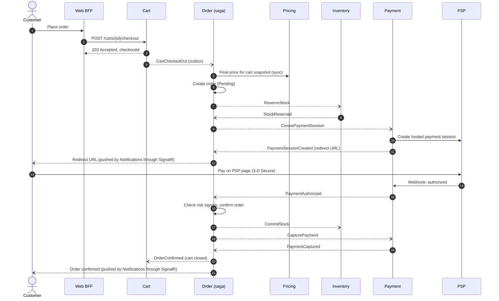
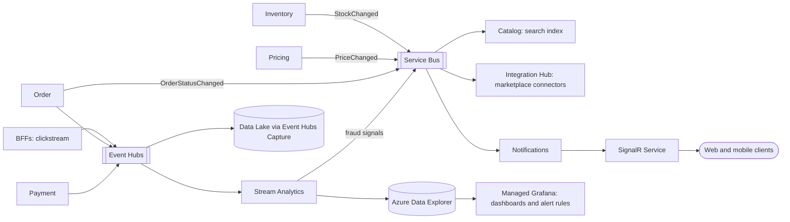
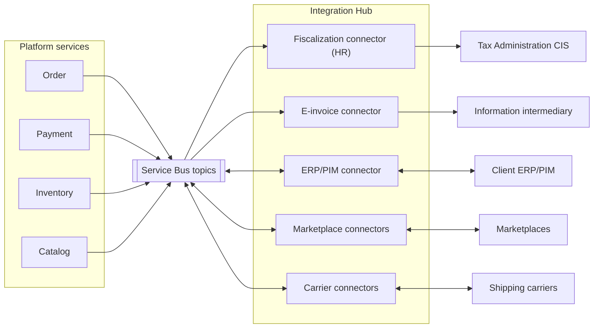
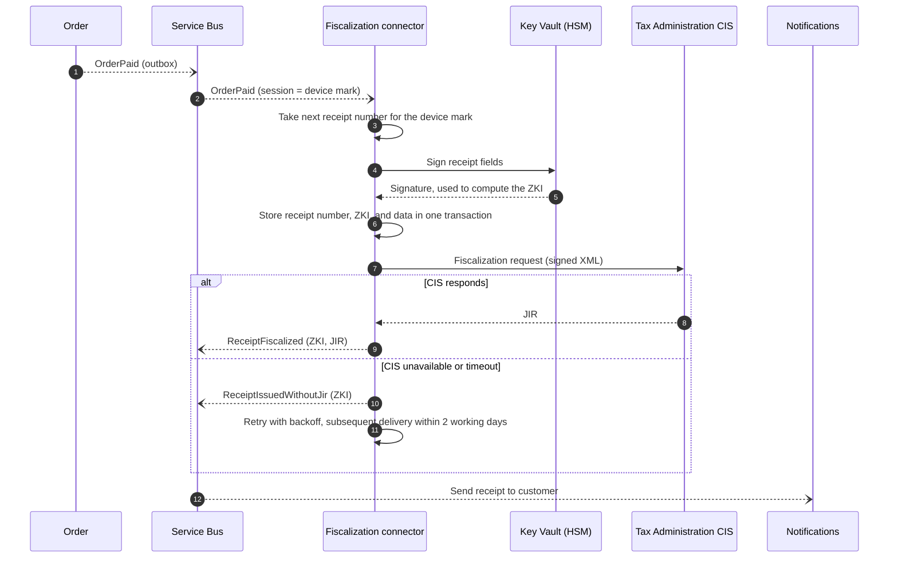
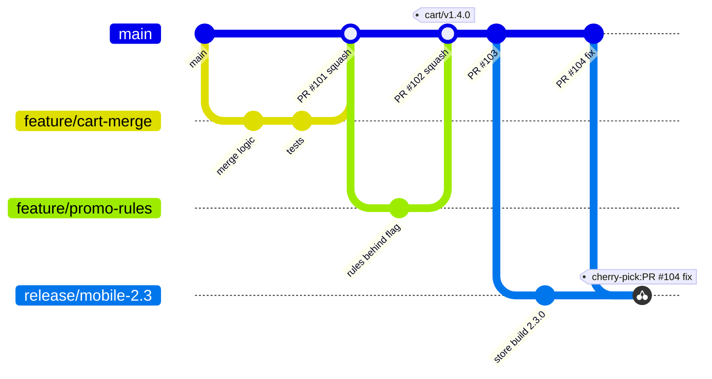
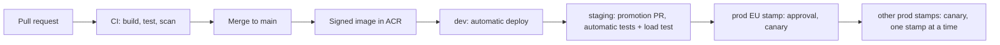

# Global Retail Platform: High-Level Architecture and Implementation Strategy

| | |
| --- | --- |
| Author | Robert Miani |
| Status | Proposal for review |
| Audience | Client technical stakeholders, delivery teams |
| Reference implementation | Cart API in this repository (`src/`) |

## Contents

1. [Purpose, scope, and assumptions](#1-purpose-scope-and-assumptions)
2. [Architecture drivers and principles](#2-architecture-drivers-and-principles)
3. [Architecture view](#3-architecture-view)
4. [Key components and responsibilities](#4-key-components-and-responsibilities)
5. [Component communication](#5-component-communication)
6. [Main technology choices](#6-main-technology-choices)
7. [Scaling strategy](#7-scaling-strategy)
8. [Real-time data processing](#8-real-time-data-processing)
9. [Security and authentication](#9-security-and-authentication)
10. [Integration with external services](#10-integration-with-external-services)
11. [Monitoring and alerting](#11-monitoring-and-alerting)
12. [Code delivery plan](#12-code-delivery-plan)
13. [Implementation roadmap](#13-implementation-roadmap)
14. [Architecture decision log](#14-architecture-decision-log)
15. [Risks and open questions](#15-risks-and-open-questions)
16. [Reference implementation: Cart API](#16-reference-implementation-cart-api)

[Appendix A. Glossary](#appendix-a-glossary)

---

## 1. Purpose, scope, and assumptions

### 1.1 Purpose

This document proposes the high-level design and the implementation strategy for an online retail
platform. The client sells on a global market and serves millions of users a day. The platform sells
products through four channels:

- Web shop
- Mobile apps (iOS, Android)
- Marketplace integrations (for example Amazon, eBay, regional marketplaces)
- B2B integrations (partner systems that order through an API)

The client's key requirements are:

1. Scalability and support for high traffic (millions of users a day).
2. Secure transactions and protection of personal data.
3. Real-time data processing.

Two cross-functional teams will build and run the platform.

Abbreviations are explained in [Appendix A](#appendix-a-glossary).

### 1.2 Scope

In scope: the platform backend, the channel-facing APIs, integrations with external systems, the
runtime platform, security, observability, and the delivery process.

Out of scope: visual design of the web and mobile clients, the internal design of the client's ERP/PIM,
and data warehouse and BI design beyond the real-time event feed.

### 1.3 Assumptions

The load figures below are estimates. They set the order of magnitude that the design must handle.
They must be replaced with the client's real numbers in the first weeks of the project.

| Metric | Assumption | Derived value |
| --- | --- | --- |
| Daily active users | 5 million, across all regions | |
| API calls per active user per day | about 40 (browse, search, cart, account) | about 200 million calls/day, about 2,300 requests/s average |
| Daily peak factor | 3x average (evening peak per region) | about 7,000 requests/s |
| Campaign peak factor (Black Friday, launches) | a further 3x | about 20,000 requests/s at the edge |
| Share served by CDN cache | 60% to 70% (static assets, images, cached catalog pages) | 6,000 to 8,000 requests/s reach the origin at campaign peak |
| Orders per day | 2% to 3% conversion, about 120,000 orders/day | about 1.5 orders/s average; about 40 orders/s sustained at campaign peak (9x traffic, conversion up to 3x higher); bursts of up to 300 orders/s for a few minutes during product drops |
| Cart writes per day | about 5 million | about 60/s average, about 1,000/s at campaign peak |
| Catalog size | 0.5 to 2 million SKUs | |

Other assumptions:

- The client's ERP/PIM is the master system for products, base prices, and physical stock (see [section 4](#4-key-components-and-responsibilities)).
- The platform owns promotions, available-to-sell stock, carts, orders, and customer profiles.
- The first market is the EU, with Croatia as a launch country. The US and APAC follow.
- Card payments go through an external payment service provider (PSP). The platform never stores card data.
- The client uses Microsoft Entra ID for its own staff.

## 2. Architecture drivers and principles

### 2.1 Quality attributes

The quality attributes are ranked. When two attributes conflict, the higher one wins.

| Rank | Quality attribute | Target |
| --- | --- | --- |
| 1 | Availability of the purchase path (browse, cart, checkout) | 99.95% per month per region |
| 2 | Security and compliance (PCI DSS, GDPR, fiscal law) | No card data in platform scope; personal data stays in the customer's home region |
| 3 | Elasticity | Absorb a 10x traffic increase within minutes without manual action |
| 4 | Data freshness | 99% of stock and price changes visible in all channels within 5 s, measured from the moment the platform receives the change |
| 5 | Latency | Channel API p95 below 300 ms for reads and below 800 ms for checkout steps |
| 6 | Team autonomy | Each team deploys its services independently, several times a day |
| 7 | Cost efficiency | Infrastructure cost scales with traffic, not with peak capacity |

### 2.2 Principles

Every decision in this document can be checked against these principles:

1. **Services own their data.** Each service has its own database. No service reads another service's
   database. Data is shared through APIs and events.
2. **Asynchronous by default between services.** A service calls another service synchronously only when
   the user waits for the answer and the data cannot be held locally.
3. **Stateless compute.** State lives in managed data stores. Any instance can serve any request, so the
   platform scales by adding instances.
4. **Design for failure.** Every external call has a timeout, a retry policy, and a fallback. A failure in
   one service or partner does not stop checkout.
5. **Secure by default.** Every request is authenticated. Services use private networking and managed
   identities. Secrets never appear in code or configuration files.
6. **Managed services first.** Two teams cannot operate brokers, databases, and identity servers. The
   platform uses managed Azure services, and the teams spend their time on business features.
7. **Everything as code.** Infrastructure, pipelines, dashboards, and alerts live in the repository and
   change through reviewed pull requests.

## 3. Architecture view

### 3.1 System context

The diagram shows the platform, the people and systems that use it, and the external systems it depends on.

### 3.2 Global topology

The platform runs as independent **regional deployment stamps**. A stamp is a complete copy of the
platform in one Azure region, with its own compute, databases, and messaging. Stamps share no runtime
state, so a failure in one stamp does not affect the others.

- **Azure Front Door** is the single global entry point. It routes anonymous traffic to the nearest stamp.
- Each customer gets a **home stamp** at registration, based on the customer's country. The home stamp
  holds all personal data for that customer, and each stamp geography has its own Entra External ID
  tenant, so identity data stays in the same geography. After sign-in, the BFF sets a stamp cookie, and a
  Front Door routing rule sends requests with that cookie to the home stamp. B2B partners use a
  stamp-specific host name (for example `eu.api.<domain>`).
- **Catalog and price data** are replicated to all stamps as events, because every region sells the same products.
- Each stamp has a **paired disaster-recovery region** with database geo-replicas.

The region names are examples. The final choice depends on latency tests and on the availability of
all required Azure services in the region.

### 3.3 Container view of one stamp

The diagram shows the main runtime components inside one stamp and how they connect.

Each service has its own data store. The data stores are listed in [section 4](#4-key-components-and-responsibilities)
and left out of this diagram for readability.

## 4. Key components and responsibilities

### 4.1 Channel entry points

| Component | Responsibility | Owner |
| --- | --- | --- |
| Azure Front Door + WAF | Global entry point. TLS termination, CDN caching, web application firewall, DDoS protection, routing to the home or nearest stamp. | Platform (shared) |
| Web shop SPA hosting | Static files of the web shop single-page application on Blob Storage, served through the Front Door CDN. | Team A |
| Web BFF (Backend for Frontend) | API for the web shop. Aggregates data from several services into one response per page. Runs the login flow and keeps tokens server-side; the browser only gets an HTTP-only session cookie. | Team A |
| Mobile BFF | API for the mobile apps. Payloads shaped for mobile screens, API versioning that supports old app versions in the stores. | Team A |
| Azure API Management | Public partner API for B2B partners and marketplaces. Partner onboarding, subscription keys, OAuth2 client credentials, quotas, rate limits, developer portal. Receives marketplace webhooks and passes them to the Integration Hub. One instance per stamp; each partner uses the host name of its home stamp. | Team B |
| Back-office BFF | API for the back-office portal used by client staff: merchandising, order management, refunds, customer service. Staff log in with the client's Entra ID workforce tenant. Each team owns its own portal modules. | Team B hosts; both teams contribute |

### 4.2 Domain services

| Service | Responsibility | Owner | Data store | Load profile |
| --- | --- | --- | --- | --- |
| Catalog & Search | Product data for the channels: descriptions, attributes, categories, media, search, filters. Imports master data from ERP/PIM through the Integration Hub. Publishes product changes. | Team A | PostgreSQL (product read model), Azure AI Search (search index), Blob (media) | Very read-heavy; most traffic is served from CDN and cache |
| Pricing & Promotions | Calculates the final price for a customer and channel: base price from ERP, price lists for B2B accounts, promotions, coupons. | Team A | PostgreSQL, Redis (price cache) | Read-heavy; called for every product list and cart |
| Cart | Holds the customer's cart across devices. Adds, updates, and removes items; merges an anonymous cart into the customer cart at login; hands the cart over to checkout. | Team A | PostgreSQL (source of truth), Redis (cache) | Write-heavy per user; large peaks in campaigns |
| Customer | Customer profile, addresses, consents (GDPR and marketing), preferences, wishlist, B2B company accounts (company, buyers, price list, credit terms). Stores the identity provider's user ID as a reference. Runs GDPR data export and erasure across the platform. | Team A | PostgreSQL | Moderate; read on login and checkout |
| Order | Runs checkout as an orchestrated saga: reserve stock, authorize payment, confirm order. Accepts orders from all channels (web and mobile through Cart; B2B partners and marketplaces through API Management and the Integration Hub). Owns the order lifecycle after that (fulfilment status, cancellations, returns). | Team B | PostgreSQL | Write-heavy at peaks; must stay consistent |
| Payment | Integrates with the PSP. Creates payment sessions, handles authorization, capture, refund, and PSP webhooks. Stores PSP tokens and references, never card data. | Team B | PostgreSQL | Low volume, high criticality |
| Inventory | Available-to-sell stock per SKU (stock keeping unit) and warehouse. Reserves stock for checkout, releases or commits it on the saga's command. Receives physical stock from ERP. Publishes stock changes to all channels. | Team B | PostgreSQL, Redis (stock counters for hot SKUs) | Write-heavy on popular SKUs during campaigns |
| Integration Hub | All integrations with external systems behind an anti-corruption layer: fiscalization, e-invoicing, ERP/PIM, marketplaces, shipping carriers. One bounded context, deployed as one worker per connector so a slow partner cannot block the others. | Team B | PostgreSQL (integration state, outbox, idempotency records) | Event-driven; spikes follow orders |
| Notifications | Sends email, SMS, and push messages. Pushes real-time updates (order status, stock) to open web and mobile sessions through Azure SignalR Service. | Team B | PostgreSQL (templates, delivery log) | Event-driven |

### 4.3 Team ownership

The teams are split by **value stream**. Each team owns a complete part of the customer journey,
so most features need only one team.

| Team | Value stream | Components |
| --- | --- | --- |
| Team A: Shopping Experience | Find a product, decide, put it in the cart, manage the account | Web BFF, Mobile BFF, Catalog & Search, Pricing & Promotions, Cart, Customer |
| Team B: Order & Fulfilment | Pay, receive the goods, get a valid receipt or invoice, return | API Management partner APIs, Back-office BFF, Order, Payment, Inventory, Integration Hub, Notifications |

In total the platform has twelve services (nine domain services and three BFFs), plus one worker per
external connector in the Integration Hub.

Shared responsibilities, owned jointly with a named rotating owner per quarter:

- Platform infrastructure (AKS, networking, Azure Firewall, Terraform modules)
- Shared messaging and push infrastructure (Service Bus and Event Hubs namespaces, SignalR Service)
- Observability standards (OpenTelemetry Collector, dashboards, alert rules)
- API and event contracts (review of breaking changes)

Stream Analytics jobs belong to the team whose domain they analyse: Team A for the conversion funnel,
Team B for payment and fraud signals.

Customer identity is not a service we build. Microsoft Entra External ID provides sign-up, sign-in,
MFA, social login, and password reset (see [section 9](#9-security-and-authentication)).

---

## 5. Component communication

### 5.1 Communication styles

| From | To | Style | Protocol |
| --- | --- | --- | --- |
| Web and mobile clients | Web BFF, Mobile BFF | Synchronous request/response | HTTPS, JSON (HTTP/2 and HTTP/3 at Front Door) |
| Web and mobile clients | Notifications (through SignalR Service) | Server push | WebSocket, with fallback to long polling |
| B2B partners, marketplaces | API Management | Synchronous request/response | HTTPS, JSON, OAuth2 client credentials |
| Platform | B2B partners, marketplaces | Outbound webhooks and partner API calls | HTTPS, payload signed with HMAC |
| BFFs | Domain services | Synchronous request/response | HTTPS, JSON inside the cluster |
| Domain service | Domain service | Asynchronous events and commands | Azure Service Bus topics (events) and queues (commands) |
| Domain services, BFFs | Stream processing | Asynchronous streams | Azure Event Hubs (Kafka protocol) |

### 5.2 When to use synchronous and when to use asynchronous calls

A service uses a **synchronous** call only when both conditions hold:

1. A user is waiting for the answer.
2. The caller cannot keep a local copy of the data, because the data must be exact at that moment
   (for example the final price at checkout).

In every other case, services communicate with **events**. A service publishes a fact about its own data
(`ProductChanged`, `StockChanged`, `OrderConfirmed`), and other services keep the local copy they need.
This keeps services available when a neighbour is down, and it keeps the synchronous call chain short.
The rule for the chain: a BFF calls domain services, and a domain service calls at most one other service
synchronously per request.

**Events** use Service Bus topics: one topic per publishing service, one subscription per consumer.
**Commands** (a request that exactly one service must carry out, such as `ReserveStock`) use Service Bus queues.
**High-volume streams** (clickstream, stock and price change feeds, telemetry for analytics) use Event Hubs.
The rule that separates the two brokers: a business workflow step goes to Service Bus; a stream that
many readers process in bulk goes to Event Hubs.

### 5.3 Reliable messaging

Messaging failures must not lose an order or send it twice. Every service applies the same four rules:

| Rule | Implementation |
| --- | --- |
| **Transactional outbox** | A service writes its state change and the outgoing message in the same database transaction (an `outbox` table). A background relay publishes the outbox rows to Service Bus and marks them as sent. The service never publishes directly inside a request. |
| **Idempotent consumers** | Each consumer records the IDs of processed messages in an `inbox` table, in the same transaction as its own state change. A duplicate message is acknowledged and skipped. Service Bus duplicate detection is an extra layer, not the only one. |
| **Ordered processing where needed** | Messages about the same checkout use a Service Bus **session** keyed by the checkout ID, which is created with `CartCheckedOut` and stays on the order. One consumer handles them in order. Other messages are processed in parallel. |
| **Idempotency keys on HTTP writes** | Clients and partners send an `Idempotency-Key` header on every write request (for example add to cart, create order). The service stores the key with the response and returns the stored response for a repeated key. A network retry never creates a second order or cart line. |
| **Retries and dead letters** | Consumers retry with exponential backoff. After the maximum number of attempts, the message goes to the dead-letter queue. A dead letter raises an alert, and an operator replays it with a tool after the cause is fixed. |

Synchronous calls between services use the standard .NET resilience handler
(`Microsoft.Extensions.Http.Resilience`): timeout, retry with jitter for idempotent requests only,
and a circuit breaker.

### 5.4 Contracts and versioning

- Every HTTP API has an OpenAPI description, generated from code and published in CI.
- Public and channel APIs are versioned in the URL (`/v1/...`). A breaking change creates a new version.
  The old version stays available until its traffic falls below an agreed level. The Mobile BFF keeps old
  versions longer, because old app versions stay installed.
- Events use the CloudEvents envelope with a JSON payload. Event schemas live in a shared contracts
  repository. Only backward-compatible changes are allowed within a version (add optional fields, never
  remove or rename). A breaking change publishes a new event type next to the old one.
- Consumer contract tests run in CI, so a provider cannot release a change that breaks a known consumer.

### 5.5 Checkout flow

Checkout crosses five services, so it runs as an **orchestrated saga** owned by the Order service. The Order
service keeps the saga state in its database, sends commands, waits for replies, and runs compensations
when a step fails or times out. Side effects after the order is confirmed (fiscalization, notifications,
analytics) are not part of the saga. They react to the `OrderConfirmed` and `OrderPaid` events.

Checkout starts with the `CartCheckedOut` event, not with a synchronous call. The client gets
`202 Accepted` with a checkout ID and follows the progress through SignalR (or by polling the order status).
This absorbs checkout peaks in a queue (see [section 7.4](#74-checkout-peaks)).

After confirmation, the Order service commands the capture of the authorized amount. When Payment
reports `PaymentCaptured`, the Order service marks the order as paid and publishes `OrderPaid`, which holds
the amounts, the VAT breakdown, and the payment method. Fiscalization of the receipt starts from `OrderPaid`
(see [section 10.3](#103-fiscalization-of-receipts-croatia)).

**Timeouts.** The saga owns the checkout timeout: 15 minutes from stock reservation to payment
authorization. Inventory holds a reservation for 30 minutes as a safety net, so a reservation never expires
while the saga still waits for the PSP.

**Risk signals.** Before confirmation, the Order service checks the fraud signals it received from stream
processing (see [section 8.2](#82-two-processing-tiers)). A flagged order goes to `OnHold` for manual review
by customer service instead of being confirmed.

Failure and compensation paths. Every path that ends the checkout without an order publishes
`CheckoutFailed` with the reason, and the Cart service reopens the cart:

| Failure | Saga action |
| --- | --- |
| Stock not available | Order is cancelled before payment. `CheckoutFailed` lists the missing items, and the customer returns to the reopened cart. |
| Price changed between cart and checkout | Order stops before stock reservation. `CheckoutFailed` carries the new prices, and the customer confirms them in the reopened cart. |
| Payment declined or abandoned | Order sends `ReleaseStock` and sets the order to `PaymentFailed`. The cart is reopened. |
| No payment authorization within 15 minutes | Order asks Payment to cancel the session, then releases the stock. A late authorization is voided by Payment. |
| Capture fails (declined, or the authorization expired) | Payment retries the capture. If it still fails, Order cancels the order, sends `ReleaseStock`, voids the authorization, and Notifications informs the customer. |
| A saga message fails repeatedly | The message goes to the dead-letter queue, the order stays in its current state, and an alert is raised. Nothing is compensated automatically on an unknown error. |

**Orders from partner channels.** B2B partners and marketplaces do not use the Cart service. A B2B
partner calls `POST /v1/orders` through API Management with an idempotency key; the order uses the
partner's price list. A marketplace order arrives through the marketplace connector in the Integration Hub,
already paid on the marketplace. Both start the same saga with a channel type, and the saga skips the steps
that do not apply:

| Channel | Price | Payment step | Receipt or invoice |
| --- | --- | --- | --- |
| Web and mobile | Pricing service | PSP hosted page | Fiscal receipt (B2C) |
| B2B on credit terms | Partner price list | Credit limit check in the Customer service, no PSP | E-invoice (B2B) |
| Marketplace | Price on the marketplace | Already paid on the marketplace | Fiscal receipt or invoice, depending on the marketplace's model (to be confirmed with the tax advisor) |

## 6. Main technology choices

| Concern | Choice | Reason |
| --- | --- | --- |
| Language and runtime | C#, .NET 10 (LTS), ASP.NET Core Minimal APIs | LTS support until November 2028, high throughput per core, the team's core skill |
| Compute | Azure Kubernetes Service (AKS) Automatic | Managed node pools, upgrades, and autoscaling; standard Kubernetes skills and tooling; room to grow past two teams |
| Container registry | Azure Container Registry, geo-replicated to every stamp region | Images are pulled from the local region |
| Global entry, CDN, WAF | Azure Front Door Premium | One global anycast entry with CDN caching, WAF, bot protection, and DDoS protection |
| Partner API gateway | Azure API Management Premium v2, one instance per stamp | Partner onboarding, keys, OAuth2, quotas, developer portal without custom code. Premium v2 does not offer multi-region deployment, and a separate instance per stamp matches the stamp model anyway |
| Business messaging | Azure Service Bus Premium | Topics, sessions, duplicate detection, dead-letter queues, private endpoints |
| Streaming | Azure Event Hubs (Kafka protocol) | High-throughput, replayable streams; Kafka clients work without changes |
| Relational data | Azure Database for PostgreSQL Flexible Server, one database per service | Zone-redundant HA, read replicas, geo-replicas for DR, mature EF Core provider |
| Cache | Azure Managed Redis | Low-latency cache for prices, carts, stock counters, rate limits |
| Product search | Azure AI Search | Full-text search, facets, filters, synonyms, per-language analyzers |
| Media | Azure Blob Storage behind Front Door | Cheap storage, served from the CDN edge |
| Real-time push | Azure SignalR Service | Managed WebSocket connections at scale; services push without holding connections |
| Stream processing | Azure Stream Analytics | SQL-like windowed queries on Event Hubs streams without custom code |
| Analytics store | Azure Data Explorer (per stamp) and Azure Data Lake Storage (per stamp) | Fast queries on streaming results for dashboards and alert rules; raw event archive for BI |
| Network security | Azure Firewall (egress allow-list), Azure CNI powered by Cilium with WireGuard transit encryption | Controlled outbound traffic; encrypted pod traffic between nodes without a service mesh |
| Customer identity | Microsoft Entra External ID, one tenant per stamp geography | Managed customer identity: sign-up, MFA, social login, OIDC; identity data stays in the customer's geography |
| Staff identity | Microsoft Entra ID (client's workforce tenant) | Single sign-on and conditional access for staff |
| Secrets, keys, certificates | Azure Key Vault Premium (HSM-backed keys for signing) | Central secret store; the private key of the fiscal signing certificate never leaves the vault |
| Configuration and feature flags | Azure App Configuration | Central configuration and feature flags per environment |
| Observability | OpenTelemetry, Azure Monitor (Application Insights, Log Analytics), Azure Monitor managed Prometheus, Azure Managed Grafana | Vendor-neutral instrumentation, managed back ends |
| Infrastructure as code | Terraform | Declarative, reviewed infrastructure changes, reusable stamp module |
| CI and CD | GitHub Actions (CI), Argo CD and Argo Rollouts (CD) | Pipelines as code; GitOps deployment with drift detection and canary releases |
| Main libraries | EF Core with Npgsql, Azure SDK for .NET, `Microsoft.Extensions.Http.Resilience`, FluentValidation, OpenTelemetry .NET | Standard, supported libraries with no commercial licence risk |
| Testing | xUnit, Testcontainers, Azure Load Testing (k6-compatible scripts) | Unit and integration tests against real dependencies; repeatable load tests |

## 7. Scaling strategy

### 7.1 Scaling by layer

| Layer | How it scales | Trigger |
| --- | --- | --- |
| Edge | Front Door serves static files, images, and cacheable API responses from the edge | Always on |
| BFFs and HTTP services | Horizontal Pod Autoscaler adds pods | CPU and requests per second per pod |
| Message-driven workers | KEDA adds consumers | Service Bus queue length and Event Hubs consumer lag |
| Cluster nodes | AKS Automatic node autoprovisioning adds and removes nodes | Pods that cannot be scheduled |
| Relational data | Scale up the server tier; add read replicas for read-heavy services; partition large tables | Replica lag, CPU, IOPS, storage alerts |
| Cache | Scale the Redis tier or add shards | Memory use, server load |
| Search | Add replicas (query load) or partitions (index size) | Query latency, index size |
| Regions | Add a new stamp | A new market or a stamp near its tested capacity |

All HTTP services are stateless, so the platform scales out by adding pods. Each service sets a minimum
number of replicas (at least three, one per availability zone) so a zone failure never removes a service.

### 7.2 Caching

Most traffic is reading the catalog. The design serves those reads from caches and keeps the databases
for writes and cache misses.

| Data | Cache | Lifetime | Invalidation |
| --- | --- | --- | --- |
| Static files (SPA, fonts, images) | Front Door CDN | Long (file names contain a content hash) | New deployment changes the file names |
| Product list and product detail responses | Front Door CDN | 60 s, with stale-while-revalidate | `ProductChanged` event purges the affected paths |
| Prices per price list | Redis | 5 minutes | `PriceChanged` event deletes the key |
| Cart | Redis, cache-aside | 30 minutes idle | Every cart write deletes the key |
| Stock level shown to customers | Redis | Updated by events | `StockChanged` event updates the value; the exact check happens at reservation |
| Customer session and rate-limit counters | Redis | Session length | Expiry |

The cache is an optimisation, never the source of truth. When Redis is not available, services read
from the database and serve slower responses instead of errors.

### 7.3 Protecting the platform under load

- **Rate limits in three layers.** Front Door WAF limits requests per client IP. API Management applies
  quotas per partner subscription. Services apply per-user limits with the ASP.NET Core rate limiter.
- **Bulkheads and circuit breakers.** Each external dependency has its own connection pool and circuit
  breaker. A slow marketplace or PSP does not use up threads that other requests need.
- **Graceful degradation.** Each service defines what it drops first under stress:

  | Situation | Behaviour |
  | --- | --- |
  | Search is slow or down | Category pages are served from the CDN; free-text search shows a message |
  | Non-essential page parts (reviews, related products) are slow | The BFF omits them after a short timeout |
  | Pricing is slow | Product lists show cached prices; checkout always recalculates |
  | Fiscalization service is down | Receipts are issued with the ZKI code and sent to the Tax Administration later (see [section 10.3](#103-fiscalization-of-receipts-croatia)) |

### 7.4 Checkout peaks

Checkout is the most expensive flow and the most important one. During a campaign, orders arrive about
25 times faster than on an average day, and during product drops up to 200 times faster for a few minutes
(see [section 1.3](#13-assumptions)). The design uses **queue-based load levelling**: the Cart service
accepts the checkout and publishes `CartCheckedOut`. The Order service reads from its subscription at the
rate it can handle, and KEDA adds Order workers as the backlog grows. The customer sees a short "processing" state
instead of an error. For extreme product drops, a virtual waiting room in front of checkout is an option
and is listed under risks.

### 7.5 Stock contention on popular products

When thousands of customers buy the same product at the same moment, one database row becomes a
bottleneck. The Inventory service handles this in two steps:

1. **Default:** a conditional update in PostgreSQL
   (`UPDATE ... SET available = available - @qty WHERE sku = @sku AND available >= @qty`). This is atomic and
   needs no application lock.
2. **Hot SKUs** (flagged by merchandising for a campaign, or detected by lock-wait metrics): an atomic counter
   in Redis acts as an **admission gate** in front of the database. A request that the gate rejects gets
   "sold out" at once, without touching the database. A request that the gate admits still runs the
   conditional update in PostgreSQL in the same request, and the database stays the source of truth. If the
   database update fails, the counter is incremented back. If Redis fails over and loses the counter, the
   gate is rebuilt from the database, and in the meantime requests go straight to the database. The gate
   cannot cause overselling; its worst failure is a short period of slower reservations.

### 7.6 Data growth

- Each service has its own database, so load is spread across servers from the start.
- Large tables (orders, order lines, integration logs) are partitioned by month. Old partitions are moved
  to cheaper storage according to the retention policy.
- Read-heavy services (Catalog, Pricing) add read replicas.
- Horizontal sharding (for example Order data by customer ID) is **not** part of the first release. The team
  revisits it when a single service database needs more than the largest available tier, or passes about
  4 TB of hot data.

### 7.7 Capacity validation

Load tests run in the staging environment with Azure Load Testing before each release that touches a hot
path, and before every major campaign. The budget for one EU stamp, based on [section 1.3](#13-assumptions):

| Scenario | Target |
| --- | --- |
| Browse and search | 20,000 requests/s at the edge, 8,000 requests/s at the origin, p95 below 300 ms |
| Cart writes | 1,000 requests/s, p95 below 300 ms |
| Checkout, sustained | 40 orders/s for 1 hour, confirmation within 10 s at p95 (excluding time spent on the PSP page) |
| Checkout, burst | 300 orders/s for 5 minutes; no errors, the backlog clears within 10 minutes |

A release that misses the budget does not go to production.

### 7.8 Availability and disaster recovery

| Failure | Protection | Recovery target |
| --- | --- | --- |
| One pod or node fails | At least three replicas per service, spread across availability zones | No user impact |
| One availability zone fails | Zone-redundant AKS, PostgreSQL HA, Service Bus, Redis | No user impact; database failover in under 2 minutes |
| A whole region fails | Paired DR region, prepared per component as in the table below | RPO 5 minutes or less, RTO 1 hour or less (proposed; to be agreed with the client) |
| Data corruption by a bug or an operator | Point-in-time restore of PostgreSQL | Restore to any point in the last 35 days |

Readiness of each component in the DR region:

| Component | DR posture |
| --- | --- |
| PostgreSQL databases | Warm: geo-replica, promoted on failover |
| Service Bus | Warm: geo-replication to the DR namespace |
| AKS cluster and services | Warm: a small cluster runs in the DR region and scales out on failover; Argo CD keeps it in the desired state |
| Azure AI Search | Warm: a second search service, kept up to date by the same product events |
| API Management | Warm: a second instance with the same configuration from code, with zero traffic |
| Blob Storage (media) | Geo-zone-redundant storage with read access in the secondary region |
| Key Vault | Replicated by Azure to the paired region (read-only during a failover) |
| Redis | Cold: a new empty cache; services work without it and warm it on use |
| Event Hubs, Stream Analytics | Cold: recreated from Terraform; the analytical tier may miss events during the outage |

Anonymous browsing fails over to another healthy stamp at once, because catalog data exists in every stamp.
Customer data does not move between stamps, so the customer's home stamp fails over to its own DR region.
The team runs a DR drill for each stamp every six months.

## 8. Real-time data processing

### 8.1 Use cases

| Use case | Latency target | Consumer |
| --- | --- | --- |
| Stock changes visible in all channels, including marketplaces | 99% within 5 s | Catalog, BFF caches, marketplace connectors |
| Price and promotion changes visible in all channels | 99% within 5 s | Catalog, BFF caches, marketplace connectors |
| Order status updates to the customer | 2 s | Web and mobile clients |
| Fraud and abuse signals (for example many orders from one card token or IP) | 10 s | Order (puts suspicious orders on hold) |
| Live business metrics (orders per minute, conversion, payment success rate) | 1 minute | Business dashboards, alerting |

The freshness clock starts when the platform receives a change. When the ERP/PIM delivers changes in
batches, the batch interval adds to that time and is agreed with the client separately.

### 8.2 Two processing tiers

Real-time processing has two tiers with different tools.

- **Operational tier.** Business events that change what the platform does. Services publish them through
  the outbox to Service Bus, and .NET consumers act on them. For example, Inventory publishes
  `StockChanged`. Catalog updates the availability in the search index, the BFF caches update the stock
  value, and the marketplace connectors push the new stock to each marketplace. The connectors group
  changes per SKU over a short window, so they stay within each marketplace's API rate limits.
- **Analytical tier.** High-volume streams processed in bulk. BFFs publish clickstream events, and services
  publish order and payment events to Event Hubs. Azure Stream Analytics runs windowed queries on these
  streams: conversion funnel, payment success rate by PSP and method, and fraud velocity rules. Results go
  to Azure Data Explorer, where Azure Managed Grafana shows them next to the service metrics and runs the
  alert rules on them. Fraud signals also go to a Service Bus topic that the Order service consumes. Simple
  counters (orders per minute, carts created) do not need stream processing; the services emit them as
  OpenTelemetry metrics (see [section 11.1](#111-telemetry)). Event Hubs Capture writes all raw events to Azure
  Data Lake Storage in the same stamp for the data platform and BI. Events carry customer IDs, not names or
  contact data.

### 8.3 Push to clients

The Notifications service sends real-time updates to open web and mobile sessions through Azure SignalR
Service. The client opens the connection through its BFF, which authenticates the user and adds the
connection to a group for that user. Services never hold client connections, so they scale without sticky
sessions. When the app is closed, Notifications sends a mobile push notification instead.

## 9. Security and authentication

### 9.1 Authentication per channel

| Actor | Identity provider | Flow | Token handling |
| --- | --- | --- | --- |
| Web shop customer | Microsoft Entra External ID (tenant of the customer's geography) | OpenID Connect authorization code flow with PKCE, run by the Web BFF as a confidential client | The Web BFF keeps the tokens in an encrypted server-side session. The browser only gets an `HttpOnly`, `Secure`, `SameSite=Lax` session cookie, so JavaScript never sees a token. `Lax` is needed because the customer returns from the sign-in page and the PSP page by a cross-site redirect. Write requests also need an anti-forgery token. |
| Mobile app customer | Microsoft Entra External ID (tenant of the customer's geography) | Authorization code flow with PKCE through the system browser | Short-lived access token; refresh token with rotation, kept in the iOS Keychain or encrypted with an Android Keystore key. App attestation (App Attest, Play Integrity) limits abuse from fake clients. |
| B2B partner system | Microsoft Entra ID (app registration per partner) | OAuth2 client credentials with a certificate-signed client assertion (`private_key_jwt`); no shared client secrets | The partner proves that it holds its private key. API Management validates the token and the subscription key, then applies the partner's quota. Tokens carry the partner ID and its scopes. Partner traffic keeps the Front Door WAF and DDoS protection. |
| B2B buyer (a person at a partner company) | Microsoft Entra External ID | Same as the web shop customer | The Customer service links the person to a company account and a role (buyer, approver, administrator). |
| Marketplace | The marketplace's own identity | The platform calls the marketplace API with the credentials the marketplace issues. Inbound webhooks are verified by signature. | Marketplace credentials are stored in Key Vault and rotated. |
| Client staff | Microsoft Entra ID (client's workforce tenant) | OpenID Connect through the Back-office BFF | MFA and conditional access are required. Administrative roles are granted just in time. |
| Service to Azure resource | Microsoft Entra Workload ID | Federated identity for the Kubernetes service account | Services connect to PostgreSQL, Service Bus, Key Vault, and Storage with Entra tokens. There are no connection string passwords. |
| Service to service | Microsoft Entra ID and Entra External ID | The BFF requests a user access token for one shared platform API (one audience, with a scope per service) and forwards it; background workers use their workload identity | Every service validates the token (issuer, audience, expiry, scope) itself. It does not trust the network. |

Customer MFA is risk-based: it is required for sensitive actions (change of email or password, new payment
method, large B2B orders) and when Entra External ID detects a risky sign-in.

### 9.2 Authorization

- **Ownership in every service.** A service checks that the caller owns the resource: a customer can only
  read or change their own cart, orders, and profile. The check is in the domain service, not only in the BFF.
  This is the main control against broken object-level authorization, the most common API vulnerability.
- **Scopes for partners.** Each partner gets only the scopes it needs (for example `orders.write`, `stock.read`).
- **Roles for staff.** Entra ID groups map to application roles (merchandiser, customer service, finance, administrator).

### 9.3 Payment security (PCI DSS)

- Customers enter card data only on the **PSP's hosted payment page**, reached by a **full redirect**. The
  platform never receives, processes, or stores card numbers. It stores only PSP tokens and references.
- This keeps the merchant in the smallest PCI DSS v4.0.1 scope (**SAQ A**). A full redirect is chosen over
  an embedded iframe, because the SAQ A script-attack eligibility rule applies to iframe pages.
- Strong customer authentication (PSD2, 3-D Secure) is run by the PSP.
- PSP webhooks are verified by signature and processed idempotently. The Payment service confirms the
  payment status with the PSP API before it changes an order.
- A daily reconciliation compares the Payment service records with the PSP settlement report.

### 9.4 Data protection and GDPR

| Control | Implementation |
| --- | --- |
| Encryption in transit | TLS 1.2 or higher on every connection to and from the cluster and to every Azure service, TLS 1.3 where supported. HTTP is redirected to HTTPS at Front Door. Inside the cluster, services call each other over HTTP, and WireGuard transit encryption (Azure CNI powered by Cilium) encrypts all pod traffic between nodes. Traffic between pods on the same node does not leave the host. |
| Encryption at rest | All Azure data stores encrypt at rest. Databases with personal data use customer-managed keys in Key Vault. |
| Network isolation | All PaaS services use private endpoints and have public access turned off. Kubernetes network policies deny all traffic between pods by default and allow only the declared paths. Outbound traffic goes through Azure Firewall with an allow-list of partner domains (PSP, CIS, marketplaces, carriers). |
| Secrets | Azure Key Vault only. Services read secrets through workload identity. Secrets and certificates are rotated, and expiry raises an alert. |
| Data residency | Personal data is stored only in the customer's home stamp (see [section 3.2](#32-global-topology)). Each stamp geography has its own Entra External ID tenant, Data Lake, and log workspace. Front Door is global and processes client IP addresses in transit; its logs are sent to the log workspace of the stamp that served the request. |
| Data minimisation | Services store only the personal data they need. Events carry customer IDs, not names or addresses, unless the consumer needs them. |
| Consent | The Customer service records consents with time and version. Notifications checks marketing consent before sending. |
| Right of access and erasure | The Customer service runs the request. It publishes `CustomerErasureRequested`; each service deletes or anonymises its data and reports completion. The customer's account in Entra External ID is deleted. Orders and invoices are kept for the legal retention period, with personal data minimised. |
| Erasure in secondary stores | Raw events in the Data Lake carry customer IDs only; the mapping to a person is deleted, so the events become anonymous. Database backups expire after 35 days, and a restore replays pending erasure requests before the data is used. Audit logs keep the customer ID only. |
| Logs | No personal data or secrets in logs. Audit logs of staff actions are write-once and kept for the agreed period. |

### 9.5 Application and platform protection

| Threat (OWASP API Security Top 10 and platform) | Control |
| --- | --- |
| Broken object-level authorization | Ownership checks in every service (section 9.2); integration tests for access to another user's resources |
| Broken authentication | Managed identity providers, short-lived tokens, no custom password handling |
| Unrestricted resource consumption | Rate limits at Front Door, API Management, and service level; maximum page sizes; request size limits |
| Server-side request forgery | Services do not fetch URLs supplied by users; outbound allow-list at Azure Firewall |
| Security misconfiguration | Infrastructure as code with review; Azure Policy and AKS deployment safeguards; no public endpoints on data stores |
| Improper inventory of APIs | Every API is published with OpenAPI; partner APIs exist only in API Management; old versions have a retirement date |
| Injection and common web attacks | Parameterised queries (EF Core), input validation on every endpoint, Front Door WAF with managed rule sets |
| Bots, credential stuffing, scalping | Front Door bot protection, Entra External ID sign-in protection, rate limits on login and checkout |
| Compromised dependency or image | Dependency scanning, signed images with SBOM, only images from our registry can run (Azure Policy), Microsoft Defender for Containers |

Security is tested continuously in CI (static analysis, dependency and secret scanning) and by an external
penetration test before each go-live and at least once a year.

## 10. Integration with external services

### 10.1 Integration Hub

All integrations with external systems go through the **Integration Hub**, which is an anti-corruption layer
between the platform and the outside world. Domain services publish business events in the platform's own
language (`OrderConfirmed`, `OrderPaid`, `StockChanged`). A connector in the Integration Hub translates
the event into the partner's protocol and data model, and translates the partner's replies back into
platform events. No domain service knows a partner's API.

Each connector runs as its own worker deployment, with its own queue subscription, credentials, rate limits,
and circuit breaker. A slow or failing marketplace cannot delay fiscal receipts.

The PSP is the one exception: the Payment service integrates with it directly, because payment is part of the
checkout saga and has its own PCI DSS boundary. The Payment service applies the same rules (adapter behind an
interface, idempotency, reconciliation).

### 10.2 Integrations overview

| External system | Direction | Protocol | Trigger | Failure handling |
| --- | --- | --- | --- | --- |
| Tax Administration fiscalization service (CIS), B2C receipts | Out | SOAP 1.1 over HTTPS, XML signature | `OrderPaid` for a B2C order (receipt); `OrderRefunded` (cancellation receipt with negative amounts) | Retry with backoff; receipt stays valid with its ZKI; subsequent delivery (section 10.3) |
| Information intermediary, B2B e-invoices | Out and in | Intermediary's REST API; e-invoice in UBL 2.1 (EN 16931, HR CIUS) | B2B invoice issued; payment received | Retry; status events for delivered or rejected invoices |
| PSP | Out and in | REST, signed webhooks | Checkout saga | Idempotent calls, webhook verification, daily reconciliation |
| ERP/PIM | In and out | Events or batch files, depending on the ERP | Product, price, and stock changes in; orders, invoices, and returns out | Replayable imports, idempotency per record, reconciliation |
| Marketplaces | In and out | Each marketplace's API | Stock and price changes out; orders in; shipment status out | Per-marketplace rate limits, change coalescing, reconciliation |
| Shipping carriers | Out and in | Carrier APIs, tracking webhooks | Order ready to ship; tracking updates | Retry; fallback carrier |
| Email, SMS, and push providers | Out | Provider APIs | Notifications events | Retry; fallback provider for critical messages |

### 10.3 Fiscalization of receipts (Croatia)

**Legal context.** Under the Fiscalization Act (Zakon o fiskalizaciji, NN 89/2025), from 1 January 2026 every
B2C receipt must be fiscalized, whatever the payment method: cash, cards, bank transfers, and other methods.
Web shop card payments through a payment gateway are in scope. The details in this section must be confirmed
by the client's tax advisor before implementation.

**How it works.** Fiscalization is asynchronous and never blocks checkout:

1. The Order service publishes `OrderPaid` through its outbox. The event holds the order number, amounts,
   VAT breakdown, and payment method. A refund publishes `OrderRefunded`, which produces a cancellation
   receipt with negative amounts that refers to the original receipt.
2. The fiscalization connector assigns the next receipt number. The number is gap-free and sequential per
   business premises mark and device mark. To avoid one global bottleneck, receipts are spread over a fixed
   set of device marks: each device mark is a Service Bus session, so exactly one worker at a time issues
   numbers for it, however many workers KEDA starts.
3. The connector computes the issuer's protective code (**ZKI**): it signs the receipt fields with the FINA
   (Croatian Financial Agency) application certificate and hashes the signature. The connector stores the
   receipt number, the ZKI, and the receipt data **in one database transaction before it calls CIS**. The
   receipt is legally issued at this point, and a crash or a retry reuses the stored number and never
   creates a gap.
4. The connector sends the signed XML request to CIS. CIS returns the unique receipt identifier (**JIR**).
5. The connector stores the request, the response, and the JIR, and publishes `ReceiptFiscalized`.
   Notifications sends the receipt with the JIR and the QR code to the customer.

**When CIS is not available.** The connector publishes `ReceiptIssuedWithoutJir`, and Notifications sends the
receipt to the customer with the ZKI only. The customer does not get a second receipt later. The connector
retries with backoff and marks later messages as subsequent delivery. The Fiscalization Act (article 21)
requires subsequent delivery **within two working days**; the exact start of that period is confirmed with
the tax advisor. An alert fires long before the deadline (see [section 11.4](#114-alerting)).

**Certificate and keys.** The FINA application certificate is stored in Key Vault Premium with an HSM-backed,
non-exportable key. The connector calls the Key Vault sign operation, so the private key never leaves the
vault. Each receipt needs about two sign operations (ZKI and XML signature). One vault allows 2,000 RSA-2048
HSM operations per 10 seconds, so one vault supports about 100 receipts per second. That is more than the
sustained campaign peak of about 40 orders per second, and the queue absorbs short bursts, because the legal
deadline is days, not seconds. If receipts grow beyond this, the connector spreads device marks over several
vaults. An alert fires 30 days before the certificate expires.

**Algorithm change.** The Tax Administration is moving CIS from RSA-SHA1 to RSA-SHA256. During 2026 CIS
accepts both, and RSA-SHA1 and TLS 1.1 are switched off in production on 1 January 2027. The connector
uses RSA-SHA256 from the start where CIS accepts it, and it reads the algorithm from configuration, so a
further change needs no code release.

**Other countries.** The platform sells globally, so tax compliance is a plug-in per country. Each country gets
its own connector behind the same internal events (`OrderPaid`, `OrderRefunded`, `InvoiceIssued`). Croatia is the first.

### 10.4 B2B e-invoicing (Fiscalization 2.0)

From 1 January 2026, VAT-registered businesses in Croatia must issue and receive e-invoices (eRačun) for B2B
transactions. The platform does this through a **certified information intermediary**, not through its own
access point:

1. The Order service publishes `InvoiceIssued` for a B2B order.
2. The e-invoice connector builds the invoice in UBL 2.1 according to EN 16931 and the Croatian CIUS, including
   the required national extensions (for example the product classification per line).
3. The intermediary delivers the invoice to the buyer's intermediary, fiscalizes it, and returns status updates
   (delivered, rejected). The connector turns them into platform events.
4. When the B2B payment arrives, the connector reports it to the Tax Administration through the intermediary
   (eIzvještavanje), within the legal deadline.

Using an intermediary keeps the platform out of the certification and network operation of an e-invoice
access point. The cost is a per-document fee and a dependency on the intermediary, which the connector
isolates behind the same internal events.

### 10.5 Rules for every connector

- **Timeouts and retries.** Every call has a timeout. Retries use exponential backoff with jitter, and only for
  idempotent operations or operations with an idempotency key.
- **Circuit breaker.** After repeated failures, the connector stops calling the partner for a short time and
  keeps the messages in its queue.
- **Dead letters and replay.** A message that keeps failing goes to the dead-letter queue and raises an alert.
  An operator replays it after the cause is fixed.
- **Audit log.** The connector stores every request and response with the correlation ID for the period the
  law or the contract requires.
- **Reconciliation.** A scheduled job compares the platform's records with the partner's records (receipts,
  payments, marketplace orders) and reports differences.
- **Test environments.** Every connector runs against the partner's test environment in `staging`, and against
  recorded responses in CI.

## 11. Monitoring and alerting

### 11.1 Telemetry

Every service is instrumented with the OpenTelemetry SDK for .NET and emits three signals:

| Signal | Content |
| --- | --- |
| Traces | One trace per user request, across BFFs, services, and Service Bus messages. The W3C trace context travels in HTTP headers and in message application properties, so one trace ID follows a checkout from the click to the fiscal receipt. |
| Metrics | Request rate, error rate, and duration per endpoint and per consumer (the RED method). Runtime metrics (CPU, memory, GC, thread pool). Business metrics (carts created, checkouts started, orders confirmed, payment success rate, receipts fiscalized). |
| Logs | Structured JSON logs with the trace ID and span ID. No personal data or secrets in logs; a log filter removes known sensitive fields. |

Services send OTLP data to an OpenTelemetry Collector in each cluster. The collector exports traces and
logs to Application Insights and Log Analytics, and metrics to Azure Monitor managed Prometheus. The
exporter endpoint is configuration, so a change of back end needs no code change.

### 11.2 Health checks

| Check | Endpoint | What it checks | Used by |
| --- | --- | --- | --- |
| Liveness | `/health/live` | The process responds. No dependency checks, so a database outage does not restart every pod. | Kubernetes liveness probe |
| Readiness | `/health/ready` | The service's own database is reachable. Redis and Service Bus report `Degraded` but keep the pod ready: the service works without the cache, and the outbox keeps outgoing messages until Service Bus is back. | Kubernetes readiness probe, load balancer |
| Startup | `/health/startup` | Start-up work is finished (configuration loaded, caches warmed). | Kubernetes startup probe |
| Stamp health | `/health/stamp` on the BFFs | The stamp can serve the purchase path. | Front Door origin probes; Front Door moves traffic away from an unhealthy stamp |
| Synthetic journeys | External | Home page, product page, search, add to cart, and login, every 5 minutes from several regions. A synthetic checkout with a test product runs in staging after every deployment. | Application Insights availability tests |

Health endpoints are not reachable from the internet, except the stamp health path that Front Door probes.

### 11.3 Service level objectives

Alerts are based on service level objectives (SLOs) for the journeys that matter to the business, not on
individual servers.

| Journey | Service level indicator | Objective (30 days) |
| --- | --- | --- |
| Browse and search | Share of requests that succeed | 99.95% (the availability target in [section 2.1](#21-quality-attributes)) |
| Browse and search | Share of successful requests faster than 300 ms | 99% |
| Cart | Share of cart requests that succeed | 99.95% |
| Cart | Share of successful cart requests faster than 300 ms | 99% |
| Checkout | Share of checkouts that reach a final state (confirmed or a clear failure) within 10 s, excluding PSP page time | 99.95% |
| Partner API | Share of partner requests that succeed | 99.9% |
| Stock freshness | Share of stock changes visible in all channels within 5 s of receipt | 99% |
| Fiscalization | Share of receipts with a fiscal identifier (JIR) within 1 minute | 99.5%, and 100% within the legal deadline |

### 11.4 Alerting

- **Paging alerts are symptom-based.** They use multi-window SLO burn rates. A fast burn (the error budget
  would be gone in about 2 days) pages the on-call engineer. A slow burn opens a ticket.
- **Cause-based alerts open tickets or support a page.** Examples:

  | Alert | Why it matters |
  | --- | --- |
  | Dead-letter queue is not empty | A business message failed and needs action |
  | Oldest unsent outbox message is older than 1 minute | Events are not leaving a service |
  | Consumer lag or queue length grows for 10 minutes | Consumers cannot keep up |
  | Receipts without a fiscal identifier approach the legal deadline | Compliance risk |
  | Any certificate (TLS, fiscal signing) expires in less than 30 days | Planned renewal |
  | PSP or marketplace error rate above normal | Partner problem; check the partner status page |
  | Database CPU, storage, or replica lag above threshold | Capacity |

- **Routing.** Azure Monitor action groups send pages to the on-call tool (PagerDuty or an equivalent) and
  post all alerts to the owning team's Teams channel. Each team is on call for its own services. The shared
  platform has a rota across both teams.
- **Runbooks.** Every alert links to a runbook in the repository: what the alert means, how to confirm it,
  and the first steps to fix it.

### 11.5 Dashboards as code

Dashboards are Grafana JSON files in the repository, deployed to Azure Managed Grafana by the pipeline.
Every service gets the same RED dashboard from a template. Business dashboards (orders per minute,
conversion, payment success) are built on the same metrics. A dashboard change is a reviewed commit.

## 12. Code delivery plan

### 12.1 Repositories

| Repository | Content | Owner |
| --- | --- | --- |
| `platform-app` (monorepo) | All services and BFFs, shared build properties, event and API contracts, tests, runbooks, dashboards | Each team owns its folders through `CODEOWNERS` |
| `platform-gitops` | Kubernetes manifests (Helm values) per environment and stamp; the desired state for Argo CD | Both teams; production changes need approval |
| `platform-infra` | Terraform modules and environment definitions (one reusable stamp module) | Shared platform owner |

The monorepo keeps cross-service changes atomic and keeps one set of standards for two teams. CI runs
only the pipelines of the services whose folders changed. The web and mobile clients live in their own
repositories, owned by whoever builds them (open question in [section 15.2](#152-open-questions-for-the-client)).

### 12.2 Branching strategy

The teams use **trunk-based development**.

- `main` is always releasable.
- Work happens on short-lived branches (1 to 2 days) and is merged by pull request.
- A pull request needs a green CI run and one approval from the owning team (`CODEOWNERS`). It is
  squash-merged, so every commit on `main` is one reviewed change.
- Unfinished features are merged behind a feature flag (Azure App Configuration) instead of living on a
  long branch. A flag is removed once its feature is fully rolled out.
- Every merge to `main` produces a versioned, signed image. A **release** is the promotion of that version to
  production through a pull request in `platform-gitops` (see [section 12.4](#124-continuous-delivery)). The
  promoted commit gets a tag (`<service>/vX.Y.Z`) for traceability.
- A **hotfix** is a normal pull request to `main` with all CI checks. The fast path only skips the waiting time
  in `staging` (the automatic tests still run) and uses larger canary steps.
- The mobile app repositories use the same model with one exception: they cut a short-lived
  `release/mobile-X.Y` branch for app store submission, because store review takes days. Fixes go to `main`
  first and are cherry-picked to the release branch. The diagram shows both cases.

### 12.3 Continuous integration

GitHub Actions runs these stages for each changed service on every pull request and on every merge to `main`:

| Stage | Tools | Fails the build when |
| --- | --- | --- |
| Build and unit tests | `dotnet build`, `dotnet test` | Compilation error, failing test, coverage below the agreed floor |
| Integration tests | Testcontainers (PostgreSQL, Redis, Service Bus emulator) | Failing test |
| Contract tests | Consumer contract tests for APIs and events | A change breaks a known consumer |
| Static analysis | .NET analyzers, CodeQL | New high-severity finding |
| Dependency and secret scan | GitHub dependency review action, GitHub secret scanning with push protection (Dependabot opens update pull requests) | Known vulnerable package, committed secret |
| Container build and scan | Docker build, Trivy | Critical vulnerability in the image |
| SBOM and signing | SBOM generation, image signing | Missing SBOM or signature |
| Publish | Push the image to Azure Container Registry (ACR) | |

Microsoft Defender for Containers also scans the images in the registry and the running containers, so a
vulnerability found after release raises an alert.

On a merge to `main`, the last step opens an automatic commit in `platform-gitops` that sets the new image
version for the `dev` environment.

### 12.4 Continuous delivery

- **GitOps.** Argo CD in each cluster pulls the desired state from `platform-gitops` and corrects drift.
  The CI system has no credentials for the clusters.
- **Promotion.** Promotion to `staging` and `prod` is a pull request in `platform-gitops`. The approval of that
  pull request is the release approval, and the Git history is the audit trail.
- **Canary releases.** For the BFFs and other services that receive traffic through the cluster ingress,
  Argo Rollouts shifts 5%, then 25%, 50%, and 100% of the traffic to the new version through the ingress
  traffic router. Internal services and message workers use a canary by replica count (for example one new
  pod out of ten). Between steps, Argo Rollouts compares error rate and latency with the old version using
  Prometheus metrics. A failed check rolls back automatically.
- **Stamp by stamp.** Production stamps are updated one at a time, so a bad release affects one region at most.
- **Database migrations.** Migrations follow the expand and contract pattern: add new columns or tables first,
  deploy code that uses both, then remove old structures in a later release. EF Core migration bundles run as a
  Kubernetes job before the new version starts. A migration never removes something the running version uses.
- **Infrastructure.** A pull request in `platform-infra` shows the Terraform plan. After approval, the pipeline
  applies it. Each environment and stamp has its own Terraform state.

### 12.5 Environments

| Environment | Purpose | Data | Deployment |
| --- | --- | --- | --- |
| Local | Development | Docker Compose with PostgreSQL, Redis, and emulators | Developer |
| `dev` | Integration of all services | Synthetic data | Every merge to `main`, automatic |
| `staging` | Production-like tests, load tests, partner sandbox integrations (PSP test mode, fiscalization test service) | Synthetic data, production-sized | Promotion pull request |
| `prod` | Production, one deployment per stamp | Real data | Promotion pull request with approval, canary |

Environments have separate subscriptions, networks, and credentials. No environment other than `prod` can reach
production data.

## 13. Implementation roadmap

The roadmap delivers a working purchase path early in one market and adds channels and regions after it.
Durations assume two teams of five to six engineers each.

| Phase | Duration | Team A: Shopping Experience | Team B: Order & Fulfilment | Exit criteria |
| --- | --- | --- | --- | --- |
| 0. Foundations | Weeks 1 to 4 | Service template (the Cart API in this repository), Web BFF skeleton, identity setup in Entra External ID | Terraform stamp module, AKS, Service Bus, CI/CD, GitOps, observability baseline | A template service deploys through the full pipeline to `dev` and `staging` with dashboards and alerts |
| 1. MVP web shop, EU stamp, Croatia | Months 2 to 5 | Catalog with ERP/PIM import, basic pricing, Cart, Customer, Web BFF | Order saga, Payment with one PSP, Inventory, fiscalization, email notifications, back-office order view | Go-live criteria below are met |
| 2. More channels | Months 6 to 8 | Mobile BFF and mobile apps, promotions and coupons, B2B price lists | Partner API in API Management (B2B), first marketplace connector, B2B e-invoicing, real-time analytics | First B2B partner and first marketplace live |
| 3. Global growth | Months 9 to 12 | Localisation (languages, currencies), search tuning per market | Second stamp (US), then APAC; tax adapters per new country; more marketplaces | Second stamp live; DR drill passed in both stamps |

**Go-live criteria for every new stamp or major channel:**

- The load test meets the budget in [section 7.7](#77-capacity-validation).
- An external penetration test has no open high or critical findings.
- A DR drill restores the stamp within the recovery targets in [section 7.8](#78-availability-and-disaster-recovery).
- Every paging alert has a runbook, and the on-call rota is staffed.
- Fiscalization and payments pass end-to-end tests against the providers' test environments.

The client's input is needed in phase 0: real traffic figures, the ERP/PIM interface, the PSP and markets,
the target marketplaces, and the fiscal certificate. These are listed in [section 15](#15-risks-and-open-questions).

## 14. Architecture decision log

Each entry records a load-bearing decision: the context that produced it, the alternative that lost, what
the decision makes expensive, and the condition that should make somebody revisit it.

**ADR-01. Azure is the cloud platform.**
- Context: a .NET team, a need for managed services so that two teams can run the platform, and a client that already uses Entra ID.
- Rejected: AWS (equally capable, weaker fit with the team's and client's Microsoft stack); cloud-agnostic Kubernetes with self-run open-source services (too much operations work for two teams).
- Expensive: leaving Azure. Kubernetes, PostgreSQL, the Kafka protocol, and OpenTelemetry keep the core portable.
- Revisit: the client mandates another cloud, or Azure lacks a required service in a target region.

**ADR-02. Coarse-grained microservices, split by bounded context and load profile.**
- Context: millions of users, very different load profiles (catalog reads versus checkout writes), four channels, two teams.
- Rejected: modular monolith (cannot scale the catalog and checkout independently, and one deployment for all channels); fine-grained microservices (two teams cannot own 15+ services, each with its own domain logic).
- Expensive: distributed consistency (sagas, outbox, reconciliation) and operating twelve services plus the connector workers. The connector workers share one codebase and one bounded context, so they add deployments, not domain complexity.
- Revisit: a service needs changes from both teams in most sprints (merge it or move it), or a team grows past about eight people (split services and teams).

**ADR-03. Teams are split by value stream.**
- Context: two cross-functional teams; features should need one team, not two.
- Rejected: split by channel (both teams would change the same core services); core versus edge (almost every feature would need both teams).
- Expensive: the Order & Fulfilment team owns more integration work; the load between teams must be watched.
- Revisit: more than 30% of features need both teams, or a third team is added.

**ADR-04. AKS Automatic is the compute platform.**
- Context: many services and workers, event-driven scaling, canary releases, and GitOps; no dedicated platform team.
- Rejected: Azure Container Apps (less control over networking and rollouts, harder to grow into); App Service (weak for workers and many services).
- Expensive: Kubernetes knowledge in both teams.
- Revisit: operations work on the cluster takes more than 20% of one engineer's time; then evaluate Container Apps again.

**ADR-05. Front Door at the edge, a BFF per first-party channel, API Management for partners (one instance per stamp).**
- Context: four channels with different needs; partners need onboarding, keys, and quotas; B2C traffic is large. Partner traffic also goes through Front Door, so partners authenticate with `private_key_jwt` instead of transport-level mTLS, which Front Door does not pass through.
- Rejected: API Management for all channels (cost and latency on the B2C hot path); a custom YARP gateway for all (we would build partner onboarding ourselves).
- Expensive: two BFFs to maintain; one API Management instance per stamp to configure through code.
- Revisit: the web and mobile BFFs converge on the same API shape; API Management adds multi-region support in the tier we use; or a key partner contractually requires mTLS (then add a partner entry point with mTLS that bypasses Front Door).

**ADR-06. Service Bus for business messaging, Event Hubs for high-volume streams.**
- Context: business workflows need dead-letter queues, sessions, and duplicate detection; analytics and stock feeds need throughput and replay.
- Rejected: Event Hubs only (no dead-letter queue or sessions, we would build retry topics); Service Bus only (weak for high-volume streams and replay).
- Expensive: two brokers to learn and monitor, and a clear rule for which one to use.
- Revisit: one broker covers both needs in practice, or message volume on Service Bus passes its Premium tier limits.

**ADR-07. Transactional outbox and idempotent consumers in every service.**
- Context: a lost or duplicated order event means a lost sale or a double charge.
- Rejected: publishing directly after the database commit (lost messages on crash); distributed transactions (not supported across these services).
- Expensive: an outbox relay per service and an inbox table per consumer.
- Revisit: not expected; this is a baseline rule.

**ADR-08. Checkout is an orchestrated saga in the Order service, started asynchronously by `CartCheckedOut`.**
- Context: checkout spans five services and has compensations; peaks need buffering.
- Rejected: pure choreography (the flow and its compensations become implicit); a synchronous checkout call chain (no buffer at peaks, one slow service fails the checkout).
- Expensive: an asynchronous client flow (202 and push updates) and saga state management.
- Revisit: checkout p95 confirmation time stays above 10 s because of messaging overhead.

**ADR-09. One PostgreSQL Flexible Server database per service.**
- Context: services own their data; orders and payments need ACID transactions; the team knows SQL and EF Core.
- Rejected: Azure SQL Hyperscale (higher cost, heavier local development); Cosmos DB for most services (weak multi-document transactions, request-unit pricing risk).
- Expensive: cross-service queries (handled by events and read models); horizontal sharding when a service outgrows one server.
- Revisit: a service database needs more than the largest tier, or passes about 4 TB of hot data.

**ADR-10. Cart data in PostgreSQL, with Redis as a cache.**
- Context: carts are business data (cross-device, merge at login, abandoned-cart analysis) with a high read and write rate.
- Rejected: Redis only (data loss on eviction or failover); Cosmos DB (a second database technology for one service).
- Expensive: cache invalidation logic and two stores to keep consistent.
- Revisit: cart writes exceed what one PostgreSQL server handles at campaign peak (about 10,000 writes/s).

**ADR-11. Regional deployment stamps with a home stamp per customer, and one identity tenant per stamp geography.**
- Context: global users, low latency, GDPR data residency, limited blast radius. An Entra External ID tenant stores its data in one geography, so one global tenant would keep all customers' identity data in one place.
- Rejected: one region with DR (latency and blast radius); global active-active writes (conflicts on orders, stock, and payments; harder data residency); one global identity tenant (identity data outside the home geography).
- Expensive: one full platform copy per region; one identity tenant per geography to configure; moving a customer between regions.
- Revisit: a region's traffic is too small to justify a full stamp (serve it from the nearest stamp).

**ADR-12. Real-time processing in two tiers, with SignalR Service for client push.**
- Context: operational events must change platform behaviour within seconds; analytics needs windowed processing of large streams.
- Rejected: Microsoft Fabric Real-Time Intelligence (a data platform product, beyond this scope); custom .NET stream processing only (rebuilds windowing and aggregation).
- Expensive: two tiers with different tools.
- Revisit: the client adopts a data platform that already provides stream processing.

**ADR-13. Microsoft Entra External ID for customers; the Web BFF holds web tokens server-side.**
- Context: customer identity is tier-0 and should not be built or run by two feature teams; Azure AD B2C is closed to new customers.
- Rejected: Keycloak (we would run a critical component ourselves); Duende IdentityServer (licence cost and operations).
- Expensive: dependency on Entra External ID features and pricing per active user.
- Revisit: a required feature (for example a specific B2B identity federation) is not available.

**ADR-14. Card payments only through the PSP's hosted page, by full redirect.**
- Context: PCI DSS scope drives cost and risk; the SAQ A script-attack criterion applies to iframe pages.
- Rejected: embedded payment fields or iframe (more PCI scope and script-integrity controls); own card processing (full PCI DSS scope).
- Expensive: less control over the look of the payment step.
- Revisit: the conversion rate on the redirect step is measurably worse than the market benchmark.

**ADR-15. Fiscalization is asynchronous in the Integration Hub; B2B e-invoicing goes through an information intermediary.**
- Context: all B2C payments must be fiscalized since 1 January 2026; CIS can be unavailable; the law allows delivery within two working days; e-invoicing requires certified exchange.
- Rejected: synchronous fiscalization in checkout (a CIS outage stops sales); one third-party provider for everything (per-transaction fees, and every country still needs its own solution).
- Expensive: receipt numbering per device mark, subsequent-delivery logic, and signing throughput limited by Key Vault (about 100 receipts per second per vault); a fee per e-invoice.
- Revisit: the fiscal rules change, or the intermediary's fees exceed the cost of running our own access point.

**ADR-16. OpenTelemetry instrumentation with Azure Monitor back ends.**
- Context: managed services first; one trace across services and messages.
- Rejected: a self-run Grafana stack (a second ecosystem to operate); Datadog (cost at this volume).
- Expensive: Azure Monitor ingestion cost at high log volume; this needs sampling and log levels.
- Revisit: monthly observability cost passes an agreed share of the infrastructure cost (for example 15%).

**ADR-17. GitHub Actions for CI, Argo CD and Argo Rollouts for CD, Terraform for infrastructure.**
- Context: pipelines as code, audit trail, canary releases, no cluster credentials in CI.
- Rejected: Azure DevOps Pipelines (push-based deployment without drift detection); GitHub Actions deploying directly (cluster credentials in CI, no drift correction).
- Expensive: operating Argo CD in each cluster and a separate GitOps repository.
- Revisit: the client standardises on another delivery platform.

**ADR-18. Trunk-based development with feature flags.**
- Context: several deployments a day, two teams in one monorepo.
- Rejected: GitFlow (long-lived branches, late integration, slow flow).
- Expensive: discipline in small pull requests and in removing old feature flags.
- Revisit: a regulated release process requires a formal release branch for the backend.

**ADR-19. One application monorepo, plus separate GitOps and infrastructure repositories.**
- Context: two teams, twelve deployables, shared contracts and standards.
- Rejected: a repository per service (about 15 repositories and duplicated pipelines); a repository per team (shared code needs a third place).
- Expensive: path-filtered CI and repository-level permissions.
- Revisit: about six teams, or CI times above 15 minutes for a typical change.

**ADR-20. The client's ERP/PIM is the master for products, base prices, and physical stock.**
- Context: the client already runs an ERP/PIM; duplicating master data management would double the scope.
- Rejected: the platform as master (a full back-office build for two teams).
- Expensive: the platform depends on the ERP/PIM's interface quality and change frequency.
- Revisit: the ERP/PIM cannot deliver changes within the 5-second freshness target, or the client wants to retire it.

**ADR-21. A Customer service owns profile, consent, and B2B account data.**
- Context: the identity provider handles login only; GDPR requests need one owner.
- Rejected: custom attributes in the identity provider (cannot model B2B accounts or consent history); spreading the data across services (GDPR erasure must find every piece).
- Expensive: one more service for Team A.
- Revisit: not expected.

**ADR-22. No service mesh in the first release; WireGuard encrypts pod traffic between nodes.**
- Context: every service validates tokens itself, network policies deny traffic by default, and a mesh adds operations work for two teams. AKS provides WireGuard transit encryption with Azure CNI powered by Cilium, without a mesh.
- Rejected: a service mesh with mutual TLS from day one (strongest option, most operations work); plain unencrypted pod traffic (a weak story for payment-related services).
- Expensive: the Advanced Container Networking Services add-on cost; no workload-level mutual authentication at the network layer (tokens cover it at the application layer).
- Revisit: a compliance review requires workload-level mutual TLS, or the number of services passes about 20.

### Considered and rejected at the system level

- **Event sourcing for orders.** Rejected: an event log as the source of truth adds complexity that the requirements do not need. The outbox gives reliable events without it.
- **GraphQL gateway for the channels.** Rejected: BFFs give the same aggregation with simpler caching at the CDN and simpler authorization.
- **A separate database technology per service by default.** Rejected: PostgreSQL plus Redis and AI Search covers all needs, and fewer technologies are easier for two teams to run.

## 15. Risks and open questions

### 15.1 Risks

| Risk | Impact | Mitigation |
| --- | --- | --- |
| The load assumptions in [section 1.3](#13-assumptions) are wrong | Under- or over-sized platform | Measure real traffic in phase 0; autoscaling and stamps absorb errors in either direction |
| Two teams own twelve services plus the connector workers | Slow delivery, on-call fatigue | Managed services, one service template, platform automation; propose a third team (platform or a new value stream) before phase 3 |
| Fiscal and e-invoicing rules change | Non-compliance, rework | All tax logic sits behind the Integration Hub adapters; legal review each quarter; certified intermediary for e-invoicing |
| Marketplace APIs differ and have strict rate limits | Stock or price out of sync, blocked accounts | One worker per marketplace, change coalescing, reconciliation jobs, alerts on partner errors |
| Consistency bugs in distributed flows (saga, outbox) | Lost or duplicated orders, wrong stock | Idempotent consumers, saga state tests, daily reconciliation between Order, Payment, Inventory, and the PSP |
| Extreme product drops exceed checkout capacity | Slow or failed checkouts at the worst moment | Queue-based checkout, hot-SKU handling; a virtual waiting room in front of checkout as an option for known drops |
| A customer moves to another country or region | Personal data in the wrong stamp | A documented, audited migration process between stamps |
| Dependence on Azure | Higher exit cost | Kubernetes, PostgreSQL, the Kafka protocol, and OpenTelemetry keep the core portable; Azure-specific services sit behind small adapters |
| Cloud cost grows faster than revenue | Budget overrun | Cost per order as a tracked metric, budget alerts, scale-in to minimums at night, reserved capacity for the base load |

### 15.2 Open questions for the client

1. What are the real traffic numbers: daily active users, peak requests, orders per day, campaign calendar?
2. What interface does the ERP/PIM offer: events, APIs, or batch files? How often do products, prices, and stock change?
3. Which PSP or PSPs, for which markets and payment methods?
4. Which marketplaces come first, and do they need stock and order sync only, or also catalog publishing?
5. What do B2B partners expect: REST APIs only, or also EDI? Which credit and invoicing terms?
6. Which countries follow Croatia, and in what order? This drives the tax adapters and the stamp plan.
7. Are the proposed recovery targets (RPO 5 minutes, RTO 1 hour) acceptable?
8. What are the data retention rules for orders, invoices, and personal data?
9. Who builds and owns the web and mobile clients?

## 16. Reference implementation: Cart API

The repository contains a working implementation of the **Cart** service. It is the service template from
phase 0 of the roadmap: the structure and practices every other service follows.

### 16.1 What it demonstrates

| Decision or section | How the Cart API shows it |
| --- | --- |
| ADR-10, section 7.2 | PostgreSQL as the source of truth with EF Core migrations; Redis cache-aside on reads, invalidated on writes; the service keeps working when Redis is down |
| ADR-07, ADR-08 | Checkout writes the cart state and the `CartCheckedOut` event in one transaction (outbox); a relay publishes the event |
| Section 5.3 | `Idempotency-Key` header on write requests; optimistic concurrency with a row version |
| Section 9 | JWT bearer authentication (a local development issuer stands in for Entra External ID); ownership checks; rate limiting |
| Section 11 | Liveness, readiness, and startup health checks; OpenTelemetry traces and metrics; structured logs |
| Section 12 | Dockerfile, Docker Compose for local runs, GitHub Actions CI with unit and integration tests (Testcontainers) |

### 16.2 Code structure

The service uses a light onion structure:

| Project | Content |
| --- | --- |
| `Cart.Domain` | The `Cart` aggregate and its rules (quantity limits, merge, checkout state). No dependencies. |
| `Cart.Application` | Command handlers (add item, change quantity, remove item, merge carts, check out) and query handlers (get cart). Ports for the repository, cache, outbox, and clock. |
| `Cart.Infrastructure` | EF Core with PostgreSQL, Redis cache, outbox relay. |
| `Cart.Api` | Minimal API endpoints, authentication, rate limiting, health checks, OpenTelemetry. |

Commands and queries are separated (CQRS without a separate read store): commands load and change the
aggregate; queries read through the cache into response DTOs. Endpoints call handlers directly. The service
does not use a mediator library, because it adds indirection with little value for a handful of use cases,
and MediatR has been commercially licensed since version 13. It also does not use a generic repository over
EF Core.

Run instructions are in the [README](../README.md).

## Appendix A. Glossary

| Term | Meaning |
| --- | --- |
| ACR | Azure Container Registry |
| ADR | Architecture decision record |
| AKS | Azure Kubernetes Service |
| APIM | Azure API Management |
| BFF | Backend for Frontend: an API layer built for one client channel (web or mobile) |
| BI | Business intelligence |
| CDN | Content delivery network |
| CIS | Central information system of the Croatian Tax Administration for fiscalization |
| CIUS | Core invoice usage specification: a national profile of the EN 16931 e-invoice standard |
| CQRS | Command query responsibility segregation: separate models for writes and reads |
| DLQ | Dead-letter queue |
| DR | Disaster recovery |
| DTO | Data transfer object |
| ERP / PIM | Enterprise resource planning / product information management system |
| FINA | Croatian Financial Agency, the issuer of fiscal certificates |
| GDPR | EU General Data Protection Regulation |
| HMAC | Hash-based message authentication code |
| HPA | Kubernetes Horizontal Pod Autoscaler |
| HSM | Hardware security module |
| IOPS | Input/output operations per second |
| JIR | Unique receipt identifier returned by CIS |
| KEDA | Kubernetes Event-Driven Autoscaling |
| mTLS | Mutual TLS: both sides of a connection present a certificate |
| NN | Narodne novine, the Croatian official gazette |
| OIDC | OpenID Connect |
| OTLP | OpenTelemetry protocol |
| OWASP | Open Worldwide Application Security Project |
| PCI DSS, SAQ A | Payment Card Industry Data Security Standard; Self-Assessment Questionnaire A, the smallest scope for merchants that fully outsource card handling |
| PKCE | Proof Key for Code Exchange, an OAuth2 protection for public clients |
| PSD2 | EU Payment Services Directive 2, which requires strong customer authentication |
| PSP | Payment service provider |
| RED | Rate, errors, duration: the three basic service metrics |
| RPO / RTO | Recovery point objective (maximum data loss) / recovery time objective (maximum downtime) |
| SBOM | Software bill of materials |
| SKU | Stock keeping unit |
| SLO | Service level objective |
| SPA | Single-page application |
| Stamp | A complete, independent deployment of the platform in one region |
| UBL | Universal Business Language, the XML format of the e-invoice |
| WAF | Web application firewall |
| ZKI | Issuer's protective code, computed by the seller for every fiscal receipt |
