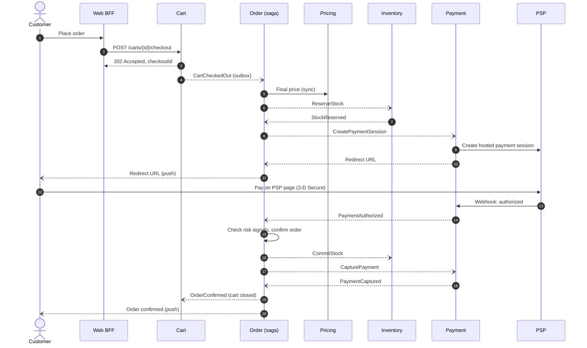
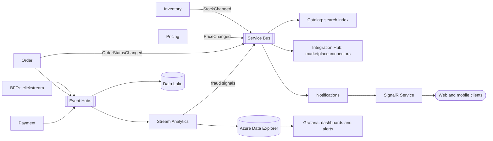
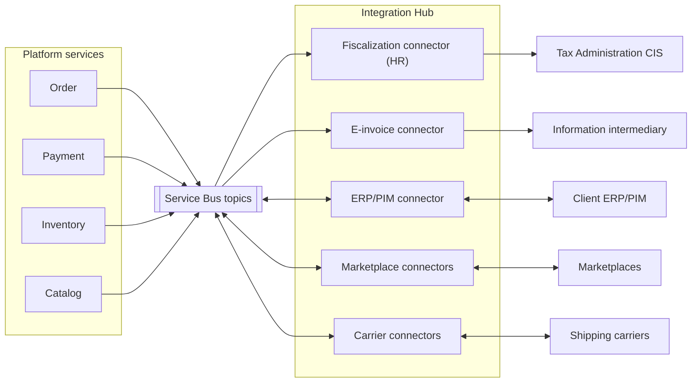
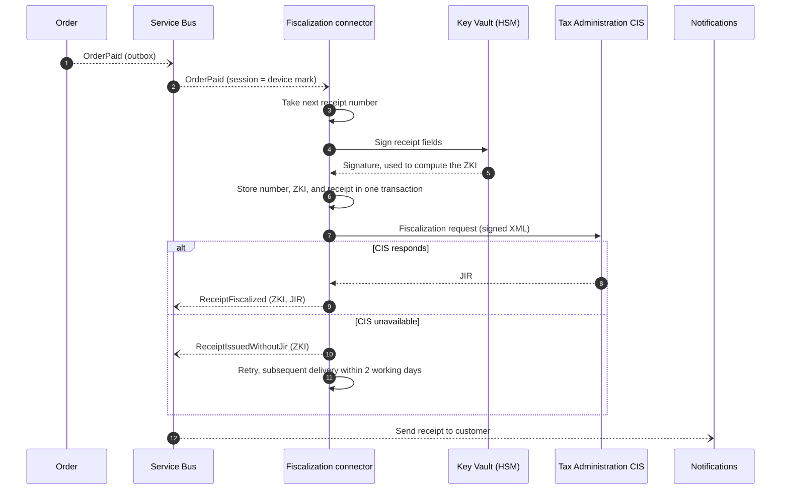
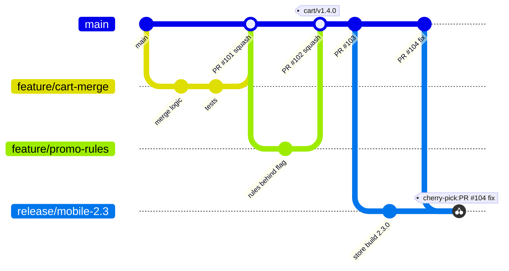
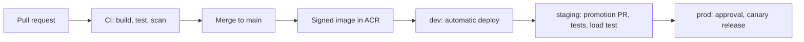

# Retail Platform: High-Level Architecture and Implementation Strategy

| | |
| --- | --- |
| Author | Robert Miani |
| Status | Proposal for review |
| Audience | Client technical stakeholders, delivery teams |

## Contents

1. [Purpose, scope, and assumptions](#1-purpose-scope-and-assumptions)
2. [Architecture drivers and principles](#2-architecture-drivers-and-principles)
3. [Architecture view](#3-architecture-view)
4. [Key components and responsibilities](#4-key-components-and-responsibilities)
5. [Component communication](#5-component-communication)
6. [Main technology choices](#6-main-technology-choices)
7. [Scaling strategy](#7-scaling-strategy)
8. [Real-time data processing](#8-real-time-data-processing)
9. [Security and authentication](#9-security-and-authentication)
10. [Integration with external services](#10-integration-with-external-services)
11. [Monitoring and alerting](#11-monitoring-and-alerting)
12. [Code delivery plan](#12-code-delivery-plan)
13. [Architecture decision log](#13-architecture-decision-log)
14. [Risks and open questions](#14-risks-and-open-questions)

[Appendix A. Glossary](#appendix-a-glossary)

---

## 1. Purpose, scope, and assumptions

### 1.1 Purpose

This document proposes the high-level design and the implementation strategy for an online retail
platform that serves millions of users a day. The platform sells through four channels:

- Web shop
- Mobile apps (iOS, Android)
- Marketplace integrations (for example Amazon and regional marketplaces)
- B2B integrations (partner systems that order through an API)

The client's key requirements are scalability under high traffic, secure transactions and protection of
personal data, and real-time data processing. Two cross-functional teams will build and run the platform.

Abbreviations are explained in [Appendix A](#appendix-a-glossary).

### 1.2 Scope

In scope: the platform backend, the channel APIs, integrations with external systems, the runtime platform,
security, observability, and the delivery process.

Out of scope: the design of the web and mobile clients, the internal design of the client's ERP/PIM, and
data warehouse and BI design. Markets outside the EU are out of scope at this stage; the design does not
block them.

### 1.3 Assumptions

The load figures are estimates that set the order of magnitude. They must be replaced with the client's
real numbers at the start of the project.

| Metric | Assumption | Derived value |
| --- | --- | --- |
| Daily active users | 5 million across the EU | |
| API calls per active user per day | about 40 | about 200 million calls/day, about 2,300 requests/s on average |
| Daily peak | 3x average (evening) | about 7,000 requests/s |
| Campaign peak (Black Friday, launches) | a further 3x | about 20,000 requests/s at the edge |
| Share served by the CDN | 60% to 70% | 6,000 to 8,000 requests/s reach the origin at campaign peak |
| Orders | 2% to 3% conversion, about 120,000 orders/day | 1.5 orders/s on average, about 40 orders/s sustained at campaign peak, bursts of up to 300 orders/s for a few minutes during product drops |
| Cart writes | about 5 million/day | about 1,000/s at campaign peak |
| Catalog | 0.5 to 2 million SKUs | |

Other assumptions:

- The platform sells in the EU. Croatia is the launch country; other EU countries follow.
- The client's ERP/PIM is the master for products, base prices, and physical stock. The platform owns
  promotions, available-to-sell stock, carts, orders, and customer profiles.
- Card payments go through an external payment service provider (PSP). The platform never stores card data.
- The client uses Microsoft Entra ID for its own staff.

## 2. Architecture drivers and principles

### 2.1 Quality attributes

The attributes are ranked. When two of them conflict, the higher one wins.

| Rank | Quality attribute | Target |
| --- | --- | --- |
| 1 | Availability of the purchase path (browse, cart, checkout) | 99.95% per month |
| 2 | Security and compliance (PCI DSS, GDPR, fiscal law) | No card data in platform scope; all data stays in the EU |
| 3 | Elasticity | Absorb a 10x traffic increase within minutes without manual action |
| 4 | Data freshness | 99% of stock and price changes visible in all channels within 5 s of receipt |
| 5 | Latency | Channel API p95 below 300 ms for reads and below 800 ms for checkout steps |
| 6 | Team autonomy | Each team deploys its services independently, several times a day |
| 7 | Cost efficiency | Cost follows traffic, not peak capacity |

### 2.2 Principles

1. **Services own their data.** Each service has its own database. Data is shared through APIs and events.
2. **Asynchronous by default between services.** A synchronous call is used only when a user waits for the
   answer and the data cannot be held locally.
3. **Stateless compute.** Any instance can serve any request, so the platform scales by adding instances.
4. **Design for failure.** Every external call has a timeout, a retry policy, and a fallback. A failing
   service or partner does not stop checkout.
5. **Secure by default.** Every request is authenticated, networks are private, and services use managed
   identities instead of secrets.
6. **Managed services first.** Two teams cannot operate brokers, databases, and identity servers, so the
   platform uses managed Azure services.
7. **Everything as code.** Infrastructure, pipelines, dashboards, and alerts change through reviewed pull requests.

## 3. Architecture view

### 3.1 System context

### 3.2 Deployment topology

The platform runs in **one primary Azure region in the EU**, spread over three availability zones, with a
**warm disaster-recovery (DR) region** in another EU country. From one central region, every EU user is within
about 50 ms, and all data stays in the EU.

- **Azure Front Door** is the entry point. It serves cached content from edge locations across Europe,
  filters traffic with the web application firewall (WAF), and sends the rest to the primary region.
- The **DR region** runs a small copy of the platform with database replicas (see [section 7.5](#75-availability-and-disaster-recovery)).
- The infrastructure is one reusable Terraform module, so a second active region can be added later if
  load or new markets require it.

The region names are examples. The final choice depends on latency tests and on the availability of all
required Azure services.

### 3.3 Container view

Each service has its own data store, listed in [section 4](#4-key-components-and-responsibilities).

## 4. Key components and responsibilities

### 4.1 Channel entry points

| Component | Responsibility | Owner |
| --- | --- | --- |
| Azure Front Door + WAF | Entry point: TLS, CDN caching, WAF, DDoS protection, routing to the active region. | Shared |
| Web BFF (Backend for Frontend) | API for the web shop. Aggregates data from several services per page. Runs the login flow and keeps tokens server-side. | Team A |
| Mobile BFF | API for the mobile apps. Mobile-shaped payloads and long support for old app versions. | Team A |
| Azure API Management | Partner API for B2B partners and marketplaces: onboarding, OAuth2, subscription keys, quotas, developer portal. Receives marketplace webhooks. | Team B |
| Back-office BFF | API for the back-office portal: merchandising, order management, refunds, customer service. Staff log in with the client's Entra ID. Each team owns its portal modules. | Team B hosts |

### 4.2 Domain services

| Service | Responsibility | Owner | Data store |
| --- | --- | --- | --- |
| Catalog & Search | Product data, categories, media, search, and filters. Imports master data from the ERP/PIM. | Team A | PostgreSQL, Azure AI Search, Blob Storage |
| Pricing & Promotions | Final price per customer and channel: base price, B2B price lists, promotions, coupons, VAT. | Team A | PostgreSQL, Redis |
| Cart | Cart across devices; merges an anonymous cart at login; hands the cart over to checkout. | Team A | PostgreSQL (source of truth), Redis (cache) |
| Customer | Profile, addresses, consents, wishlist, and B2B company accounts (buyers, price list, credit terms). Runs GDPR data export and erasure. | Team A | PostgreSQL |
| Order | Runs checkout as a saga and owns the order lifecycle (fulfilment, cancellations, returns) for all channels. | Team B | PostgreSQL |
| Payment | PSP integration: payment sessions, authorization, capture, refund, webhooks. Stores PSP references, never card data. | Team B | PostgreSQL |
| Inventory | Available-to-sell stock per SKU and warehouse; reservations for checkout. Publishes stock changes. | Team B | PostgreSQL, Redis |
| Integration Hub | All external integrations behind an anti-corruption layer: fiscalization, e-invoicing, ERP/PIM, marketplaces, carriers. One worker per connector. | Team B | PostgreSQL |
| Notifications | Email, SMS, and push messages; real-time updates to open sessions through SignalR Service. | Team B | PostgreSQL |

Customer identity is not a service we build. Microsoft Entra External ID provides sign-up, sign-in, MFA,
social login, and password reset.

### 4.3 Team ownership

The teams are split by **value stream**, so most features need only one team:

| Team | Value stream | Components |
| --- | --- | --- |
| Team A: Shopping Experience | Find a product, decide, fill the cart, manage the account | Web BFF, Mobile BFF, Catalog & Search, Pricing & Promotions, Cart, Customer |
| Team B: Order & Fulfilment | Pay, receive the goods and a valid receipt or invoice, return | API Management, Back-office BFF, Order, Payment, Inventory, Integration Hub, Notifications |

In total there are twelve services (nine domain services and three BFFs), plus one worker per connector.
The platform infrastructure, the observability standards, and the API and event contracts are owned jointly,
with one named owner per quarter.

## 5. Component communication

### 5.1 Communication styles

| From | To | Style |
| --- | --- | --- |
| Web and mobile clients | BFFs | HTTPS, JSON |
| Web and mobile clients | Notifications | Server push over WebSocket (SignalR Service) |
| B2B partners, marketplaces | API Management | HTTPS, JSON, OAuth2 |
| BFFs | Domain services | HTTPS, JSON inside the cluster |
| Domain service | Domain service | Events (Service Bus topics) and commands (Service Bus queues) |
| Services | Stream processing | Event Hubs streams (Kafka protocol) |

**Rule for synchronous calls.** A service calls another service synchronously only when a user waits for the
answer and the data must be exact at that moment, for example the final price at checkout. In all other cases
services publish **events** about their own data (`ProductChanged`, `StockChanged`, `OrderConfirmed`), and other
services keep the local copy they need. A domain service makes at most one synchronous call to another service
per request.

**Rule for the two brokers.** A business workflow step goes to Service Bus. A high-volume stream that many
readers process in bulk (clickstream, analytics) goes to Event Hubs.

### 5.2 Reliable messaging

Every service applies the same rules, so a failure never loses an order or creates it twice:

| Rule | How it works |
| --- | --- |
| Transactional outbox | A service writes its state change and the outgoing message in one database transaction. A relay publishes the message afterwards. |
| Idempotent consumers | A consumer records processed message IDs in the same transaction as its own change, and skips duplicates. |
| Idempotency keys on HTTP writes | Clients and partners send an `Idempotency-Key` header. A repeated key returns the stored response. |
| Ordered processing where needed | Messages for one checkout use a Service Bus session keyed by the checkout ID. |
| Retries and dead letters | Consumers retry with backoff. A message that still fails goes to the dead-letter queue and raises an alert. |

Synchronous calls use the .NET resilience handler: timeout, retry for idempotent requests, and a circuit breaker.

**Contracts.** HTTP APIs have OpenAPI descriptions and are versioned in the URL (`/v1/...`). Events use the
CloudEvents envelope; within a version only backward-compatible changes are allowed. Contract tests in CI stop
a provider from breaking a known consumer.

### 5.3 Checkout flow

Checkout crosses five services, so it runs as an **orchestrated saga** in the Order service. The saga state is
stored in the Order database. Checkout starts with the `CartCheckedOut` event: the client gets `202 Accepted`
and follows the progress through SignalR push. This puts a queue in front of checkout, which absorbs peaks
(see [section 7.3](#73-checkout-peaks-and-popular-products)).

After the capture, the Order service publishes `OrderPaid` with the amounts and VAT breakdown. Fiscalization
starts from this event. A flagged fraud signal puts the order on hold for manual review instead.

| Failure | Saga action |
| --- | --- |
| Stock missing or price changed | Stop before payment; `CheckoutFailed` reopens the cart with the details. |
| Payment declined, abandoned, or not authorized within 15 minutes | Cancel the payment session, release the stock, reopen the cart. Inventory holds stock for 30 minutes, so the hold never expires before the saga timeout. |
| Capture fails | Retry; then cancel the order, release the stock, void the authorization, and inform the customer. |
| Unknown repeated error | Dead-letter queue and alert. No automatic compensation. |

**Partner channels.** B2B partners call `POST /v1/orders` through API Management and use their price list and
credit terms instead of the PSP. Marketplace orders arrive already paid through the Integration Hub. Both start
the same saga, which skips the steps that do not apply.

## 6. Main technology choices

| Concern | Choice | Reason |
| --- | --- | --- |
| Runtime | C#, .NET 10 (LTS), ASP.NET Core | Supported until November 2028; high throughput; the team's core skill |
| Compute | Azure Kubernetes Service (AKS) Automatic | Managed nodes, upgrades, and autoscaling (KEDA, HPA) |
| Edge | Azure Front Door Premium | CDN, WAF, bot and DDoS protection in one service |
| Partner API gateway | Azure API Management Premium v2 | Partner onboarding, keys, OAuth2, quotas without custom code |
| Business messaging | Azure Service Bus Premium | Topics, sessions, duplicate detection, dead-letter queues, geo-replication |
| Streaming | Azure Event Hubs (Kafka protocol) | High-throughput, replayable streams |
| Relational data | Azure Database for PostgreSQL Flexible Server, one database per service | Zone-redundant HA, read and geo-replicas, mature EF Core provider |
| Cache | Azure Managed Redis | Prices, carts, stock counters, sessions, rate limits |
| Search | Azure AI Search | Full-text search, facets, analyzers for EU languages |
| Real-time push | Azure SignalR Service | Managed WebSocket connections at scale |
| Stream processing and analytics | Azure Stream Analytics, Azure Data Explorer, Data Lake Storage | Windowed queries, fast analytics queries, raw event archive |
| Customer identity | Microsoft Entra External ID (EU tenant) | Managed sign-up, MFA, social login, OIDC |
| Secrets and keys | Azure Key Vault Premium | Secrets and HSM-backed signing keys; workload identity access |
| Network security | Private endpoints, Azure Firewall, Cilium with WireGuard encryption | Private data stores, outbound allow-list, encrypted pod traffic |
| Configuration, feature flags | Azure App Configuration | Per environment |
| Observability | OpenTelemetry, Azure Monitor, managed Prometheus, Managed Grafana | Vendor-neutral instrumentation, managed back ends |
| Infrastructure and delivery | Terraform, GitHub Actions, Argo CD, Argo Rollouts | Everything as code, GitOps, canary releases |

## 7. Scaling strategy

### 7.1 Scaling by layer

| Layer | How it scales |
| --- | --- |
| Edge | Front Door serves static files, images, and cacheable catalog responses (60% to 70% of requests) |
| HTTP services | Horizontal Pod Autoscaler on CPU and requests per pod; at least three replicas, one per zone |
| Message workers | KEDA on queue length and consumer lag |
| Cluster nodes | AKS node autoprovisioning |
| Databases | Larger tier, read replicas for read-heavy services, monthly partitions for large tables |
| Cache and search | Larger Redis tier; more AI Search replicas |

All services are stateless, so they scale out by adding pods. Each service has its own database, so data
load is spread from the start. Sharding is not part of the first release; it is revisited when one service
database outgrows the largest tier.

### 7.2 Caching and protection

| Data | Cache | Invalidation |
| --- | --- | --- |
| Static files | Front Door CDN, long lifetime | New file names on each deployment |
| Product lists and details | Front Door CDN, 60 s | `ProductChanged` purges the paths |
| Prices | Redis, 5 minutes | `PriceChanged` deletes the key |
| Cart | Redis, cache-aside | Every cart write deletes the key |
| Displayed stock | Redis | `StockChanged` updates it; the exact check happens at reservation |

The cache is never the source of truth. When Redis is unavailable, services read from the database.

- **Rate limits** at Front Door (per IP), in API Management (per partner), and in each service (per user).
- **Circuit breakers and bulkheads** per external dependency, so a slow partner does not block other requests.
- **Graceful degradation.** Under stress, the BFFs drop non-essential page parts, product lists show cached
  prices, and receipts are fiscalized later when the Tax Administration service is down.

### 7.3 Checkout peaks and popular products

**Checkout peaks.** Orders arrive about 25 times faster than average during a campaign, and up to 200 times
faster during a product drop. Checkout uses **queue-based load levelling**: Cart publishes `CartCheckedOut`,
the Order service consumes at the rate it can handle, and KEDA adds Order workers as the backlog grows. The
customer sees a short "processing" state instead of an error.

**Popular products.** Inventory reserves stock with an atomic conditional update in PostgreSQL. For SKUs that
are flagged as hot during a campaign, an atomic counter in Redis acts as an **admission gate**: when it reaches
zero, requests get "sold out" without touching the database. Admitted requests still update PostgreSQL, which
stays the source of truth, so the gate cannot cause overselling.

### 7.4 Capacity validation

Load tests run in staging with Azure Load Testing before releases that touch a hot path and before each campaign:

| Scenario | Target |
| --- | --- |
| Browse and search | 20,000 requests/s at the edge, 8,000 at the origin, p95 below 300 ms |
| Cart writes | 1,000 requests/s, p95 below 300 ms |
| Checkout | 40 orders/s sustained for 1 hour; 300 orders/s for 5 minutes with no errors |

### 7.5 Availability and disaster recovery

| Failure | Protection | Target |
| --- | --- | --- |
| Pod, node, or one availability zone | Three replicas across zones; zone-redundant AKS, PostgreSQL, Service Bus, Redis | No user impact |
| Whole primary region | Warm DR region: PostgreSQL geo-replicas, Service Bus geo-replication, a small AKS cluster kept in sync by Argo CD, a second AI Search and API Management instance, geo-redundant media storage | RPO 5 minutes, RTO 1 hour (to be agreed with the client) |
| Data corruption | PostgreSQL point-in-time restore | Any point in the last 35 days |

Failover to the DR region is a decision by the on-call lead, following a runbook, because it includes promoting
the databases. The Redis cache starts empty in DR, and the analytical tier may miss events during the outage.
The team runs a DR drill every six months.

## 8. Real-time data processing

| Use case | Target |
| --- | --- |
| Stock and price changes in all channels, including marketplaces | 99% within 5 s |
| Order status updates to the customer | 2 s |
| Fraud signals (for example many orders from one card token) | 10 s; suspicious orders are put on hold |
| Live business metrics (conversion, payment success rate) | 1 minute |

Real-time processing has two tiers:

- **Operational tier.** Business events go through Service Bus to .NET consumers. For example, Inventory
  publishes `StockChanged`; Catalog updates the search index, the BFF caches update the stock, and the
  marketplace connectors push the new stock to each marketplace within its API rate limits.
- **Analytical tier.** Clickstream, order, and payment events go to Event Hubs. Azure Stream Analytics runs
  windowed queries (conversion funnel, payment success rate, fraud velocity rules). Results go to Azure Data
  Explorer for Grafana dashboards and alerts, and fraud signals go back to the Order service through Service
  Bus. Event Hubs Capture archives all raw events in the Data Lake for BI.

Notifications pushes updates to open sessions through Azure SignalR Service, so services never hold client
connections. When the app is closed, it sends a mobile push notification instead.

## 9. Security and authentication

### 9.1 Authentication

| Actor | Identity provider | Flow |
| --- | --- | --- |
| Web shop customer | Entra External ID | OIDC authorization code flow with PKCE, run by the Web BFF. Tokens stay on the server; the browser gets only an `HttpOnly`, `Secure`, `SameSite=Lax` session cookie and an anti-forgery token. |
| Mobile app customer | Entra External ID | Authorization code flow with PKCE; short-lived access token; rotated refresh token in the device's secure storage; app attestation. |
| B2B partner system | Entra ID, one app registration per partner | OAuth2 client credentials with a certificate-signed client assertion (`private_key_jwt`); no shared secrets. API Management validates the token and applies the partner's quota. |
| Client staff | Client's Entra ID | OIDC through the Back-office BFF, with MFA, conditional access, and just-in-time admin roles. |
| Services | Entra Workload ID | Services reach databases, Service Bus, and Key Vault with Entra tokens; there are no passwords in connection strings. |

The BFFs request user tokens for one shared platform API, with one scope per service. Every service validates
the token itself and does not trust the network. Customer MFA is risk-based: it is required for sensitive
actions and for risky sign-ins.

### 9.2 Authorization

- **Ownership checks in every service.** A customer can only read or change their own cart, orders, and
  profile. The domain service checks this, not only the BFF. This is the main control against broken
  object-level authorization, the most common API vulnerability.
- **Scopes for partners** (for example `orders.write`, `stock.read`) and **roles for staff** from Entra ID groups.

### 9.3 Payment security

- Customers enter card data only on the **PSP's hosted payment page**, reached by a full redirect. The platform
  stores only PSP references. This keeps the client in the smallest PCI DSS scope (**SAQ A**); a full redirect is
  chosen over an iframe because the SAQ A script-attack rule applies to iframe pages.
- The PSP runs 3-D Secure (strong customer authentication under PSD2).
- PSP webhooks are verified by signature and processed idempotently, and a daily job reconciles payments with
  the PSP settlement report.

### 9.4 Data protection and GDPR

| Control | Implementation |
| --- | --- |
| Encryption | TLS 1.2+ for all external and Azure service traffic; WireGuard encrypts pod traffic between nodes; all data encrypted at rest, with customer-managed keys for personal data |
| Network | Private endpoints for all data stores; default-deny network policies between pods; outbound traffic through Azure Firewall with an allow-list |
| Secrets | Key Vault only, accessed through workload identity; rotation and expiry alerts |
| Data residency | All data, identity data, logs, and backups stay in EU regions |
| Minimisation | Events and logs carry customer IDs, not names or contact data |
| Consent and erasure | The Customer service records consents and runs erasure requests: it publishes `CustomerErasureRequested`, and every service deletes or anonymises its data. Orders and invoices are kept for the legal retention period. |

**Application protection.** The Front Door WAF with managed rule sets and bot protection, input validation and
parameterised queries in every service, request size and page size limits, signed container images with an
SBOM, and an external penetration test before go-live and once a year.

## 10. Integration with external services

### 10.1 Integration Hub

All external integrations go through the **Integration Hub**, an anti-corruption layer. Domain services publish
events in the platform's own language (`OrderPaid`, `StockChanged`), and a connector translates them to the
partner's protocol and back. No domain service knows a partner's API. Each connector runs as its own worker,
with its own queue, credentials, rate limits, and circuit breaker, so a slow marketplace cannot delay fiscal
receipts. The PSP is the exception: the Payment service calls it directly, because payment is part of the
checkout saga and has its own PCI DSS boundary.

| External system | Protocol | Trigger |
| --- | --- | --- |
| Tax Administration (CIS), B2C receipts | SOAP over HTTPS, signed XML | `OrderPaid`; `OrderRefunded` for cancellation receipts |
| Information intermediary, B2B e-invoices | Intermediary API, UBL 2.1 (EN 16931, Croatian CIUS) | B2B invoice issued; B2B payment received |
| PSP | REST, signed webhooks | Checkout saga, refunds |
| ERP/PIM | Events or batch files | Products, prices, and stock in; orders, invoices, and returns out |
| Marketplaces | Each marketplace's API | Stock and prices out; orders in; shipment status out |
| Shipping carriers | Carrier APIs, webhooks | Shipments out; tracking in |

Every connector uses timeouts, retries with backoff, a circuit breaker, a dead-letter queue with replay, an
audit log of requests and responses, and a daily reconciliation with the partner's records.

### 10.2 Fiscalization of receipts (Croatia)

Under the Fiscalization Act (NN 89/2025), since 1 January 2026 every B2C receipt must be fiscalized, for any
payment method, including card payments in a web shop. Fiscalization is asynchronous and never blocks checkout:

1. The Order service publishes `OrderPaid` (or `OrderRefunded` for a cancellation receipt).
2. The fiscalization connector takes the next receipt number. Numbers are gap-free per business premises and
   device mark. Each device mark is a Service Bus session, so exactly one worker numbers its receipts.
3. The connector signs the receipt fields with the FINA certificate to compute the **ZKI** code, and stores the
   number, the ZKI, and the receipt in one transaction. The receipt is now legally issued, and a retry can never
   create a gap in the numbering.
4. The connector sends the signed request to CIS and receives the **JIR** identifier.
5. Notifications sends the receipt with the JIR and QR code to the customer.

- **CIS unavailable.** The customer gets the receipt with the ZKI only. The connector retries and delivers the
  receipt later, within the legal deadline of two working days. An alert fires long before that deadline.
- **Keys.** The certificate's private key is an HSM-backed, non-exportable key in Key Vault, and signing happens
  inside the vault. One vault signs about 100 receipts per second, which is above the sustained campaign peak;
  short bursts wait in the queue.
- **Algorithm change.** CIS switches off RSA-SHA1 and TLS 1.1 on 1 January 2027. The connector uses RSA-SHA256
  and reads the algorithm from configuration.
- The legal details must be confirmed by the client's tax advisor before implementation.

### 10.3 B2B e-invoicing and other EU countries

Since 1 January 2026, VAT-registered businesses in Croatia must exchange B2B invoices as e-invoices (eRačun).
The e-invoice connector builds the invoice in UBL 2.1 and sends it through a **certified information
intermediary**. The intermediary delivers and fiscalizes it, returns the status, and reports B2B payments to
the Tax Administration. This keeps the platform out of running its own certified access point.

The platform will sell in more EU countries, so tax compliance is a plug-in per country behind the same
internal events (`OrderPaid`, `OrderRefunded`, `InvoiceIssued`). VAT for cross-border B2C sales is calculated by
the destination country's rate in the Pricing service and reported through the EU One-Stop Shop (OSS).

## 11. Monitoring and alerting

### 11.1 Telemetry

Every service uses the OpenTelemetry SDK and sends traces, metrics, and logs to an OpenTelemetry Collector,
which exports them to Azure Monitor (Application Insights, Log Analytics, managed Prometheus). The trace context
travels in HTTP headers and in message properties, so one trace follows a checkout from the click to the fiscal
receipt. Metrics cover request rate, errors, and duration per endpoint, plus business metrics (orders, payment
success, receipts fiscalized). Logs are structured and contain no personal data. Dashboards are Grafana files
in the repository.

### 11.2 Health checks

| Check | Endpoint | What it checks | Used by |
| --- | --- | --- | --- |
| Liveness | `/health/live` | The process responds; no dependency checks, so a database outage does not restart every pod | Kubernetes |
| Readiness | `/health/ready` | The service's own database is reachable. Redis and Service Bus report `Degraded` but keep the pod ready, because the service works without the cache and the outbox holds messages. | Kubernetes, load balancer |
| Startup | `/health/startup` | Configuration loaded and caches warmed | Kubernetes |
| Region health | `/health/region` on the BFFs | The region can serve the purchase path | Front Door probes; alert to start the DR runbook |
| Synthetic journeys | External | Home page, search, add to cart, and login every 5 minutes; a synthetic checkout in staging after each deployment | Application Insights availability tests |

### 11.3 Service level objectives and alerts

| Journey | Objective (30 days) |
| --- | --- |
| Browse, search, cart | 99.95% of requests succeed; 99% of successful requests faster than 300 ms |
| Checkout | 99.95% of checkouts reach a final state within 10 s, excluding time on the PSP page |
| Partner API | 99.9% of requests succeed |
| Stock freshness | 99% of changes visible within 5 s |
| Fiscalization | 99.5% of receipts get a JIR within 1 minute; 100% within the legal deadline |

- **Paging alerts** use SLO burn rates: a fast burn pages the on-call engineer, a slow burn opens a ticket.
- **Cause alerts** cover a non-empty dead-letter queue, an outbox message older than 1 minute, growing consumer
  lag, receipts close to the fiscal deadline, certificates expiring within 30 days, and partner error rates.
- **Routing.** Azure Monitor action groups page the owning team through the on-call tool and post to its Teams
  channel. Every alert links to a runbook in the repository.

## 12. Code delivery plan

### 12.1 Repositories

| Repository | Content |
| --- | --- |
| `platform-app` (monorepo) | All services, contracts, tests, dashboards, and runbooks. `CODEOWNERS` gives each team its folders, and CI builds only the services that changed. |
| `platform-gitops` | Kubernetes manifests per environment: the desired state for Argo CD |
| `platform-infra` | Terraform modules and environments |

### 12.2 Branching strategy

The teams use **trunk-based development**:

- `main` is always releasable. Work happens on short-lived branches (1 to 2 days) merged by pull request.
- A pull request needs green CI and one approval from the owning team, and is squash-merged.
- Unfinished features are merged behind feature flags instead of living on long branches.
- A release is the promotion of a built version to production; the promoted commit gets a tag
  (`<service>/vX.Y.Z`). A hotfix is a normal pull request to `main` through the same pipeline.
- The mobile app repositories cut a short-lived release branch for app store submission. Fixes go to `main`
  first and are cherry-picked.

### 12.3 CI/CD

- **CI (GitHub Actions)** runs for each changed service: build, unit tests, integration tests with
  Testcontainers, contract tests, static analysis (CodeQL), dependency and secret scanning, container image
  scan (Trivy), SBOM generation and image signing. Any failure blocks the merge.
- **CD (GitOps).** Argo CD in each cluster pulls the desired state from `platform-gitops` and corrects drift;
  the CI system has no cluster credentials. Promotion to staging and production is a pull request in
  `platform-gitops`, so the approval and the audit trail are in Git.
- **Canary releases.** Argo Rollouts shifts 5%, 25%, 50%, then 100% of traffic to the new version, compares
  error rate and latency with the old version, and rolls back automatically on a failed check.
- **Database migrations** use expand and contract: add new structures first, remove old ones in a later
  release, so the running version always works.
- **Environments.** `dev` (every merge), `staging` (production-like, partner test environments), and `prod`
  (primary and DR region). They use separate subscriptions and credentials, and only `prod` can reach
  production data.

## 13. Architecture decision log

| # | Decision | Why | Rejected alternative | Revisit when |
| --- | --- | --- | --- | --- |
| 1 | Azure as the cloud | .NET team, managed services for two teams, client already on Entra ID | AWS (weaker fit); self-run Kubernetes stack (too much operations work) | The client mandates another cloud |
| 2 | Coarse-grained microservices (twelve services) | Very different load profiles per domain; four channels; two teams | Modular monolith (cannot scale catalog and checkout separately); fine-grained services (two teams cannot own 15+) | A service needs both teams in most sprints, or a team grows past eight people |
| 3 | Teams split by value stream | Most features need one team | Split by channel or core versus edge (both teams in every feature) | More than 30% of features need both teams |
| 4 | AKS Automatic | Many services and workers, event-driven scaling, canary releases | Container Apps (less control); App Service (weak for workers) | Cluster operations take more than 20% of one engineer |
| 5 | Front Door, a BFF per first-party channel, API Management for partners | Different channel needs; partner onboarding without custom code | API Management for all (cost and latency on B2C); custom gateway | A key partner requires mTLS (add a separate entry point) |
| 6 | Service Bus for workflows, Event Hubs for streams | Dead-letter queues and sessions versus throughput and replay | One broker for both | One broker covers both needs in practice |
| 7 | Outbox and idempotent consumers everywhere | A lost or duplicated event means a lost sale or a double charge | Publishing after commit (loses messages on crash) | Not expected; baseline rule |
| 8 | Orchestrated checkout saga, started asynchronously | Five services with compensations; peaks need a buffer | Choreography (implicit flow); synchronous chain (fails under peaks) | Checkout p95 stays above 10 s |
| 9 | PostgreSQL Flexible Server, one database per service | ACID for orders and payments; EF Core skills | Azure SQL Hyperscale (cost); Cosmos DB (weak multi-document transactions) | A database outgrows the largest tier |
| 10 | Cart in PostgreSQL with a Redis cache | Carts are business data with high read and write rates | Redis only (data loss); Cosmos DB (second database technology) | Cart writes exceed one server at peak |
| 11 | One EU region with a warm DR region | EU-only market; one region is within about 50 ms of all EU users; data stays in the EU | Several active regions (double cost and complexity) | Expansion outside the EU, or the region nears capacity |
| 12 | Two-tier real-time processing with SignalR push | Operational events need seconds; analytics needs windowed processing | Custom stream processing only (rebuilds windowing) | The client adopts a data platform with stream processing |
| 13 | Entra External ID; the Web BFF holds tokens | Identity is tier-0 and should be managed; Azure AD B2C is closed to new customers | Keycloak or Duende IdentityServer (we would operate them) | A required identity feature is missing |
| 14 | Card payments only on the PSP page, by full redirect | Smallest PCI DSS scope (SAQ A) | Embedded payment fields (larger scope) | Conversion on the redirect step is measurably low |
| 15 | Asynchronous fiscalization; e-invoices through an intermediary | A CIS outage must not stop sales; certified e-invoice exchange | Synchronous fiscalization; one provider for all tax work | The fiscal rules change, or intermediary fees exceed running our own access point |
| 16 | OpenTelemetry with Azure Monitor back ends | Managed services; one trace across services and messages | Self-run Grafana stack; Datadog (cost) | Observability cost passes 15% of infrastructure cost |
| 17 | GitHub Actions, Argo CD, Argo Rollouts, Terraform | Pipelines as code; no cluster credentials in CI; canary releases | Azure DevOps or push-based deployment (no drift detection) | The client standardises on another delivery platform |
| 18 | Trunk-based development with feature flags | Several deployments a day | GitFlow (long-lived branches, late integration) | Regulation requires formal release branches |
| 19 | One application monorepo, plus GitOps and infrastructure repositories | Two teams, shared contracts and standards | Repository per service (about 15 repositories) | About six teams, or CI above 15 minutes |
| 20 | ERP/PIM as the master for products, prices, and stock | Avoids duplicating master data management | Platform as the master (full back-office build) | The ERP/PIM cannot meet the freshness target |
| 21 | A Customer service owns profile, consent, and B2B accounts | The identity provider handles login only; GDPR needs one owner | Data in the identity provider, or spread across services | Not expected |
| 22 | No service mesh; WireGuard encrypts pod traffic | Tokens and network policies cover service security with less operations work | Service mesh with mTLS (most operations work) | Compliance requires workload-level mTLS |

## 14. Risks and open questions

| Risk | Mitigation |
| --- | --- |
| The load assumptions are wrong | Measure real traffic early; autoscaling absorbs errors in both directions |
| Two teams own twelve services plus connectors | Managed services, one service template, automation; propose a third team when the backlog demands it |
| Fiscal and e-invoicing rules change | Tax logic sits behind Integration Hub connectors; regular legal review |
| Marketplace APIs differ and have strict rate limits | One worker per marketplace, change coalescing, reconciliation |
| Consistency bugs in distributed flows | Idempotency everywhere and daily reconciliation between Order, Payment, Inventory, and the PSP |
| Product drops exceed checkout capacity | Queue-based checkout, hot-SKU gate, a virtual waiting room as an option |

Open questions for the client:

1. What are the real traffic numbers and the campaign calendar?
2. What interface does the ERP/PIM offer (events, APIs, or batch files), and how often does data change?
3. Which PSP, marketplaces, and B2B partner requirements (REST only or also EDI) come first?
4. Which EU countries follow Croatia, and in what order?
5. Are the proposed recovery targets (RPO 5 minutes, RTO 1 hour) acceptable?
6. What are the retention rules for orders, invoices, and personal data?

## Appendix A. Glossary

| Term | Meaning |
| --- | --- |
| ACR | Azure Container Registry |
| AKS | Azure Kubernetes Service |
| BFF | Backend for Frontend: an API layer built for one client channel |
| BI | Business intelligence |
| CDN | Content delivery network |
| CIS | Central fiscalization system of the Croatian Tax Administration |
| CIUS | National profile of the EN 16931 e-invoice standard |
| DR | Disaster recovery |
| ERP / PIM | Enterprise resource planning / product information management system |
| FINA | Croatian Financial Agency, the issuer of fiscal certificates |
| GDPR | EU General Data Protection Regulation |
| HPA | Kubernetes Horizontal Pod Autoscaler |
| HSM | Hardware security module |
| JIR | Unique receipt identifier returned by CIS |
| KEDA | Kubernetes Event-Driven Autoscaling |
| mTLS | Mutual TLS: both sides of a connection present a certificate |
| NN | Narodne novine, the Croatian official gazette |
| OIDC | OpenID Connect |
| OSS | EU VAT One-Stop Shop for cross-border sales |
| PCI DSS, SAQ A | Payment card security standard; SAQ A is the smallest scope, for merchants that fully outsource card handling |
| PKCE | Proof Key for Code Exchange, an OAuth2 protection for public clients |
| PSD2 | EU Payment Services Directive 2 |
| PSP | Payment service provider |
| RPO / RTO | Maximum data loss / maximum downtime after a disaster |
| SBOM | Software bill of materials |
| SKU | Stock keeping unit |
| SLO | Service level objective |
| SPA | Single-page application |
| UBL | Universal Business Language, the XML format of the e-invoice |
| WAF | Web application firewall |
| ZKI | Issuer's protective code, computed by the seller for every fiscal receipt |
